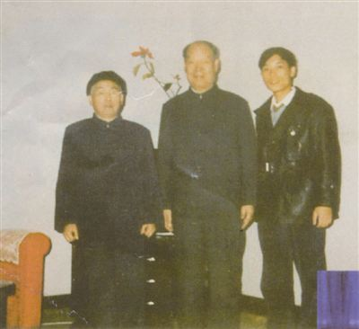
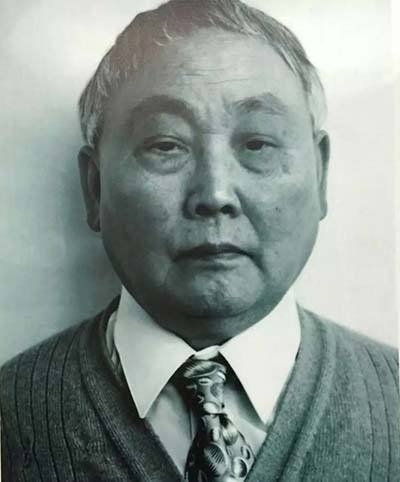

# 光明中医函授大学顾问李仲愚传略

李仲愚，1920年出生于四川省彭州市，家中世代行医。李仲愚5岁入读私塾，13岁师从堂叔晚清秀才李培生，从此踏入医门。后师从天彭名医刘国南、刘锐仁等人，17岁即悬壶于县医馆。19岁考取四川省注册中医师资格，次年入四川国医学院学习。

建国后，李仲愚历任彭县卫生工作者协会主任、县人民委员会委员。1955年，李仲愚调入成都中医进修学校，次年，又调入成都中医学院，从事中医、针灸教学和临床工作。

　　

1986年，李仲愚晋升为主任医师，享受政府特殊津贴。1996年任附属医院针灸指针研究室主任、康复科主任等职务。他治学严谨，诲人不倦，带教各层次学生教学实习，毕业实习及多批来自港台及海外学员。带习中，多从传统中医理论及针灸、气功学说出发，联系儒、佛、道知识，结合临床进行讲授，学生好评如潮。

1990年，被评为四川省自然科学界精神文明标兵称号。1991年，被国家人事部、国家中医药管理局确定为继承老中医药专家学术经验指导教师。在指导中，强调知行统一，重视医德教育。主审全国中等中医药学校教材[《针灸治疗学》](http://www.gmzywx.com/ProductDetail/2743559.html)。

李仲愚长期从事临床工作，深求古训，博采新知。施术时能取各家之长，因时、因地、因人、因症而活法用之。精于方术，善用针灸，常以中医传统的汤液、针灸、角、砭、导引、按摩、薄贴、膏沫、浴熨等方法治疗内、妇、儿、外及五官各科疾病，尤擅长使用祖传绝招杵针、气功等法，内外合治、针药结合，治疗多种常见病及各种奇难杂证，疗效显著。多次进京给中央首长治病，多采用杵针、指针之法，收到了满意的疗效。并受有关部门的重视，经批准成立针灸指针研究室。

　　

1983年3月致信全国人大委员长彭真同志，反映有关问题，提出了发展中医的建议，得到中央领导和卫生部的高度重视，并采取了相应措施。

2003年，李仲愚去世，享年83岁。