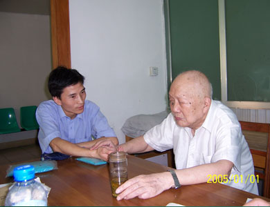

# 光明中医函授大学顾问李培生传略

　　李培生，1914年1月生于湖北汉阳。他出身中医世家，自幼便深受熏陶，从小通习典籍，善为诗文，并立志行医。青少年时，李培生白天出门侍诊，晚间便挑灯夜读，手不释卷，无论寒冬酷暑从不间断。他笃信的一点就是：“要做一名好医生，必须多闻博识、精通医理。”

　　

　　为了增长医术，李培生青年时远赴上海拜名医恽铁樵、汪莲石为师。抗战爆发后，小有名气的他返回家乡，开始在汉阳行医。独立行诊后，他仍虚心向当地老中医请教。

　　

　　1958年，湖北中医学院成立，李培生入校任教。从此开启了他长达三十余年的中医教育之路。

　　

　　李培生专精[《伤寒论》](http://www.gmzywx.com/NewsDetail/1130351.html)，是我国当代伤寒学界泰斗。在湖南中医学校任教时期，李培生为中医《伤寒论》的教学和临床培养了大量的进修生、函授生、本专科生、研究生。李老力求用最平实的语言来解读《伤寒论》，他主编的《伤寒论选读》、《伤寒论讲义》等书，自从上世纪60年代中期起，已经成为了当代所有中医学子的必读教材。

　　

　　不仅学识渊博、能力卓越，李老还是一位十分和蔼可亲的老师。曾跟随李老学习的梅国强教授曾这样评价李老：李老待人非常热心，上世纪60年代，作为青年教师的他，每有疑难问题去请教时，李老总耐心讲解。1975年，他和李老共同编写教材《伤寒论选读》。那时梅国强资历尚浅，自感无从下手。但李老鼓励他大胆做，并说‘我就在你旁边，有什么问题就问我’。

　　

　　李培生的另一位弟子、今年63岁的邱明义教授说，李老是他们的道德模范，“他常常教诲我们，‘爱人者人皆爱之，敬人者人皆敬之’，这句话成了我几十年的座右铭。”

　　

　　“文革”以后，全国几乎没有伤寒学医生，为此卫生部两次主办“全国伤寒论师资班”，李培生两次担任主讲。因此，全国伤寒学名家，基本都是他的弟子。

　　

　　从医70余年，李培生济世救人无数，但始终淡泊名利。李培生的弟子、今年50岁的北京中医药大学傅延龄教授回忆说，20多年前，自己有幸获得3年随李老学习的机会，李老常常教导他要多读《论语》，认为《论语》中“仁者爱人”的思想，是为医者必不可少的职业素质。2006年、2007年，年逾九旬的李培生仍坚持每周上3个半日门诊。医院考虑到他的身体状况，每天要求只限量挂号10个，但每次排队挂号的病人多达三四十人，李培生则抱着“能多看就多看，病人远道而来很辛苦”的仁心，从未有过任何怨言。

　　

　　李培生重视中医教育，1984年他在光明中医函授大学担任了顾问。

　　

　　2009年8月4日，我国当代著名中医学家和伤寒学家、伤寒学一代宗师李培生教授与世长辞，享年96岁。