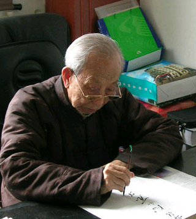
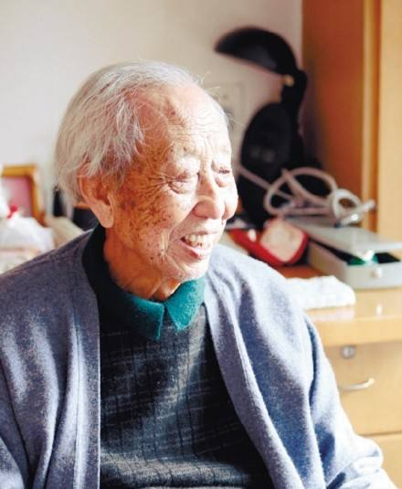

# 光明中医函授大学顾问李玉奇传略

李玉奇，1917年生于辽宁铁岭。幼时家道中落，但少年有志，发奋读书，乡试名列前茅。

当时，许多穷苦百姓深陷沉疴痼疾，倍受折磨。他甚感同情，为解苍黎之苦，不择仕途，决意学医济世。遂拜著名老中医明星垣先生门下，从师七载。经先生举荐，成为铁岭医学研究会的助教。

　　

后又从师丁乙青、姜弼臣两位先贤，攻读医学经典，积累临床经验。24岁便开始悬壶济世。行医期间，恪守师传医风，以济世救人为宗旨，深得病家信赖与敬仰。他深知学海无涯，医术无边，虽已有成，仍孜孜不倦。

新中国成立后，李玉奇先生正在大展宏图的而立之年，怀着报效祖国人民的炽热情怀，积极献身于为之奋斗的中医事业。他先后担任了辽源市立医院医务部主任、副院长，辽东省中医进修学校讲师、主任等职。五十年代初被辽东省卫生厅举送进京学习深造，毕业后即调任辽东省卫生厅负责全省中医工作、辽东辽西两省合并后，长期主管辽宁中医工作。六十年代任辽宁省卫生厅第一任中医处处长。七十年代到八十年代末曾任省政协委员，辽宁中医学院附属医院院长。后任沈阳药学院中药系兼职教授，北京光明中医函授大学顾问等职位。

人生总会有坎坷和磨难。“文革”初期，他深受其害，曾被迫下乡劳动。1972年回沈后被派到辽宁中医学院工作，但在“四人帮”横行的岁月里，他精神压抑，满腹才智不得发挥，后来到省委机关卫生所默默地当保健医生。他甘苦无愁，宠辱不惊，以一名共产党员的尊严面对一切冷遇。直到粉碎“四人帮”后，他又一次获得新生，1978年奉命新建省肿瘤医院，首任第一任副院长。他虽是花甲之年，但雄风不减，领导全院基建工程日夜奋战。

　　

李玉奇先生是在中医理论和临床实践方面均有高深造诣的著名专家。他从医五十载，积累了极为丰富的临床经验，对诸多学科领域都有较深的涉猎。他功擅内科，尤精胃疾。从六十年代后期，就开始对严重危害人们健康的脾胃系统疾病，特别是慢性萎缩性胃炎进行潜心研究。他根据[《黄帝内经》](http://www.gmzywx.com/NewsDetail/1123200.html)、《圣济总录》中的有关论述，结合现代医学检测手段，经过多年探索，在国内首先提出“以痈论治”的学术论点，打破历代医家多以“胃脘痛”、“胃痞”辨证施治的模式，并对本病发生发展的病因学分类和病势演变分期提出新的见解，总结出一整套新的辨证施治体系，取得了临床总有效率93.14%的突破性成果。

2011年2月8日，医学泰斗、国医大师李玉奇教授因医治无效在沈阳逝世，享年95岁。