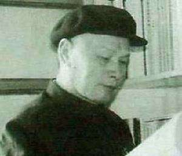
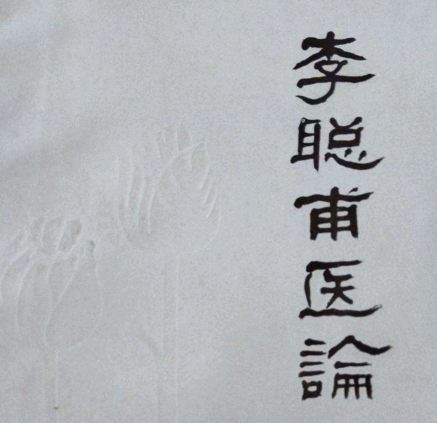

# 光明中医函授大学顾问李聪甫传略

　　1905年5月27日，李聪甫出生于湖北省黄梅县的一个贫穷的小手工业者家庭。他自幼便聪颖好学，但因家贫，读了几年私塾后便辍学了。

　　

　　1918年，年仅13岁的李聪甫，只身来到江西省九江市的中药铺做学徒。在“赵恒兴中药店”，他获得店主的允许，工作之余可以阅读医书。李聪甫白天在碾药槽上干活，深夜便在铺台上看书。如此持之以恒，三年便自学了《药性赋》、[《本草备要》](http://www.gmzywx.com/ProductDetail/2743545.html)、《汤头歌诀》等医学经典。

　　

　　**为了更能步入医林，1922年，李聪甫回到故里黄梅，随县城名医石椿山学医。第一年他学习医术，第二年随师侍诊，第三年即能独立应诊。**

　　

　　1925年，李聪甫在黄梅县“福生祥药号”坐堂行医。当时，正值第一次国共合作时期。李聪甫目睹哀鸿遍野，生灵涂炭，却听到了中国共产党为拯救中国而发出的呐喊，他写下了“尘世几无干净土，传来天外一声钟”的诗句，并以医生身份作掩护，积极参与革命活动。

　　

　　抗战胜利后，李聪甫在长沙定居。为了维护和促进中医药的事业，这一时期他写下了《国医节的感想和展望》、《庆祝国医节的感言》等文章。慷慨陈词，批判废止中医的荒谬主张。中华人民共和国建立后，1950年，某些人又倒行逆施，李聪甫奋笔写下《对余岩〈中医问题处理草案〉的批判》一书，刊行于世，捍卫中医事业。

　　

　　**1956年，李聪甫参加了国务院组织的《全国十二年科学远景规划》的制定工作，并在怀仁堂受到毛泽东主席和周恩来总理的接见。1957年以来，李聪甫就中医药研究的方法和专业人才培养，撰写了《中医研究工作之我见》、《中西医结合创立中国统一的新医学新药学之我见》、《中医应按自身的规律发展》等多篇文章，在国内产生了积极的影响。**

　　

　　自参加国家工作以来，李聪甫先后担任了湖南省人民政府委员，第一、二、五届湖南省人大代表，第三届全国人大代表，长沙市政协副主席，第二、五、六届湖南省政协常务委员，第五届全国政协委员，卫生部医学科学委员会委员，湖南省血吸虫病防治研究委员会副主任委员，中华全国中医学会常务理事，湖南省中医学会会长、名誉会长，《湖南中医杂志》名誉主编等。1988年4月，83岁高龄的李聪甫光荣地加入了中国共产党。

  

​	**光明中医函授大学办校期间李聪甫曾出任光明中医函授大学顾问。**

　　

　　1990年4月，李聪甫逝世于湖南省长沙市。