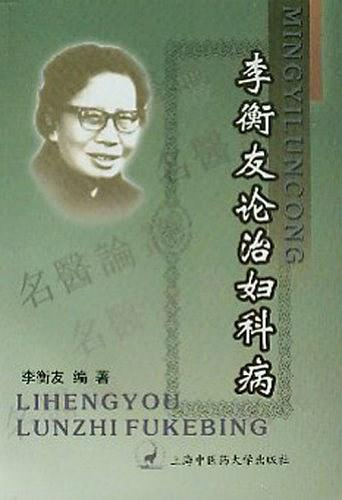

# 光明中医函授大学顾问李衡友传略

李衡友，女，1925年2月生于江西省井冈山。李家世代行医，至李衡友一代，她不让须眉，自小便苦读医书，在长辈的教导下，医术日益精进。

1940年起，李衡友开始在遂川、宁都、南昌等地行医。1955年在江西省妇幼保健医院工作，1959年南京中医学院高教研究班结业。1988年出席中国妇女第六次全国代表大会。1989年，被录入《古今中外女名人大辞典》。1992年获国务院特殊津贴。1994年录入英国剑桥传记中心出版的《世界医学名人录》及《20世纪中国医学首创者大辞典》。

　　

李老从医50余年，专长中医妇科，尤为擅长不孕症、宫血、子宫肌瘤、早期宫颈癌等疾病。她创建了《三品一条枪锥切治疗早期宫颈癌》这样的新疗法，近期及远期疗法良好且疗法简便、安全、高效。

李老重视中西医结合防治研究，注重辨病与辨证相结合。整体与局部相结合治疗原则，著有《李衡友论治妇科病》，另在国家级、省级杂志发表论文40余篇，美名享誉医界。

医术精湛的同时，李衡友也十分重视祖国医学的传承。她曾在江西中医学院兼任教授，1984年[光明中医函授大学](http://www.gmzywx.com/)成立之际，她曾担任总校顾问。