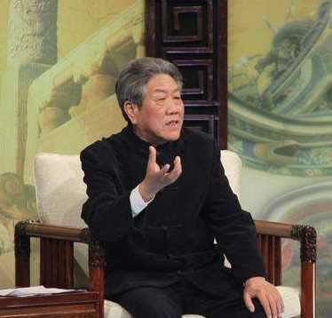

# 樊正伦

樊正伦，原中国中医药出版社古籍研究室主任，现为北京崔月犁传统医学研究中心研究员，北京平心堂中医门诊部法定负责人。樊正伦教授几十年来多方投访当代名医，颇得真传，并且博览中医典籍，对其中经典之作，精熟于心。望闻问切，精细周密，充分领悟古来医圣之道术，遣方用药，挥洒自如，广泛淬取近代名家之精华，是当今不可多得的大医。

1946年，樊正伦出生于一个书香世家，自幼受到中国传统文化熏陶。

1963年，樊正伦赴宁夏支边，在那里，他同当地老中医学习了高超的医术，并开始独立行医。

　　

樊正伦教授以治疗内科疑难杂病见长，尤擅治疗肝胆、心肺、脾胃以及疲劳综合症等疾患，已使上万名患者恢复了健康。

近年来，樊教授还致力于中医学与中医文化的普及与推广，凭借其深厚的中医文化底蕴和丰富的中医诊疗经验，在各类媒体讲授中医文化及中医养生之道。樊教授的讲座不仅能够深入浅出地传授中医养生的基本理念和基本方法，更能让听众深切感受和领悟中医学以及中医文化博大精深的独特魅力。

樊正伦老师是光明中医教材《中医药学概论》的编者之一。
