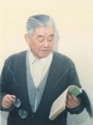
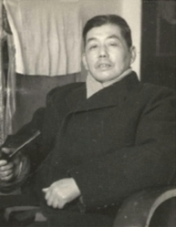

# 光明中医函授大学顾问江育仁传略

江育仁，1916年11月20日生于江苏省常熟市白茆镇山泾村。早年间在乡村学校和私塾读书，17岁拜入儒医李馨山门下，结业后在当地悬壶。

但他初入杏林，阅历不深，缺乏临床经验。再及当时小儿时病流行、危重病多，又有同行排挤，声誉逐渐低落。于是下决心奔赴上海中国医学院再求深造，并追随当地儿科名医徐小圃先生学习儿科专业。

　　

1938年，江育仁从上海中国医学院毕业，回到家乡常熟白茆镇再次开业行医。当时，儿科痧、痘、惊、疳等疾病横行，他运用在上海学来的临证经验，屡起沉疴，一时间声名鹊起。

1954年底，江苏省中医院正式挂牌，江育仁到院挂职。1955年3月，江苏省中医进修学校正式成立。江育仁作为建校初期的元老之一，他一面在大内科上班，一面负责筹组儿科，编写教材。直到1956年4月，他所参与教学的江苏省中医学校第一期医科进修班毕业，有优秀学员留校工作，儿科才正式开张挂牌。

上世纪五十、六十年代，麻疹及合并肺炎、喉炎、脑炎，流行性乙型脑炎，疳证等儿童传染病高发。1955年开始，江育仁即与南京儿童医院、南京传染病院、原南京医学院附院儿科等协作，除相互会诊，定期举行学术讲座外，还派科内技术骨干常驻有关协作单位儿科，具体管理病床，以中医药为主进行治疗观察，不断总结经验。先在南京传染病院设立中医病房医治麻疹肺炎、流行性乙型脑炎等。接着便在江苏省中医院儿科病房每年冬春季节专门收治麻疹合并症、夏秋季节专门收治流行性乙型脑炎，长达十余年，成为南京中医学院本科、西医学习中医、中医进修班同学实习温病学的重要基地。

　　

江育仁教授从事中医儿科医疗、教学、科研工作60多年。对小儿脾胃病及急性热病等有深 刻的研究，尤其擅长于小儿麻疹、流行性乙型脑炎、疮证、哮喘、反复呼吸道感染、癫痈等疾病的诊治。他善于通过大量的临床实践，总结提炼，提出了在现代儿科学术发展史上有重大影响的“脾健不在补贵在运”、“流行性乙型脑炎从热痰风论治”、“小儿疮证分疮气、疮积、干疮证治”、“反复呼吸道感染不在邪多而在正虚”等具有创新意义学术观点。

1984年，江育仁在光明中医函授大学担任了顾问一职。

2003年，江育仁教授去世，享年87岁。