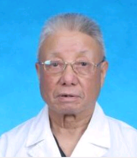
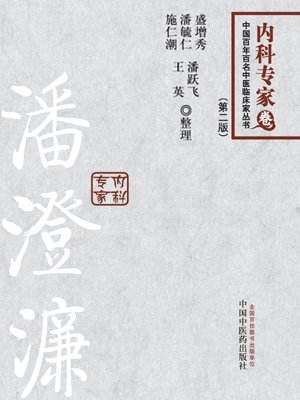

# 光明中医函授大学顾问潘澄濂传略

　　潘澄濂，1910年出生于浙江省温州市的普通工人家庭。温州地处东南沿海，常有急性热病发生，当地名医对此多有经验，深受敬慕。受此影响，潘澄濂中学毕业后便选择了中医这一职业，进入了上海中医专门学校学习。在丁甘仁、谢利恒等名师的指导下，他对[《内经》](http://www.gmzywx.com/NewsDetail/1123168.html)、[《伤寒论》](http://www.gmzywx.com/NewsDetail/1130351.html)、[《金匮要略》](http://www.gmzywx.com/NewsDetail/1131129.html)等医籍进行了系统的学习。此外，还广泛阅读了《东垣十书》、《河间六书》、《丹溪心法》等医著，对中医知识有全面的积累。

　　　　

　　当时，西医在中国发展迅速，对传统医学的冲击很大。中西论争，日趋激化。在此氛围中，他一面沉浸于中医海洋之中，撷取精华，以为根本。一面挤时间去西译学院旁听学习西医知识，进行解剖、生理、病理实验。后又阅读西医医书，他钻研中医之志弥坚，中西兼收，各取所长，为后来能取得突出的成就打下了坚实的基础。

　　

　　1929年毕业后，年仅20岁的潘澄濂踌躇满志，回到温州开办诊所。同时还参加了某医务所的工作，所中设有病床40多张，收有伤寒、疟疾、痢疾、肺炎、肺结核、肾炎、溃疡病、肝硬变等各种急慢性病例，除用西医药抢救外，其余大都采用中医治疗。

　　

　　1938年春，潘澄濂抵达上海，开始在上海中医学院和中国医学馆任教，同时为人治病。诊治中他善于总结，颇多真知。他常说，中医诊治，通过四诊的方法，识证辨性是提高疗效之关键。

　　1956年6月，浙江筹建中医研究所，潘澄濂被邀到杭州，负责组建工作。在他和同道的努力下，浙江省中医药研究所于1958年7月正式成立。他十分重视科学实验研究，亲自制定了乙型脑炎、肝炎、铅中毒、白血病及晚期血吸虫病等项目的科研计划，从科研设计到观察病例、论文总结，均亲自参加。

　

　　　　

　　潘澄濂教授是一位医德十分高尚的名医，在1985年做过胃癌手术后，他仍然坚持每周两个下午坐诊，他总说：“病人等着看病呢。”

　　

　　1993年，潘澄濂教授去世，享年83岁。

　　

　　潘澄濂教授去世15年后的2008年，一位75岁高龄的病人郑先生因咳血来找继承了潘澄濂衣钵的孙女潘跃飞，他曾在1960年受到潘澄濂的医治，48年内都未曾再次咳血。郑先生拿着一张1960年潘澄濂教授手写的药方，询问潘跃飞这张药方还能不能用。不久，在潘跃飞的帮助下，时隔48年，郑先生又一次恢复了健康。