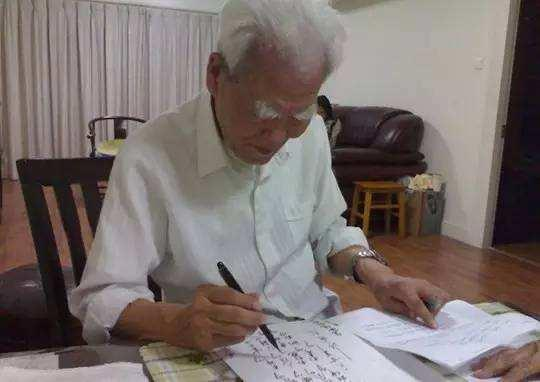
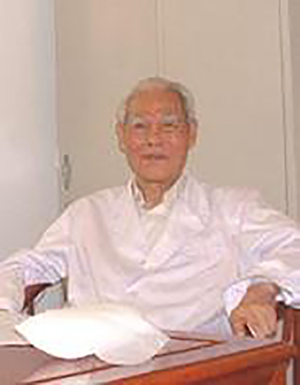
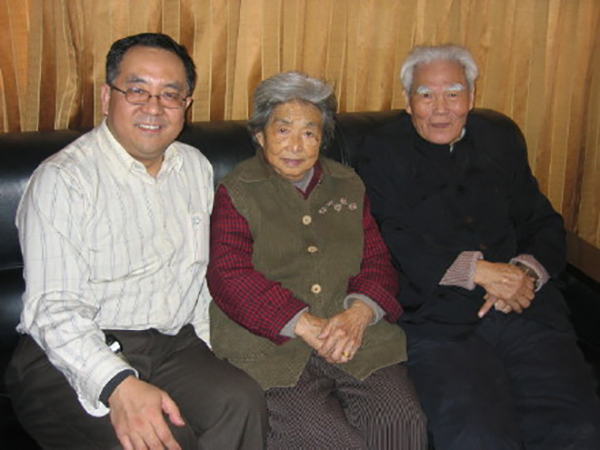

# 光明中医函授大学顾问焦树德传略

焦树德1922年5月31日出生在河北省束鹿县（现改为辛集市）双柳树村一个耕读传家的中农家庭。自幼酷爱医学，上小学时也常向当中医的外祖父学背一些中医歌诀，如“肝心脾肺肾，胆胃大小肠”，“医之始，本岐黄”等，学医救人的愿望就这样萌发了。

焦老于1991年10月应国家中医药管理局邀请有在人民大会堂参加了全国挑选的五百名老中医药专家收徒拜师大会。1992年4月被北京市科学技术委员会评为“科技之星”，消息在《北京日报》头版发表。自1990年享受国务院颁发的“特殊津贴”。1994年被收录于英国《剑桥国际名人辞典》。

1937年7月后，由于日寇侵华，学校也停办。焦老即在家乡跟随其外祖父学习中医，广泛涉猎古今医学名著，学习药物炮制，如熬膏药、轧药、炒药等，打下了深厚的中医学基础。

到了1940年，为了更好地求学，他又到本市万亿粮店作帮账先生而半工半读，考入天津“中国国医函授学院”，系统学习中医，同时受新文化运动的影响，又考入天津西医专门学校（后改为新医专科学院）通过函授学习西医。

1941年，他正式在家乡悬壶行医，在诊所“济生堂”内挂上了“树德为怀”的横幅，并将自己原来的名字“焦聚辉”改为“焦树德”。从那时起，精研岐黄、济世活人就成了焦老一生的追求。

后来，为了能更好地对医学有所深造，他卷起家当，来到北京。

1950年春，在北京前门内大中府与其表姐夫杨长谦先生合开了“慈德中医诊所”，由于治愈了不少疑难病人，深受群众和当地铁路工人的欢迎。

1951年，焦老通过北京市卫生局举行的“高级医师考试”，积极响应政府号召，毅然关闭了收入颇丰的私人诊所，成为一名国家医务人员，进入北京市立第二医院工作。从1977年起，焦老就担任起了中央首长的医疗保健任务。1984年4月，卫生部成立北京中日友好医院，焦老奉调筹建该院中医内科。

1958年秋，到北京中医学院工作共27年。历任内科教研室讲师、副主任、副教授、教授，附属医院内科主治医师、副主任、副主任医师、主任医师，中医学院学位评定委员会委员、研究生毕业论文答辩委员会主任委员、研究生导师等职，培养了三届硕士研究生。

1981年，当选为北京市东城区第七届人民代表。

1984年春，奉调到中日友好医院任中医内科副主任。

1984年冬被评为全院“先进个人”。

1985年夏，任中日友好医院专家室副主任。

1986年，荣获中华人民共和国卫生部授予的“全国卫生文明先进工作者”称号。

焦老擅治内科疑难重病，疗效卓著。对肝胆、泌尿系统结石注重增强本脏功能排石。对萎缩性胃炎、溃疡病（胃脘痛）采用自拟的三合汤、四合汤随症加减，不但能愈胃痛，而且胃镜检查也可见明显好转或溃疡愈合。对冠心病、心肌炎、心绞痛（心痹），采用心、肺、胃、肾同治，理气、通脉、助阳、涤痰并用，颇有良效。对中风（急性及血管病），应用家传中风三法，认为邪中于经，常归于腑，必须注意清化阳明，通达三焦。对再障贫血及出血性疾病，重用滋肾凉血、降气抑火而生血止血。对高热不退疾病，谨遵“见热莫攻热”古训，活用清、疏、滋、降、和等法，以解热。对休克、厥症、人事不省诸疾，辨证治本，效如桴鼓。顽症危症，每每着手成春，深受患者拥戴。

焦树德教授于2008年06月14日因病于北京逝世，享年86岁。