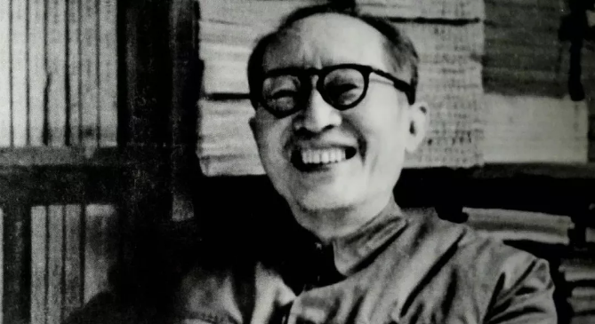

# 光明中医函授大学副校长王伯岳传略

王伯岳，字志崇，1912年生于四川成都。是当代著名中医药学家，中医理论家、教育家、中医儿科学泰斗。　

王伯岳生于医学世家，祖上三代从医。父亲王朴诚精专儿科，医术高超，成都父老称他为“王小儿”。王伯岳自幼聪颖，**6岁便跟随名儒刘洙源学习文史，16岁时他正式学医，在成都“两益合”药店做学徒，接触了无数医书及处方。三年后，他又拜入名医廖蓂阶门下受其真传。而后，他每日上午随父诊病断证，下午听廖先生授课，由此打下了扎实的中医功底。**

　　

1955年，王伯岳奉调进京，担任中国中医研究院学术秘书，后又历任数职。其间他仍不忘悬壶行医，不久便把王家医术的盛名从成都传到了北京，被北京民众誉为“小儿王”。

王伯岳精于辩证，对小儿疾病主张“三分医药，七分调理”。他主编的《中医儿科学》是我国第一部中医儿科专著；他领头创建了中华中医学会儿科专业委员会，开创了我国中医儿科学术新局面。

**1984年，光明中医函授大学在全国政协礼堂正式成立，王伯岳荣任副校长，为新中国的民间中医教育尽到了一份力。他曾为光明函大主编的《光明中医》杂志撰文，**文中说：“培养中医专业人才既是当务之急，又是发扬我国传统医学，为人类造福于千秋万代的事业。共同的事业共同办，群策群力，万众一心，有党的领导，群众的支持，我们这所大学一定能发扬传统，继往开来，一定能使中医的前途更加光明！”

1987年6月28日，王伯岳突发脑溢血去世。就在当日上午，他仍然在接诊看病。王伯岳老人的逝世，是中医界的一大无可弥补的损失。他为中医复兴所做的努力，会永远铭记在后来人心中。