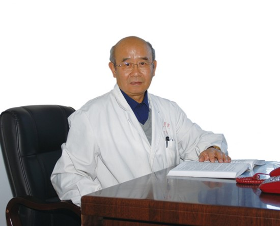
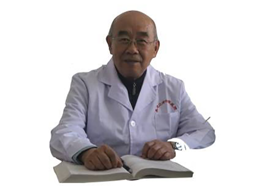

# 光明中医函授大学顾问王克勤传略

王克勤，男，1941年生。黑龙江省中医研究院研究员、主任医师，教授，黑龙江省名中医，国务院“政府特殊津贴”终身获得者，从事中医临床、科研、教学工作至今40余年。中国中医研究院研究生毕业，我国首批中医硕士学位获得者。

他1941年3月出生，山东省肥城市人，汉族，中共党员。1960年包头工业专科学校毕业，1961年南京航空学院肄业，1966年牡丹江中医班提前毕业，走“6.26”道路至850农场医院，1971年调回牡丹江医专从事中医教学与临床，1979年考入中国中医研究院研究生班师从方药中教授，1981年研究生毕业并获硕士学位，1982年起省祖研工作至今。研究员、主任医师、硕士生导师，享受国务院政府特殊津贴。曾任省祖研副所长、省中医研究院副院长，1988年辞“官”而专心业务。曾任[光明中医函授大学](http://www.gmzy.org.cn/)黑龙江分校常务副校长、省中医药学会副秘书长、《中国中医药科技》常务副主编兼编辑部主任、中医心理学研究室主任、中医文献研究室主任、老年病科主任、疑难病科主任等职。现任世界中医药学会联合会中医心理学专业委员会名誉会长并荣获学术贡献奖，此外还兼任中国民间中医药协会中医心理学专业委员会主任委员、中华中医药学会亚健康分会理事、国家自然科学基金项目评审专家、国家中医药管理局《中国中医药年鉴》编委、中华医学会《国际中医中药杂志》（原《国外医学中医中药分册》）编委、省药品审评委员会委员、哈市心理学心身医学研究所名誉所长、《上海中医药大学学报》及《光明中医》等多家学报、杂志编委等职。

以“大医精诚”为座右铭，40年来致力于中医医教研。理论功底深厚，尤精于《内经》，溯本求源探究精蕴，并用其发蒙解惑于现代临床，法古而不泥古。曾为全国针灸经络研究班及数届研究生、留学生讲授《内经》，理论联系实践，颇受欢迎。以中医心神理论为研究重点，系统整理了《内经》中有关“七情”理论及心理学方面的论述，提出“中医神主学说”，强调“形神合一”整体观思想及“神”在生命中的主导作用；提出中医心理学基础“六论”（形神合一论、心主神明论、心神感知论、五脏情志论、阴阳睡梦论、人格体质论），奠定了《中医心理学》的基础理论框架；总结了“七情辨证”的方法和步骤，以指导情志疾病的辨证论治。多年来与国内外同仁致力于“中医心理学”的学科创建，是新学科的主要倡导者。临床专长于心身疾病的治疗，主张“治病先治人，治人先治心”，在“形神合一”整体观及《内经》“治神”思想指导下，药物和心理治疗相结合。后者常用心理疏导和情志调节法，前者则在辨证论治的基础上常用调肝顺气解郁法。认为“气郁”为“六郁”之首，在当代疾病谱中已成为“百病之长”，“郁”可致“乱”，又可化热、致瘀，变化多端，由此百病丛生，故治疗应顺畅气机，以防“郁”生他变。顺气解郁应调肝，调肝又有虚实两端，实则疏肝、泻肝，虚则柔肝、补肝，临床必须明辨，方可免“虚实”之虞。这一经验用于临床疗效显著。

曾获国家中医药管理局科技进步二等奖1项、省中医药科技进步二等奖1项、地区科学大会优秀成果奖1项。出版专著《中医神主学说》，主编《中医心理学》（日文版《中国汉方心身医学》）、《中医临床大全（内科）》、《老年中医养生》、《中医适宜技术手册》等，并应邀参编《中华气功大全》、《中华医学望诊大全》、《现代中医内科学》等并任编委，在期刊杂志及国际、国内学术会议上发表论文、译文150余篇。