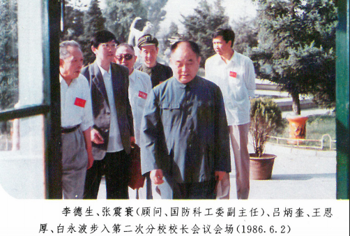

# 光明中医函授大学校长王恩厚传略

　　2016年11月19日，纪念老红军王恩厚诞辰100周年座谈会在北京举行。王恩厚的家人，生前好友及家乡代表等百余人参加，共同缅怀这位为新中国创立和中医建设立下过汗马功劳的老红军。王恩厚曾是红军队伍中的军医，他曾多次参加重大的兵团作战，创造了许多战场疗伤的奇迹；建国后他仍坚守在医疗岗位上，无私地为国家奉献；即使在离休后，他仍从事公益活动，**担任了光明中医函授大学的校长，为民间中医学校奉献余温。他为祖国和中医事业奉献了一生，这样的精神可叹又可敬。**

　　

　　1917年1月，王恩厚出生于湖北麻城。他生在贫困的农家，自幼艰苦度日。因为生活太过贫苦，13岁他就离开家乡参加了红军。

　　

　　在队伍中，他当过事务员，做过机枪手。后来当上了军医，还做上了卫生队长。1933年他正式入党，17岁时，他就已经担任了红四方面军第三十军八十八师的卫生部长。他随着这支西路军长征，三度越过雪山和草地，最终参与了红军三大主力的会师。

　　

　　1937年西路军不幸失败，建制被敌人打散。王恩厚同其他战士一面乞讨，一面坚持与敌人游动作战，最终却还是被俘。可喜的是没过多久，战士们又进行越狱逃出了生天。

　　

　　返回延安的王恩厚重新在医疗岗位任职。1944年，王恩厚担任冀中军区卫生部副部长，在艰苦卓绝的冀中平原游击战中，他领导组建了地下医院，地道医院，苇塘医院等特殊时期的特殊医院，隐蔽地救治了大批伤员，为抗战胜利做出了重要贡献。次年，他又担任晋察冀野战三纵队卫生部部长，先后在绥远、大同、石家庄等战役中救治、转移伤员。1948年在石侠和古北口的战斗中，他当机立断，转移了大量伤员脱险，因此而受到通令表彰。

　　

　　解放战争中，王恩厚任天津军管会卫生接管处总支书记，1938年冬季天津解放时，由他接管了天津市卫生单位，保证了战后天津市内的稳定。建国后，他进入中国医科大学深造，4年后以优异的成绩毕业。1950年他又参加了抗美援朝的战斗。抗美援朝结束后，**王恩厚担任了第一军医大学副校长，后又升任校长。1955年，王恩厚被授予大校军衔。**

　　

　　1958年，王恩厚随第一军医大学集体转业，担任吉林医科大学的校长兼党委书记。60年代，他率领中国政府卫生代表团先后出使朝鲜和缅甸，对国家间的医学交流做出了贡献。

　　

　　1977年，他出任中国中医研究院党委书记，当时正值“四人帮”被粉碎，中医事业百废待兴之时。他着手将研究院的工作重点转移到科研工作上，提出"以科研为中心，医疗基础，多出成果，多出人才"。他的工作为中医的恢复和发展奠定了基础。1983年王恩厚离休后，参与了许多社会公益活动。1984年，在民间的中医学校——光明中医函授大学任校长、名誉董事长，不断地发挥着余热。

　　

　　2005年8月，王恩厚病逝，享年88岁。