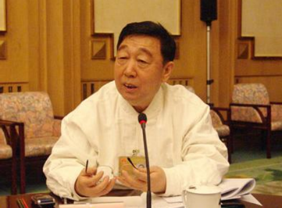

# 光明中医函授大学顾问王永炎传略

　　王永炎，中医内科专家，教授，主任医师。1938年生于天津。

　　1962年，王永炎毕业于北京中医学院，而后从事中医内科医疗、教学、科研近50年，主要的研究方向是中医药防治中风病与脑病的临床与基础。他针对中风病急性期痰热症、痰热腑实证而研究设计的化痰通腑汤与清开灵注射液静脉滴注疗法，提高了临床显效率，减轻了病残程度，目前在全国范围内被广泛应用于临床。

　　毕业二十年后，王永炎又重返母校，就任北京中医药大学校长，虽然他是第一批用现代教育方法培育出来的中医，但他始终念念不忘，在毕业之后和一代中医名家董建华的那段师生之缘。

　　董建华是如何带徒的呢？

  一开始就强调养成教育，从要求写字，再到要求抄稿子，每天都能抄一万字以上。在培养王永炎如何接待病人，如何对人对事，董建华和王永炎建立了深厚的师生感情。这种感情在跟随老师一块工作，在向老师学习的过程中不断地加深着。王永炎一直认为，他能够在行医生涯中取得相当的成就，有很大程度上都是因为受惠于几位前辈老师的提携。

　　董建华在六十几岁的时候还精力充沛，但他把自己的位子提名让王永炎去坐。王永炎自己都有些担心挑不起这个担子，但老师鼓励他，认为只要认真去做，团结同事，就可以把工作做好，这件事令王永炎感触颇深。当年在董老师门下受教的王永炎，如今已经是20多名医学博士的导师。作为承上启下的一代人，王永炎常常感叹说，任重而道远。

　　**中医药的现代化和中医药走向世界的任务是繁重的，它不是我这一代人能完成的，但是我这一代人起步了，同时应该奠定一个良好的基础，让后人延续着这条正确的方向往下走，一定会有一个好的结果。**