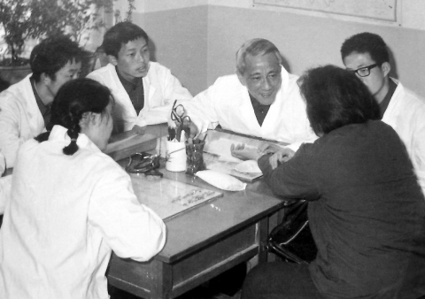
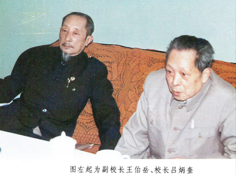

# 光明中医函授大学副校长王绵之传略

**国医大师王绵之生于1923年，是江苏省南通市一个中医世家的第19代传人。**

王绵之的父亲王蕴宽是上世纪20年代南通地区家喻户晓的名医。王绵之15岁便开始随父亲识药辨病，接待病患，背诵汤头本草，积累了丰富的中医知识和临床实践。四年后，年仅19岁的王绵之便正式挂牌行医。他医术精湛，很快便声名鹊起。

　　

中医历史十分悠久，但数千年来中医只有本草学，方剂及理论散于各家著作中，并没有系统的方剂学。而这项空白，就是王老在上世纪50年代填补的。

1947年，他通过国家考试获得了合格的中医师证书。1955年，又以优异的成绩考入江苏省中医进修学校。学习一年后，直接在校任教，并且筹建方剂教研组。开始创编、审定《中医方剂学讲义》等多部中医教材。1957年7月，王绵之又到北京中医学院担任了方剂教研室的主任。

在长期的教学和实践中，中医方剂学在他手中逐渐成型，形成了系统化的理论体系，成为了一门独立的学科。

方剂学创立后，被视为现代中医药教育的必修基础课程。方剂学科的建立，沟通了中医和中药，衔接了传统中医和现代医学，为中医院校培育中医药人才开创了一种全新的途径。

从教学大纲的制定，到[《方剂学》](http://u141711.ish168.com/ProductDetail/2750868.html?&view=1)教材的编写，王绵之倾注了大量心血。他用多年的教学经验总结出一整套中医方剂学的教学方法，培育了无数精英学子。

我国的中医教育一直是王老放不下的心头之忧，他对人说，中医院校教育这么多年，培养了不少中医人才，还是成功的，但是不完善，  必须要有再教育、后续教育、以及自身的学习提高来进行补充，这甚至要比前期的教育更重要。中医教育不能只靠中医院校，还要靠政府行为和社会力量，还有中医自己。

**1984年，王老出席光明中医函授大学的成立大会，担任了光明函大的副校长。他曾经为中医方剂学撰写的教材，也部分被光明函大的教材沿用。**

　　

2008年12月，王老被北京市授予“首都国医名师”的称号。

2009年5月，由人力资源和社会保障部、卫生部、国家中医药管理局联合授予王老首届“国医大师”称号。

2009年7月，王老因病医治无效在北京不幸逝世，享年86岁。

生前，王老曾对人说，**中医不要怕别人反对，关键是自己站得直不直，中医自己要争气。治好疑难病，不是为自己出名，而是为中医争光**。

今天的我们不难看出，这段话中蕴藏着的力量。