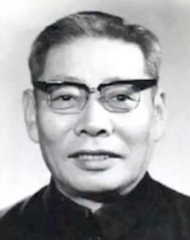

# 光明中医函授大学顾问王鸿士传略

王鸿士，1919年生于河北省武清。自幼承袭家学，攻读医书，15岁即随父应诊。1940年，他考入北平国医学院学习。1944年毕业后，拜四大名医之一孔伯华为师，同时又拜前清御医瞿文楼为师，尽得二老真传。1952年，王鸿士主持创办石景山衙门口联合诊所，很快便誉满当地。1956年，调入北京中医院内科，后历任主任医师、内科副主任、北京市中医研究所副所长等职。

王教授医术精湛，学识渊博。十分推崇张仲景“勤学古训，博采众方”之旨，并身体力行。在临床、教学方面都要求言之有据，强调诊疗技术须有功底，要**“勤学古训，学有渊源。”他师古而不泥训，主张医学要发展、学术要交流、剂型要改革，不能固步自封。**他长期从事临床、教学工作，积累了大量宝贵经验；述而有作，治学严谨，惜墨如金；效张石顽著《张氏医通》历数十年多易其稿，从不轻率下笔。经反复推敲总结整理发表的多篇论著均为精品，被选入《北京市老中医经验选编》等专著中。在院继承人有郭世滋、许信国、姚书香、王国玮等人。

[**光明中医函授大学**](http://www.gmzywx.com/NewsDetail/1078385.html)**办学期间王鸿士曾担任顾问**

1985年，王鸿士去世，享年66岁。