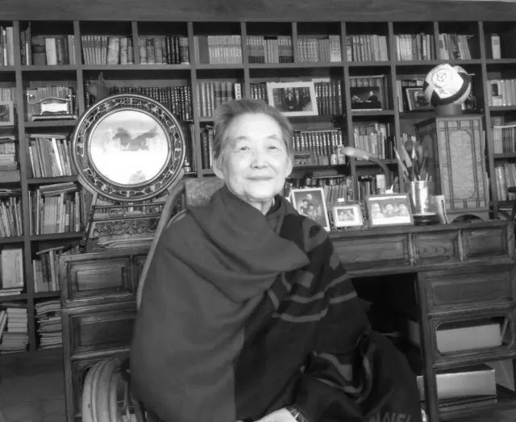
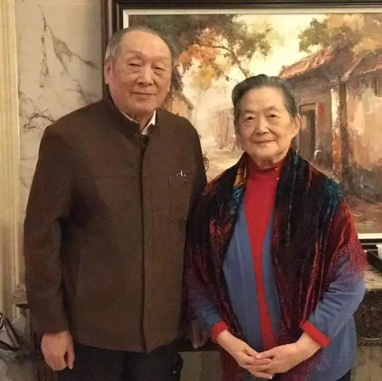

# 光明中医函授大学顾问盛亦如传略

盛亦如，女，1935年4月生，浙江省萧山市人。1959年毕业于华东师范大学中文系，生前是北京中医药大学医史学教授,兼全国高等中医药教育研究中心特约研究员。曾获国家人民教师奖章，全国教育系统劳动模范、北京市优秀教师、“三八”红旗手等称号，享受政府特殊津贴。

她是学者，是教育家。她热爱教育事业，投身教育事业30年以来，执着的探索教育规律，锐意改革教学，热忱关注青年一代的全面成长。在医史教学中，她成功地运用多种结合的方法，融传授知识、培养能力、塑造人格于一体，形成了“在育人中教书，通过教书来育人”的教育思想和独特的教学风格，使“教书”与“育人”均获明显效果，学生称颂她：“给我温暖，为我照亮”。

在北京与全国各地作数十场关于“教书育人”和“高校师生关系研究”的报告，反响热烈。学术上，看重于中国医学文化史，中医教育史的研究。首次为研究生开设《中医教育思想史》课程。主持过三项国家教委、国家中医药管理局科研项目。主要论著：论文《中医与中国文化》、《论中医传统教育》、《教师的天职》等40余篇。著作《医古文基础》、《中国医学史》、《医学伦理学》等10余种。

2017年8月22日，盛亦如教授在北京病逝，享年82岁。