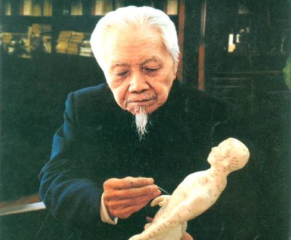
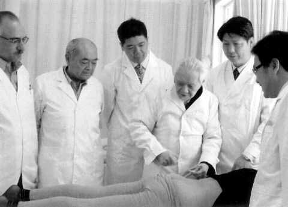

# 光明中医函授大学顾问程莘农传略

　　1921年。程莘农出生于江苏省淮安市一个书香门第，他是父亲程序生的老来子，程序生是一个思想进步的知识分子，老来得子的他决心把儿子培养成栋梁之才。

　　

　　当时西学繁盛，程序生本想送儿子出国留洋。但在程莘农6岁那年，一场横行当地的瘟疫令程序生改变了想法，他决心让儿子学医治病，悬壶济世。

　　

　　从那之后，程莘农开始随父亲接触中医的基础知识。同龄的孩子们还在做游戏的时候，小莘农已经能滚瓜烂熟地背诵数本医书了。

　　

　　程莘农进步飞快，程序生喜上眉梢。儿子16岁时，程序生为了他在医学方面的发展，不惜花了500大洋让儿子拜温病大家陆慕韩为师。

　　

　　陆慕韩在江苏威信很高，治愈过的病人不计其数。在陆慕韩门下，程莘农不但学到了高超的医术，更被老师的医德医风深深地感染了。

　　

　　无论患者是达官贵人还是贫苦佃户，无论病患的酬金是大洋还是铜子儿，陆老都一视同仁。陆老常对程莘农说：“救人如救火，有时候医生迟到片刻就会出大问题”。在陆老的熏陶下，这崇高的医德融入到程莘农心中，影响了他后来的一生。

　　

　　1939年，日军侵略江苏，陆老的家产被抢掠一空。陆老气恨交加，数月后带着愤恨离开了人世。

　　

　　陆老去世半月后，几位学友来找到程莘农，希望跟随老师最久的他继承老师的衣钵，在当地悬壶，造福百姓。这一年，程莘农正式挂牌接诊，开始了自己长达半个世纪的行医生涯。

　　

　　解放后，中医终于迎来了自己的春天。28岁那年，程莘农考入江苏省中医学校。毕业后，校方把针灸教研的工作分配给了他。可针灸对于程莘农来说是一个完全陌生的领域。一开始，他并不了解针灸的功效，对针灸也毫无兴趣，不过工作的需要，使他开始专研这门学问。

　　

　　程莘农在图书馆研读了大量针灸类的经典书籍。通过实践研究，程莘农初步掌握了针灸的治疗手法，并治好了数位病人。随后，他将全部精力投入到对针灸的专研之中，开始专门用针灸为病人诊治。随着针灸功力的增长，他的声名日隆。1956年，刚刚成立的北京中医学院邀请他到校担任了针灸教研组组长。

　　

　　1966年开始的文化大革命中，程莘农被污为反面教员，遭到了残酷的批斗。他拒不承认“罪行”，被押往外地，接受劳动改造。

　　

　　**得到平反后，程莘农继续进行中医工作。他总结了在针灸界流传的108种针法后，独创了带有“程氏”特色的三才法。他用三才针法治愈的患者多达数万人。**

　　

　　1994年，程莘农当选为首批中国工程院院士。1998年9月8日，程莘农被国家聘任为中央文史研究馆馆员，国务院总理亲自为他颁发了聘书。2000年，程莘农当选为中国中医研究院名誉院长。直到2006年，已经80多岁高龄的程莘农院士仍然坚持每周一、三、五到中医研究院针灸所出诊。

光明中医函授大学办校期间程莘农出任光明中医函授大学顾问。

　　

　　2015年5月，程莘农逝世，享年94岁。