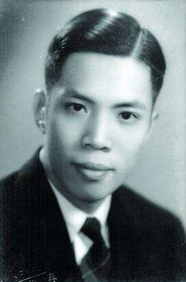
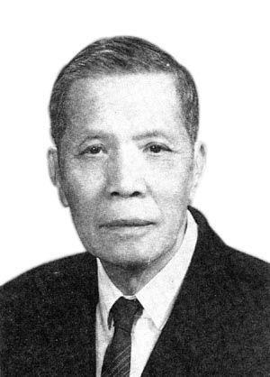

# 光明中医函授大学顾问罗元恺传略

罗元恺，中医学家。多年来从事中医医疗、教学和科研工作，培育了数代中医人才。他勤于著述，于国内外都享有较高的声誉。

1914年，罗元恺出生于广东南海县。他出身书香世家，父亲以儒通医，使罗元恺从小就对中医产生了一定了解。

　　

1930年，罗元恺考入广东中医药专门学校。五年的学习过程中，罗元恺勤奋学习，诵读了内经、难经、伤寒论、金匮要略等经典著作，对中医学有了深入的理解。他与同班十位同学组成“克明医学会”，共同研讨学习中的疑难，撰写医学论文，以互相交流启发。其后还出版了一本中医杂志《克明医刊》。经5年的研修与临床实习，1935年罗元恺以总成绩第一毕业，并留任该校附属的广东中医院任住院医师。先后在门诊及病房诊治病人，以内科为主，兼顾妇、儿科。从1935年至1938年末，他在医院处理了各种疑难重症，为其后来出色的临床诊疗打下了牢固的基础。

1938年10月，日军进犯广州，罗元恺携家人辗转抵达香港避难。次年，广东中医药专门学校迁至香港授课，他受聘为金匮要略教师。

1941年底，香港沦陷，学校停办。1942年初，罗元恺举家辗转前往韶关市开业行医，次年又与母校校董及校友共同筹划复办中医学校，然而即将开课之际，日军又拟进犯韶关，复校之事告吹。罗元恺被迫转往广东西北部的连县开业诊病，并与当地老中医赵伯平联合创办“连县中医讲习所”，继续在当地授业。在抗战期间，虽然颠沛流离，生活艰难，但他仍执着于中医教育事业，为培育中医后继人才贡献力量。

抗战胜利后，罗元恺返回广州，与校董、校友取得联系，并于1947年秋重新开办广州中医药学校，罗元恺任儿科教师。

建国后，罗元恺积极从事中医教学工作。1950年4月，36岁的罗元恺就任广东中医药专门学校校长。1951年，还兼任了附属广东中医院院长。为了学校和医院的建设，他废寝忘食、夜以继日的工作。在课程设置、教学方法、医疗质量、学生管理等方面事必躬亲，同时广纳人才，使学校和医院的工作很快走上正轨，得到发展。

　　

罗元恺22岁开始行医，50多年来一直没有脱离临床。早年主治内科杂病和温病，稍后兼治儿科，中医学院开办后，专于妇儿科，最近20多年更专于妇科。在担任院校教学行政职务期间，虽然行政工作繁忙，社会活动频繁，仍坚持每周安排一定的时间应诊和查房。他在长期的医疗实践中积累了丰富的临床经验，为无数的病人治愈了顽疾，解除了痛苦。

罗元恺教授毕生都从事于中医教育，1984年，他担任了[光明中医函授大学](http://www.gmzywx.com/)的顾问一职。

1995年2月，罗元恺教授病逝，享年81岁。
