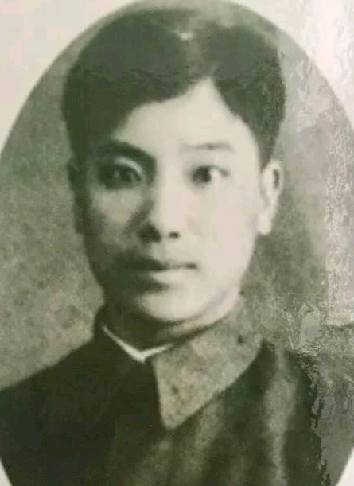

# 光明中医函授大学顾问茹古香传略

　　茹古香，1914年出生在河北抚宁县的农村。1927年，年仅21岁的茹古香随父亲到锦县的一家钱号当学徒，后来又到鞋铺李学做鞋。1931年，他进入锦县中学读书，1934年，考入锦州师范学校。毕业后，他考取了南满医科大学制药专业。

　　

　　1938年，茹古香暑假回乡，得知冀东一些地方正准备举行抗日武装暴动，遂与有爱国思想的伪乡长“自卫团”团总许维纯联系，共同筹划在七家寨村发动的抗日武装暴动。

　　

　　很快，茹古香与许维纯组织140余人在七家寨村发动起义，建立临抚抗日游击大队，许维纯任队长，茹古香任副队长。暴动队伍当夜便攻占了台头营镇。起义胜利后，茹古香说服游击大队投靠了八路军。从此，茹古香便开始在我党的指导下进行工作，游走于前线和敌后，成为了一名光荣的革命斗士。而他在学校中所学的专业医术，也在他日后的工作中发挥了很大的作用。

　　

　　1947年，茹古香调任锦县县长，后任中共锦县工委书记，领导了当地轰轰烈烈的土地改革运动。1948年10月，担任锦州市人民政府办公室主任兼卫生局局长。1949年5月，任辽西省卫生处长，后升任卫生厅副厅长。

　　

　　1954年6月，茹古香任辽宁省卫生厅党组成员兼办公室主任。1958年受命筹建辽宁省中医学院。1962年5月，任辽宁中医学院副院长、院长兼学院党委副书记。

　　

　　1984年，担任了[光明中医函授大学](http://www.gmzywx.com/NewsDetail/1137094.html)的顾问一职。

　　

　　1990年8月，茹古香去世，享年76岁。