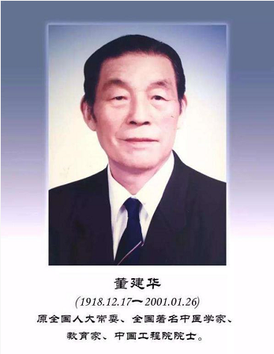

# 光明中医函授大学顾问董建华传略

　　1918年12月17日，董建华出生在上海市青浦县的一个中医世家。他的曾祖父是一位中医眼科大夫，外祖父是秀才出身的儒医。17岁时，按照父亲的安排，董建华拜上海名医严二陵为师。严二陵是驰名沪、江、浙一带的中医大家，不仅擅长内科，对妇儿杂症也有独到之处。在随师应诊的过程中，董建华虚心刻苦。随诊之余，他苦读[《内经》](http://www.gmzywx.com/ProductDetail/2743547.html)、《难经》、[《伤寒论》](http://www.gmzywx.com/ProductDetail/2743554.html)、[《金匮要略》](http://www.gmzywx.com/ProductDetail/2743549.html)等经典著作，每读一书，他都要摘录，结合临床实践写出心得体会。遇到疑问，便虚心向老师及师兄求教。日积月累，不仅学到了老师临床诊治疾病的经验，而且掌握了中医理论，深得老师的真传。他知道，要想在学术上有所成就，必须广开思路，集思广益。因此，他一面精益求精地探索严先生的学术思想，同时博采众家之长，广泛收集名家验案，临证加以运用、比较，开拓了自己的思路，为逐渐形成自己的学术风格打下了基础。

　　

　　1942年，董建华返回故里，开业行医。他一面为患者诊治，一面在秦伯未开办的中医函授学校深造。当时正值抗日战争时期，社会动乱，百姓生活困苦，天花、霍乱、伤寒等传染病流行。董建华不计报酬，无论穷富，精心为患者治病，积累了极丰富的经验。

　　

　　**中华人民共和国成立以后，为培养更多的中医人才，于1956年在北京、上海等地成立了中医学院。董建华作为中医专家及师资力量，被调至北京中医学院工作，他将全部心血和精力都投向中医教育事业。当时中医学院尚无完整的教材，他率先组织教研室教师编撰了《温病学讲义》及《伤寒论释义》，并参加了全国《中医内科学》的统编教材的编写，进行了开创性的工作。**他根据中医学的特点，提出中医学院学生应早临床、多临床才能真正掌握中医学的要契的想法，并身先士卒，带领学生深入矿山、农村、医院实习、调查，使学生站在医疗工作的第一线，思想、医德和技术得到了很好的锻炼，培养了一批既精通理论又有很高的临床技能的中医人才。这批学生走上了工作岗位后，相继成为全国各省市的中医骨干力量，其中不少走上了中医工作的领导岗位，成为中医事业的栋梁。

　　

　　董建华精湛医术蜚声于海内外，慕名而来的患者甚众，有专程从海外归来的华侨，也有从偏僻地方来的农民，他都一一精心诊治，其中不少疑难重症，中医、西医治疗未获效的，通过他的治疗都获得了很好的疗效。

　　

　　董建华在长期从事中医工作过程中，十分关注中医事业的发展和前途。**1984年光明中医函大成立，董建华在校内担任了顾问**，与近百位名老中医一同为新中国的民间中医教育奉献力量。他毕生致力于中医教育事业，造就了一大批中医栋梁之材。

　　2001年1月，董建华逝世，享年83岁。