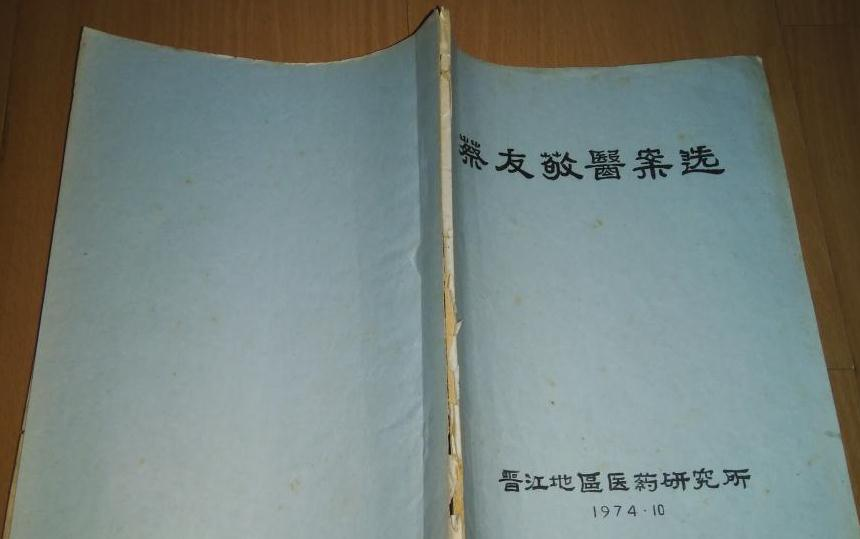

# 光明中医函授大学顾问蔡友敬传略

蔡友敬，国内著名中医，对内经病候有深入研究，五十年来从事中医医疗、教学工作，专长中医内科，精研中医经典理论。

1916年9月，蔡友敬出生于福建省泉州。他幼习经史，中学毕业后，他就学于近代名医丁甘仁创办的私立上海中医学院，尽得“丁氏学派”之真传。毕业后，他返回桑梓，行医执教至今。

解放前他曾为中医事业四处奔走，饱受国难之苦。解放后，他深受党和人民的信赖，选任他为中国人民政治协商会议福建省第一届委员会委员。1954年，他联合泉州市名老中医，创办泉州市联合中医院，被选任院长。

1958年，联合中医院并入泉州市人民医院，蔡友敬则调任泉州大学医学院中医系。

次年，医学院中医系并入晋江地区卫生学校。当时，福建省卫生厅在中等卫生学校开设中医专业，学校指定他主持制订该专业的教学计划、教学大纲，并由他编写《中医学基础》和《中医内科学》等讲义，作为供全省中医士专业使用的教材。

　　

1979年，蔡友敬又在西安参加编写全国中等中医教材《方剂学》一书。在70年代全国掀起西医学习中医高潮中，福建医科大学及厦门、福州、南平、漳州、莆田、泉州等地部队医院纷纷举办高级班和普及班，均请他去授课，受到了好评。他的严肃认真，循循善诱，因材施教的教学作风和方法，为师生们交口赞誉，受到了表彰。

“书山有路勤为径，学海无涯苦作舟”。蔡友敬酷爱读书，以“勤”、“苦”两字作为学习方法，应诊、教学之暇，总是手不释卷，数十年如一日。

蔡友敬历来主张做一个医务工作者，最重要是树立高尚的医德。他始终以唐代名医孙思邈为榜样，虚怀若谷，平易近人，从不以“大医”自居。

长期以来，他除上班外，其余时间不论白天夜晚，严寒酷暑，随时随地都有患者求诊，他总是来者不拒，一视同仁，满腔热情地为病人服务。至于下乡期间，顶风冒雨，长途跋涉为病人出诊的事例，更是不胜枚举。多年来，他自付邮资，默默地干着一份额外的“函诊”工作，每年来自各地的求诊信达100～200封，他都有求必应，一一回复。由于他每日清晨、中午、晚上休息时间都不避免为人们看病，因而人们给他一个雅号——“五班制医生”。1982年被福建省人民政府授予他为福建省劳动模范。

1984年又被卫生部授予全国卫生先进工作者称号。1985年荣获福建省工会发给他“五一劳动奖章”。1992年又被卫生部授予全国卫生系统模范工作者的奖状、奖品。1992年受国务院表彰享受政府特殊津贴。他的事迹被列入《中国当代医学家荟萃》及《当代福建科技名人》，为后人所传颂。

1984年，他担任了[光明中医函授大学](http://www.gmzywx.com/)的顾问一职。

2005年4月30日，蔡友敬去世，享年89岁。