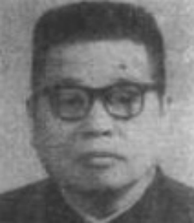

# 光明中医函授大学顾问袁家玑传略

袁家玑，1913年生于贵州贵阳。父祖两代皆为当地名医，家中开设“袁体德堂”中药铺。他自幼便深受家庭熏陶，少年时即热心中医。1931年，袁家玑赴京学医，考入名医肖龙友。孔伯华等人举办的北平国医学院，不久又转入名医施今墨创办的华北国医学院就读。以优异成绩毕业后，又随施今墨老师临证实习一年，甚得赞许，被视为施老高足。这段时间的经历和学习，为袁家玑以后在中医事业的发展奠定了坚实的基础。

　　

1936年，袁家玑返回贵阳，参加贵州省民政厅中医开业考试并获得第一。次年，袁家玑正式开业，时值瘟疫横行当地，求医者甚众，他据证而辨，以温病论治，疗效极佳，一时名噪省城，２０余岁即蜚声医林，成为当时贵阳四大名医之一。

解放后，袁家玑历任贵州市卫生局副局长；贵阳中医学院副院长、院长等职。解放后的40余年中，他多次被评为省、市及全国劳模，当选为省、市及全国人民代表，在教育卫生战线上作出了无私的奉献。

　　

袁家玑著书颇丰，他担任过《贵州民间药草》、《医林拔萃》等书的主编，还曾参与了《实用中医内科学》、《中医药科研资料汇编》、《中国名医名方》等医籍的审定和撰写。他发表过《心病辨证论治的体会》、《冠心病的治疗经验》等数十篇论文。

在30年代，袁家玑已经开始了自己的中医教育生涯，他曾受聘于“国医研究所”，讲授《伤寒论》和《温病学》。1958年，袁家玑任贵阳市卫生局副局长，在任上，他组建了西医离职学习中医班与在职西医学习中医班，并亲身讲述过《中医学概论》、《中医内科》、伤寒论等多门课程。1965年贵阳中医学院成立，袁家玑历任副院长、院长、名誉院长，为中医后继人才的培养倾注了全部精力。

　　

1984年，袁家玑担任了[光明中医函授大学](http://www.gmzywx.com/)的顾问。

　　

1991年，袁家玑逝世，享年78岁。