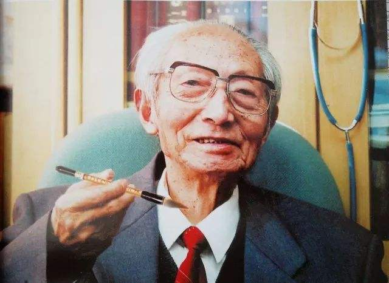
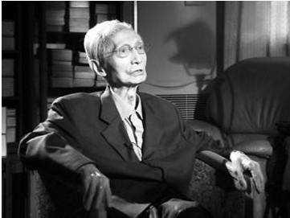

# 光明中医函授大学顾问裘沛然传略

裘沛然，1913年出生于浙江慈溪，童年时在江南著名学者施叔范门下就学二年，其后在家自学，并随叔父裘汝根学习针灸，从而对中医古籍及针灸临床了解渐深。

时逢军阀混战，国事日非。裘沛然本想发扬国学，但限于时局，志不能遂，乃锐志于医学。

　　

1930年，裘沛然进入丁甘仁创办的上海中医学院学习，同时在名医丁济万的诊所临床实习，又常请益于谢观、夏应堂、程门雪、秦伯未、章次公诸之门，深得上海诸名家的青睐。

1934年，裘沛然毕业，先后在慈溪、宁波、上海等地悬壶。以行医自给，临诊之余，勤研中医学和历史、文学、哲学等，家中藏书数万卷，寝馈其中20余年。

1958年，裘沛然进入上海中医学院担任教学工作，历任针灸、经络、内经、中医基础理论，各家学说诸教研室主任。其时，学院开创伊始，无现成的教材，他就率领针灸教研室教师带头编写各种教材以应教学急需。并在短短的四年中主持编写出了六种针灸书籍，推动了全国针灸学术的发展。他对教学重视启发式讲课，形象教学和现场教学。他还创造性地制订了“三基”(基本知识，基本理论，基本技能)训练项目，对中医教学质量提高发挥了巨大的作用，受到了卫生部的表彰。他讲理论常常联系实际，还多次带领学生下厂，下乡。

裘沛然十分重视中医教育的教材建设。1958年他刚进入上海中医学院针灸教研室，即着手教材建设，带头编写针灸教材。在短短4年中，针灸教研室便出版了《针灸学概要》、《经络学说》、《针灸学讲义》、《刺灸法》、《腧穴学》、《针灸治疗学》6部著作。1960年和1964年，裘沛然两次受命卫生部担任全国高等中医院校统编教材编审中心组成员，1977年又任编审委员会副主任。他全力投入工作，认真负责，出色地完成了10门教材的审阅修改任务。

　　

裘沛然善治疑难杂病，倡导“伤寒温病一体论”，提出“经络是机体联系的学说”及“疑难病症治疗八法”，对中医学的发展提出“中医特色，时代气息”八字方针，并对“中医可持续发展”战略提出独到见解。裘沛然精通医道，兼通文史哲，笔耕不辍，获得了几十项奖励和成果。

1984年，他担任了[光明中医函授大学](http://www.gmzywx.com/)的顾问一职。

2010年5月3日，国医大师裘沛然因病医治无效，于5时在上海龙华医院去世，享年97岁。
