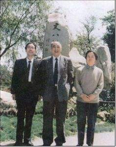

# 光明中医函授大学顾问谢海洲传略

谢海洲，现代中医药大师，中国中医研究院广安门医院内科资深研究员、主任医师、博士生导师。曾任北京中医药大学名誉教授、中华药学会理事、北京市制药总厂顾问等职。

1921年，谢海洲出生于河北省秦皇岛。他出身中医世家，从小耳濡目染，少年时即已熟读《医宗金鉴》、《陈修园医书24种》、《药性赋》等医学著作，并能熟诵若干方歌。谢海洲家学渊源，并通过自己的艰苦自学取得优异的成绩。

　　

1942年，谢海洲毕业于北京汇文中学，后转入北京大学农学院生物系，专攻植物学。后拜赵橘黄先生为师，又得江南名医徐衡之、章次公的教诲。

1947年，谢海洲经南京考试院河北山东考试处录取为中医师。两年后，谢海洲担任了北京市卫生学校高级老师。

1953年，谢海洲担任中华医学会编辑，1956年调入北京中医学院任教，担任中药教研组副主任，两年后中药系成立后任第一届主任,1976年调入中国中医研究院广安门医院内科工作，历任中国中医研究院资深研究员、博士生导师。

谢海洲教授从事内科疾病治疗研究60余年，在治疗风湿性疾病、脑血管病后遗症、颅脑外伤后遗症、神经系统疾病，癫痫、不孕不育症等方面经验丰富。他创制新方，用于治疗疑难病，如其研制的“补肾生髓汤”对再生障碍性贫血、血小板减少、白细胞降低等病效果显著；“补肾荣脑汤”对治疗痿证、痴呆、大脑发育不全等取得较好的效果。1990年，谢海洲教授荣获国务院颁发的首批有突出贡献的专家称号。

　　

至今，谢海洲已经出版了《谢海洲医学文集》、《常用中药知识》、《医药丛谈》、《中药常识》、《中药小辞典》、《简明中药手册》等20余部专著。其中《谢海洲医学文集》获得2005年度中华中医药学会科学技术（著作）一等奖。

谢海洲教授重视中医教育，1984年他担任了[光明中医函授大学](http://www.gmzywx.com/)的顾问一职。

2005年11月5日，谢海洲教授在北京因病去世，享年84岁。