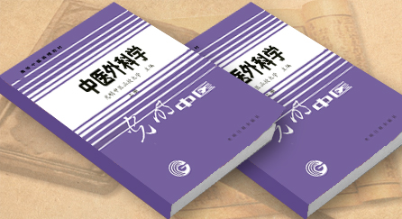

# 赵尚华-《中医外科学》主编

光明中医函授大学《中医外科学》主编

赵尚华，男，1943年8月出生，山西原平人。现为山西中医学院教授、外科教研室主任、针灸系主任，兼中国中医药学会外科学会副主任委员，山西省中医药学会常务理事、副秘书长，中医外治杂志副主编，香港国际传统医学研究会理事，泰国世界传统医学研究会医事顾问、理事。

长期从事中医外科的教学、科研、临床工作，对血管病、乳房病和部分癌症的治疗有良的疗效，对中医外科基本理论及中医文献研究有较深的造诣。其主要学术思想体现在如下著作中：《中医外科心得集》初步总结了作者的实践经验，详细考证阐述了五善七恶的源流及应用，首次提出了与内治法相呼应的中医外科外治箍围消散法、透脓祛腐法、生肌收口法三大法，是中医外科学理论和实践上的重大突破；《中医外科外治法》明确提出了与外科外治的五法、十剂说，丰富了外科治疗经验，可操作性强，填补了中医外科外治法缺乏专著的空白；《中医外科方剂学》内服消、托、补，外用箍、祛、收，法度森然，249方一以贯之。真正使外科方剂由经验走向科学。此外尚有《中医外科学》（光明日报出版社）、《中医血管外科学》、《张子琳医疗经验选辑》、《乳房病》等共计30余部约合370万言著作行世。

自1970年始发表论文30余篇。其“中医治疗血栓闭塞性脉管炎的临床研究”获1994年山西省科技进步奖；参与研制的“骨刺停贴膏”获1995年山西省优秀新产品二等奖；著作中有6部荣获省和国家级科技著作奖；他拟创的逍遥萎贝散、阳和通脉汤、逐瘀通脉汤、解毒通脉汤、顾步复脉汤、椒艾洗药、深静脉炎洗剂、浅静脉炎洗剂、柴翘五淋散、加味羊肾丸、疏风清解汤等方剂被多种大型工具书所收载。1992年应马来西亚中医学院邀请讲学3月，受到当地同道师生的高度赞誉，为中外科技文化的交流作出了贡献。1990年11月山西日报发表了“为振兴‘国宝’奋战的人”的长篇报道，比较系统地介绍了其主要事迹。其传略已被收入《中国高级专业技术人才辞典》、《中国社会团体大全》、《中华人物大典》、《世界名医大全》、《世界名人录》等辞书中。