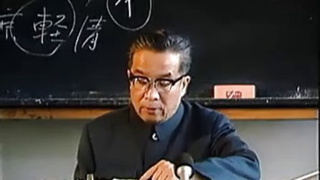
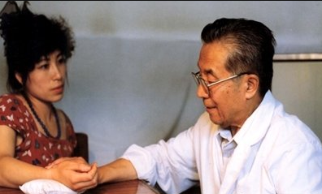

# 光明中医函授大学顾问赵绍琴传略

　　1918年，赵绍琴出生于北京，他是三代御医之后，自幼便继承家学。1934年，赵绍琴的父亲病故，他继承父业，悬壶京师，成为赵氏家族中唯一的医学传人。独立行医后，赵绍琴不因继承家传医学而满足，而是先后从师于京都名医瞿文楼、韩一斋、汪逢春三位先生，集三大名家真传于一身。

　　**赵绍琴行医一世，救人无数，妙手回春，神乎其技，尤其擅长于诊脉、观色、察舌、辨证，临床四诊合参，见微知著。他精于用药，处方药味少，分量轻，疗效好。一般处方不过6、7味，却能立见功效。用“于平淡处见神奇”来形容，真是再贴切不过了。**

　　赵绍琴医风严谨，诊断细致入微，望、闻、问、切，一丝不苟；脉、舌、色、症，详察细辨。并能结合现代医学检验结果，作出准确判断。临证处方用药少，药量轻，配伍严密，效果显著。犹如钥匙开锁，一拨即开。已故著名中医学家秦伯未同赵绍琴交往颇深，曾在一檀香鬲面上挥毫书写“平正清灵一名医”赠予赵绍琴。“平正清灵”四字，不仅是对赵绍琴精湛医术的赞誉，也是对其高尚医德的中肯评价。

　　新中国成立时，赵绍琴已经是北京小有名气的青年中医了，他积极参加新中国的医疗卫生工作。1950年3月13日，新中国第一所中医学校北京中医进修学校正式成立，当年，赵绍琴即应邀到学校为学员讲授学术研究课，自此便担负了长达半个世纪的培育中医的神圣职责。1956年，北京中医学院建立，赵绍琴应聘任教，成为北京中医学院第一批中医教师中的一员，先后讲授本草学、内科学、温病学等课程。

　　**赵绍琴在北京中医药大学执教四十五年，辛勤耕耘，桃李满天，培养出一批既精通中医理论又具有较高临床技能的高级中医人才。不管是走上了高级领导岗位，或已成为中医事业的栋梁之才，他们依然把赵绍琴看作自己永远的老师。赵绍琴毕生致力于中医教育，1984年，他还在光明中医函授大学担任了顾问**。

　

　　2001年，赵绍琴逝世，享年83岁。