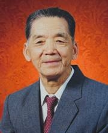
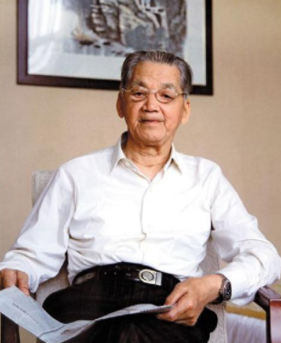
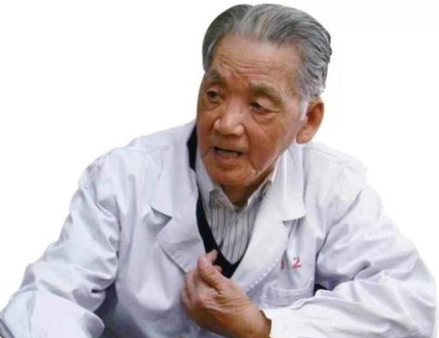

# 光明中医函授大学顾问路志正传略

路志正，男，汉族，1920年12月出生，中国中医科学院主任医师，1939年2月起从事中医临床工作，为全国老中医药专家学术经验继承工作指导老师、"首都国医名师"，国家级非物质文化遗产传统医药项目代表性传承人。

中医世家主任医师，全国政协委员，卫生部药品评审委员会顾研究院专家咨询委员会委员，北京中医药大学名誉教授。精通中医典籍，擅长中医内科、针灸，对妇科、儿科等亦很有深造诣。擅长针药并用，同时特别重视食疗，圆机活法，因证而施。擅治神经性头痛、三叉神经痛、癫痫、儿童多动症、抽动-秽语综合征、脑瘫等疑难病，有自己的独到见解和临床经验，疗效颇佳。

曾先后到泰国、菲律宾、马来西亚、日本等国进行学术交流，受到国内外人士的高度赞誉。幼继家学，从伯父路益修学中医，继拜盐山孟正已先生为师，长而在（1934年-1939年）河北中医专科学校学习。1934年其伯父年创办医校，遂正式学医，并拜师山西省盐城名医孟正已先生。1939年毕业后悬壶乡里，1951-1952年7月在北京中医进修学校学习。1952年8月，在国家卫生部医政局医政处中医科工作。1954年11月，国家卫生部中医司技术指导科工作。1973年他来中国中医研究院广安门医院从事临床工作，1981年参加广安门医院内科研究室的创办工作，任室副主任，从事痹证的科研和医疗工作。1985年调内三科，从事胸痹的临床研究。

他现任中华人民共和国药典委员会委员，卫生部药品评审委员会委员，卫生部国际交流中心理事，中华全国中医内科学会副主任委员，中华全国中医痹病专业委员会副主任委员，北京市老年康复医学研究会副会长，北京中医药大学名誉教授等职。他参加编著的主要著作有:《中医临床资料汇编》、《中国针灸学概要》、《中华人民共和国药典》(二部)、《医论医话荟要》、《中医症状鉴别诊断学》、《中医证候鉴别诊断学》、《中国医学百科全书.中医内科学》、《中国名老中医经验集萃》，主编《中医内科急症》、《路志正医林集腋》、《痹病论治学》等书。在《中医杂志》等全国中医学术刊物上，发表论文数十篇。

他对眩晕、胆结石、风湿性和类风湿性关节炎、萎缩性胃炎、甲亢和甲状腺瘤、白塞氏综合征、干燥综合征、胸痹、不寐、多寐，以及妇科经带胎产、不孕等疑难病症，均有自己的独到见解，临床疗效显著。他治疗眩晕经验的专家系统已应用于临床。

他潜心于痹证，胸痹的临床研究，“路志正调理脾胃法治疗胸痹经验的继承整理研究”课题获国家中医药管理局科技成果二等奖。其参加的《中医症状鉴别诊断学》、《中医证候鉴别诊断学》课题分获中医研究院二等奖和三等奖。以他为副主任委员的中医痹病委员会与辽宁本溪中药三厂共同研制的痹病系列新药:痹冲剂、寒湿痹冲剂、湿热痹冲剂、瘀血痹冲剂均获国家新药证书。并曾于1992年主持召开了国际中医心病学术会议。

1964年，他参加卫生部组织的《中国针灸学概要》的编写工作，首创穴位编码法，为针灸走向世界奠定了基础，并被译成日、俄、英三种文字。1975年以后，该书作为北京、上海、南京“国际针灸培训班”的教材，为世界100多个国家和地区培训了大批针灸医生。

1979年以来，培养研究生12名，1991年10月作为全国中医师承制导师，培养中医学术继承人二名。

1981年，他参与创建广安门医院内科研究室，建立极具中医特色的痹证、急症等病例书写、查房、会诊、疑难病讨论的模式，在中医学术整理、疑难病症研究和中医病房建设方面做了大量的工作。他与其他老专家一起，成立了中医风湿病学会和内科心病专业委员会，分别担任主任委员和副主任委员。他提出的“燥痹”、“产后痹”的病名和辨证论治等内容，对风湿病学科的建设起到了推动作用。

1984年，他担任了[光明中医函授大学](http://u141711.admin.ish168.com/)的顾问一职。