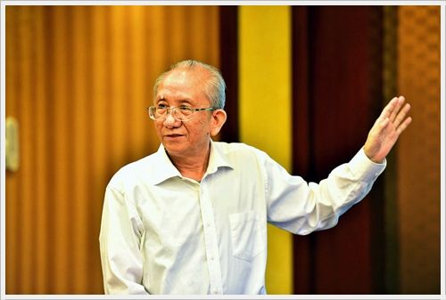
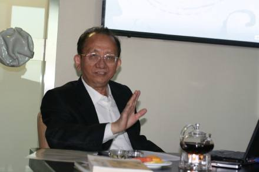

# 光明中医函授大学顾问郑金生传略

郑金生，首届医学史硕士、博士生导师、中华人民共和国卫生部医史文献学科带头人，2003年荣获国际传统医学年度大奖。

1946年5月22日，郑金生出生于江西省南昌市。1956年，郑金生进入江西中医学院，1970年加入江西中医学院中医系方药教研室，1978年10月至1981年7月在中医研究院中国医史文献研究所担任硕士研究生。

　　

1985年到1993年，郑金生担任了中国医史文献研究所科研办公室主任。郑金生从事中医药教学、医史文献研究30余年，主攻中国药学史。发表中国医药学史及文献研究相关论文150余篇，出版有关书籍50余种，其中包括《历代中药文献精华》、《本草纲目索引》、《中国大百科全书·中医》、《中国科学技术史·医学史》、《食疗本草译注》等书籍。

郑金生对《履巉岩本草》等十余种古本草及古医籍研究极有创见，对历代药王及药王庙有深入的研究，结合用药实际考证了龟甲运用历史，为纠正专用龟下甲的错误及修改《药典》龟甲来源奠定了坚实的文献研究基础。已考证汉代的新绛、唐代的卖麻藤、宋代的人工牛黄及曲节草等多种药物基原，并提出新见解。

主持国家出版署及国家中医药管理局重点课题《中华大典·药学分典》的编纂，对中药古代文献进行空前汇总；主持国家中医药管理局重点课题《日本现存中国散逸古医籍的研究》，将日本所藏中国亡佚的中医珍本典籍160余种复制归国，进行整理研究。主持国家科技部课题“国内失传中医善本古籍的抢救回归与整理研究”，出版了《日本现存中国稀觏古医籍丛书》、《国外回归中医善本古籍丛书》，为当代中医研究增添了一批重要的学术资料。获省部级科技奖励一等奖1项，二等奖3项，及其它各种奖励10余项。

　　

专攻中医药历史文献，尤擅长中药学史。曾担任《中国本草全书》学术委员会主任，主编《中华大典·药学分典》、《本草纲目索引》，整理《南宋珍稀本草三种》等古籍40余种，著《药林外史》、《中国古代养生》、《历代中药文献精华》、《图说中医》等书。发表学术论文140余篇。