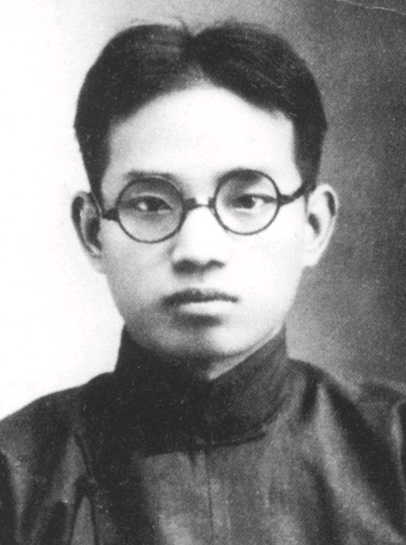
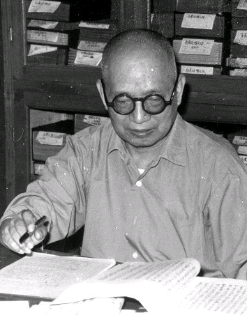

# 光明中医函授大学顾问郭霭春传略

郭霭春，1912年生于天津。七岁入塾，后师从朴学大师章钰先生、史学大师卢弼先生研习小学、经学、史学等。20世纪30年代起开始研究中医典籍，并在战乱时期从师宝坻名医赵镕轩学习岐黄之术四年。

　　

建国后，郭霭春主持崇化学会、崇化中学工作，为津门培育人才。教务之余，为人诊病省疾，从未间断。后转入天津中医学院任教，历任多职。

郭霭春热爱中医事业，认为欲发扬中医，“非致力于中医文献不能收功”。于是尽瘁精力于文献整理，历近二十年的时间，著成《黄帝内经素问校注语译》一书。其间虽历十年动乱亦未中辍。学术界普遍认为，该书是我国目前整理研究《素问》成就最大、学术水平最高的著作。后又完成《中国医史年表》、《灵枢经校释》等书，为中医文献整理和阐释作出了重大贡献。

《中国分省医籍考》则是奠定郭霭春文献大家地位的又一部力作。一直以来，中医医籍书目只有日本人丹波元简撰成于道光六年的《中国医籍考》和民国期间日本人冈西为人著《宋以前医籍考》比较完善——早在上个世纪五十年代末，郭霭春涉足中医文献研究之初，就注意到这个问题，对此深感不安并引以为耻——此两部书广泛利用了中国的正史、类书，甚至稗官野史即文人笔记中的史料。郭霭春以其出入文史的大史料观，独辟蹊径，决心利用地方志这一外人不曾涉及的乡邦文献，从中钩稽医籍书目资料。自1958年始，二十七年间足迹遍及全国各省市图书馆，共查阅了四千余种地方志，历尽艰辛，饱尝困苦，终于在1984年完成独树一帜的《中国分省医籍考》，全书近两百万字。巧合的是，“搜罗百氏，采访四方”的[《本草纲目》](http://www.gmzywx.com/ProductDetail/2743545.html)也用了李时珍二十七年的光阴，两书字数亦相差无几。

　　

郭霭春博学多识，治儒通医，并擅诗，编有诗集《残吟剩草》,而一生低调做人，布衣粗食，不改其乐。

1984年，郭霭春在光明中医函授大学担任了顾问一职。

2001年，郭霭春逝世，享年89岁。