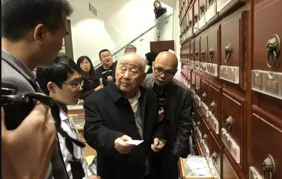

# 光明中医函授大学顾问金世元传略

　　金世元，出生于1926年。他14岁时，家中为了让他能有一门谋生的手艺，把他送到北京复有药庄当学徒。作为学徒要从最脏、最累的活干起。在他学徒的那个年代，对于一些关键工艺，师傅从不亲传，主要靠徒弟自己的悟性，在一旁观察、领悟。和金世元同来的学徒有很多都适应不了走了，而他却留了下来，并且在这边干边悟中，掌握了许多中药炮制过程中的要领。两年的学徒生涯过后，他不仅掌握了制药的基本流程，还对药材的性味产生了浓厚兴趣。

　　1940年，金世元参加了由政府举办的“北京中药讲习所”，当时任课的是北京城有名的汪逢春、赵树屏等中医大家。他们对于中药方剂学的理解，把金世元带到了一个新的高度。到了二十六，七岁的时候，金世元就已经与北京的各大药行来往密切了。

　　1943年，金世元来到北京通州益元堂药店工作。1956年，又被调入北京市药材公司业务科中药研究室。

　　在金世元的药学研究中，他尤其重视“地道药材”，为了掌握这些地道药材的特性，年轻的金世元经常是背着干粮，夹着雨伞，到各药材产地去，虚心向药农请教，在实践中了解原料药材之间的差别。

　　为了加强中药人材的培养，1961年，北京市卫生局决定在北京卫生学校开设中药专业。考虑到金世元中医药知识的全面，把他调来创建这门新的学科。当时的金世元虽然已经具备了丰富的实践经验和扎实的理论基础，但他还是深感到自己知识的不足。

　　此后，金世元为祖国医学事业服务了数十年，他富有科研精神，每年都要到全国各地的药产地的看药材，他78岁那一年，还登上了海拔1000多米的长白山人参栽培基地。

　　如今，金世元教授虽已是年过古稀，但还以饱满的精神为中医药事业的发展做出不懈的努力，为后来的中医从业者做出了伟大的榜样。

　　1984年，担任[光明中医函授大学](http://www.gmzywx.com/NewsDetail/1078385.html)顾问。

　　2007年，获国家级非物质文化遗产“中药炮制技术”代表性传承人。

　　2009年获北京市“首都国医名师”光荣称号，同年获得中国北京同仁堂（集团）有限责任公司“中药大师”称号。