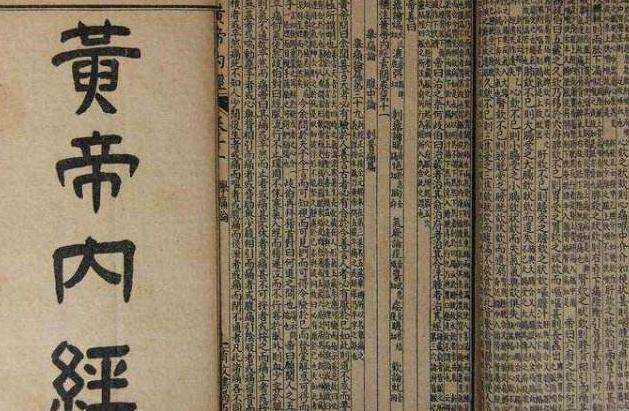

# 光明中医函授大学顾问金树滋传略

金树滋，1937年10月生于安徽省合肥市。其父金容甫是一代中医名家，在合肥市人民医院任中医科主任。中医乃金家祖业，传到金树滋这一代已是第七代。出身中医世家的金树滋在中学时代就会扎针灸，有一次好友牙痛，他几针下去便缓解了症状。

金树滋在上海中医学院苦读了六年，深得刘树农、裘沛然、金寿山等名师点拨。但毕业后，父亲仍对他从严管教，教导他对待病人应有割股之心。

金树滋的一位初中同学，结婚后生了个儿子，却在两岁时罹患脑积水，在省里看遍了各大医院，俱无果返回。后来找到金树滋，金树滋给孩子把过脉，直言不讳地说：“脑积水在中医也算疑难杂症，不是三五服药能够治好，我开的药要坚持吃，积水会慢慢消除的。”

一年后，患儿的病情开始逐渐好转，到了入学年龄还可以与正常孩子一起上学，后来还考取了大学。

金树滋在针灸研究上有很深的造诣，多年研读[《黄帝内经》](http://www.gmzywx.com/NewsDetail/1123200.html)，从中对经脉加深了认知，悟出针灸的新路子。特点是进针浅，透穴多，疗效高，收效快，用于治疗各种痛症，能有立竿见影效果。

　　

文革期间，合肥六中教授刘文霖腰肌扭伤，身体无法直立，行动困难，在各大医院都无药可施。两个月后刘教授十分悲观，认为自己将会残废。后来找到金树滋医生，经针灸治疗四十分钟，立刻可以下地行走，疗效十分神奇。

粉碎“四人帮”后，金树滋被选进安徽中医学院的领导班子，主持学院教学工作，后又调到安徽省卫生厅任副厅长，分管全省的中医药和科研项目，他奉献了一张治疗糖尿病的方子，由省医研所与某药厂合作，研制成“消渴康”获国家三类新药。金树滋教授十分重视中医教育，1984年，还曾在光明中医函授大学担任顾问一职。

金树滋先生居住于市中心，一套上世纪六十年代卫生厅陈旧的老宿舍，接待求医看病是一间约十二平方米的客厅，室内一张方桌两把椅子，一个简易沙发，书柜里陈列着中医经典书籍，墙上挂着一幅立轴，是前卫生部长钱信忠写给金树滋的题词。多少年来，在这间简陋的小厅室内，不知接待了多少上门求医的病人，治愈了多少疑难杂症患者。