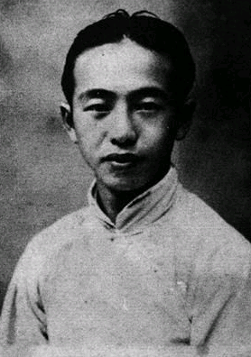
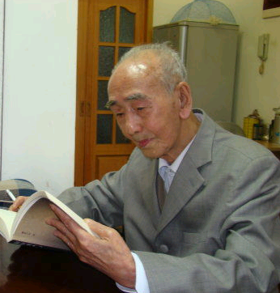

# 光明中医函授大学顾问钟一棠传略

钟一棠，1915年出生于浙江宁波。他是宁波四大中医名家“钟式内科”第四代传人。

　　

受家庭熏陶，钟一棠从小立志行医。1929年，他进入上海中医专门学校求学。四年后，他回到宁波，在二哥钟一桂任职的诊所实习了两年。1936年10月，21岁的钟一棠正式开始行医。当时，他经人推荐到庄桥一个名为“滋心斋”的诊所坐诊。他是当时祖传中医和现代医学结合的唯一一人。坐诊第三年，钟一棠小有名气，每天的门诊人数近百人。不仅庄桥本地人找他看病，连洪塘、湾头等地的乡亲也都慕名而来。

坐诊的日子里，钟一棠经常会碰到一些付不起医药费的穷苦人家。他舍医送药，从不刁难这些拮据的乡亲。甚至有时候，他还会借钱给穷人买药。

1941年4月，宁波沦陷于日寇之手。钟一棠暂停行医，直到1942年春节才回到宁波坐诊。1955年，钟一棠被调到宁波市卫生局任医防科主任，主管全市联合诊所中医方面的事务，不过他仍然在联合诊所里设有门诊时间。后来又调往市第一医院担任领导工作。

1977年，钟一棠已经到了退休年纪。这时，省市相关领导找到他，希望他能组建宁波市中医院。他一口答应了下来，和刘中柱、宋世焱等知名中医专家一起组建了宁波市中医院。七年辛劳，宁波市中医院终于从一个小小弄堂诊所办成了上规模的医院。此后，钟一棠主动从院长岗位上退下，但还是到中医院坐诊、查病房，坚持在一线。直至2000年，他才真正退休，当时他已是85岁高龄。

　　

1984年，他在[光明中医函授大学](http://www.gmzywx.com/)担任了顾问一职。

2016年2月23日，名老中医钟一棠逝世，享年101岁。