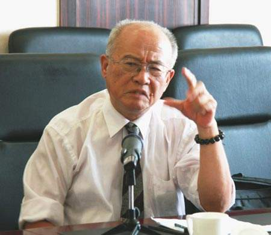
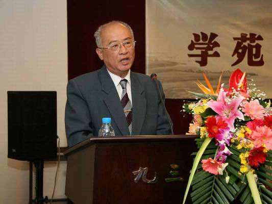

# 钱超尘

钱超尘，现任北京中医药大学教授、博士生导师。曾任中华中医药学会中医药文献研究分会副主任，中国训诂学会理事。他在中医文献研究及中医经典著作的语言研究方面开拓出许多的新领域，填补了多项学术空白，并对中国传统文化、中医古籍相关学科的传承与普及作了大量工作，积极推进了中医文献的研究工作，为中医学的发展做出了重要贡献。

　　

1936年3月17日，钱超尘出生于河北省玉田县，那里是清代著名医家王清任的故乡。

钱超尘教授出身于一个教师家庭，父亲深谙中国传统文化，能诗善画，藏书颇丰，良好的家庭文化氛围滋养着他年幼的心灵，给他提供了得天独厚的生长环境。

他自幼即开始接受中国传统文化的熏陶，尤其是对《诗经》、《论语》等经典著作的诵读，对培养他传统文学功底起到了重要作用。

1961年，钱超尘毕业于北京师范大学中文系，恰逢我国第一届古汉语研究生招生，他由于成绩突出被推荐为该校中文系古代汉语研究生，师从我国著名古汉语专家陆宗达教授。陆宗达教授在教学中非常重视学生基本功的培养，他反复强调“以经考字，以字考经”这样的经验总结，使钱超尘在学习中打下了扎实的基本功。

1972年底，钱超尘教授来到北京中医药大学讲授《医古文》课程，并开始从事中医古代文献的整理研究。钱教授怀着满腔热枕投入到中医古籍的研究整理之中，将普通训诂学与中医文献紧密结合，开创了中医训诂学研究的新天地，对中医学的学术发展做出了重要贡献。

1982年10月，卫生部在南京召开了全国高等中医院校中医药教材编审会议，钱教授被选为第五版《医古文》教材的编委，在原有基础上，又有新的增加和补充。自此，中医训诂学理论介绍到中医界，并得到了广泛的推广和传播。钱教授不但完成了中医训诂学的理论建设，而且综合运用文字学、音韵学、版本目录学、考据学，解决了许多中医古籍中的疑难问题。

　　

钱老的一生不走仕途，不慕荣利，心如澄水，性若朗月。一生待人，唯诚唯肯；一生治学，唯严唯谨。他深受顾炎武“非关六经者，一字不书”的影响，不关学术者，一字不书。先生一生站在讲台，传道授业解惑，倾囊相授。岁月漫漫流逝，不变的是他依然真诚清澈的眼神，当一代又一代的学子从他的课堂走上中医之路，畅饮中医药古籍的知识琼浆，感悟中医理论精髓，为百姓的健康带去福音的时候，钱先生也收获他的自足自乐。

钱超尘教授教授是光明中医教材《古代汉语》的编者之一！