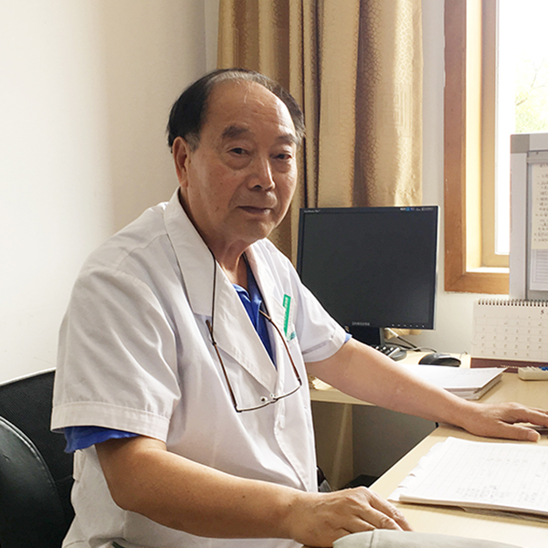

# 光明中医函授大学顾问陶广正传略

陶广正，中国中医科学院教授、研究员，博士生导师，享受国务院政府特殊津贴中医专家，北京大学医学部客座教授。曾任中华中医药学会文献学会副主任委员、秘书长，现任王清任学术思想研究会名誉主任委员。

　　

1943年1月，陶广正出生于河北省玉田县。他家中九代世医，幼承家学，渐染芝兰。

早年间，陶广正毕业于北京中医学院，1982年又获硕士学位。他从医五十余年，学验俱丰，尤擅中医内科、妇科和针灸。

陶广正熟谙历代医学大家之特长，重视历代医案之精华，常以“抗志以希古人，虚心而师百氏”、“胆大心细四诊详不许粗枝大叶，智圆行方慎思量还须理法有章”为座右铭，主张辨病论治与辨证论治相结合的治疗原则，强调在阴平阳秘的基础上发挥阳气的主导作用。

在研究古今名医医案时，陶广正汲取了许多启迪性的玄机活法，是以在治疗疑难病证时能得心应手，左右逢源。

　　

治疗危急证，每能经方重剂，大刀阔斧，以行霸道；治疗慢性病则燮理阴阳，调畅气机，看似轻描淡写，以王道无近功，久服自有益也。在近五十年的从医生涯中，陶广正治愈了大量患者，但他却始终不肯以“专家”自居。

因为对中医史的熟悉，陶广正深知科研和教育的重要性。多年来承担大量国家级及部院级科研课题。同时，在培养人才方面，陶广正因材施教，循循善诱，既教之以学问，又启迪以方法，培养多名博士研究生和硕士研究生。
