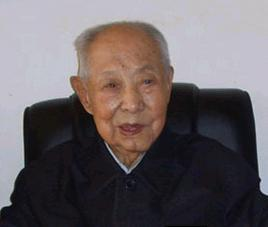

# 光明中医函授大学顾问韩百灵传略

1909年，韩百灵出生于吉林农安的一个农医世家，自幼受父兄影响，酷爱学医。八九岁时便有“不为良相，原为良医”的理想。13岁时，他拜当地名医臧鸿儒学习，18岁再次投师吉林名医王三化研习妇科，随师侍诊。

1930年初，韩百灵来到哈尔滨，在长兄秀实开的同顺堂诊所实习。同年，获中医资格证书。不久，到世和堂药店当坐堂医。1932年松花江大水，他积极参与抢救难民，义务为难民治病，直至洪水退去。

　　

1934年5月，韩百灵开办的“百灵诊所”正式开业。韩百灵在这件诊所中工作了25年。直到1959年才归入国营医疗单位。其间，他经历了千辛万苦，尝尽世态炎凉。不管环境怎么复杂，始终恪守着“医乃仁术”的宗旨，治病不问贫富贵贱，医术但求精益。即使在反动当局取消中医最猖獗的时期，也从未放弃良医治人之志，并以崇高医德取信于人。

秦艽鳖甲汤治愈肺痨是一则使韩百灵名噪一时的病例。上世纪30年代，韩老在哈尔滨行医时，经友人介绍，为东北军阀张作霖的老师——晚清巡抚曾子固的儿媳治疗肺痨。曾的儿媳患此病已一年之久，屡次更医，百治不效，奄奄一息，家人已备棺材待殓。韩老面对危症镇定自若，投以大剂加味秦艽鳖甲汤，结果服药十余日，病人已能扶床站立，一年后月经畅通，好如常人。

当时，有四位良医被誉为黑龙江四大名医，韩百灵便是其中一位。1949年，韩百灵同其他三位名医一同加入哈尔滨中医讲习班，担任中医药学讲师。几十年中，韩老集临床、教学、科研为一体，屡创佳绩，实现了他人生由名医到大师的飞跃。上世纪8 0年代是韩老事业发展的鼎盛时期，他创立了“肝肾学说”，发展了“同因异病，异病同治”的理论，形成了独具特色的“百灵妇科”，影响甚远。韩老在建国初期就是黑龙江四大名医，后被尊称八大妇科名家之一。在中医妇科界，同行专家赞之为“妇科泰斗”，著名中医专家邓铁涛尊韩老为“妇科一代宗师”；在韩老百岁华诞前夕，中国中医科学院王永炎院士贺韩老为“苍生大医，吾辈良师”。

　　

1984年，韩百灵教授担任了光明中医函授大学的顾问一职。

近些年，韩老在众多儿女的劝说下，不情愿地离开了置身几十年的诊室和教室，过上了悠闲的生活。