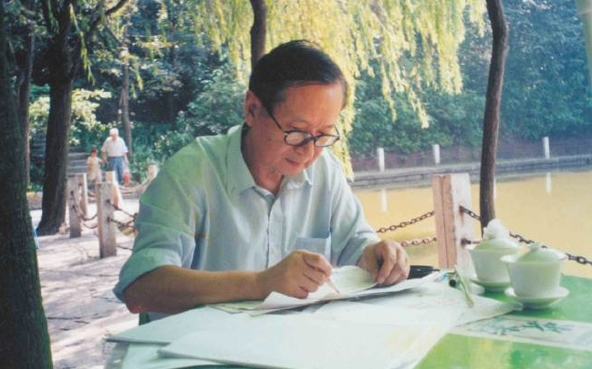

# 光明中医函授大学顾问马有度传略

马有度，成都中医药大学首届毕业生，重庆医科大学教授、主任医师，国务院特殊津贴专家，全国新药评审专家。现任中华中医药学会顾问、重庆市中医药学会名誉会长、《世界中医药》编委、《中医杂志》编委、《实用中医药杂志》顾问。

　　

1937年，马有度出生于北京。少年时期，马有度因患病而中断了学业，一位医术精湛的老中医治好了他的病，在听过老中医关于《伤寒论》的一席话后，马有度迷上了中医。

1956年，马有度进入成都中医学院，成为了成都中医学院的首届学生，后来他曾写诗表达对中医的热爱和献身中医的心情：“人生喜在结良缘，嫁给中医五十年，读书临床贵感悟，乐在其中笑开颜。”

从事中医50年来，马有度始终保持满腔的热情、充沛的精力，不仅活跃在中医学术、中医科普和社交领域，成为“三栖专家”（中医专家、科普作家、社会活动家），还以健康幽默的人格魅力感染着认识他的人。

马有度教授是著名中医专家和中医科普作家，长期工作在中医临床、科研和科普一线，治病疗效显著，科研成果累累，发明的新药复方枣仁胶囊、麻芩止咳糖浆等在临床上广泛应用。现在虽然退休，但仍应邀出门诊，病人络绎不绝，忙得不亦乐乎。

除了看病、科研，他还喜欢写作。早在1980年，马有度撰写的《医方新解》，第一版印发8.5万册仍供不应求，多次再版，当时的中医院校学生争相传阅，国医大师周仲瑛说这本书“指引不少年轻一代充满信心地迈入中医殿堂”。1983年，他出版了第一部中医科普著作《家庭中医顾问》，首发10万册，影响很大，并在台湾、日本出版和日本的杂志上连载。国医大师邓铁涛题词“中医呼唤科普”，鼓励和称赞马有度在中医科普上的贡献，他也成为我国较早从事中医科普的专家。

　　

马有度精力旺盛，才思敏捷，出口成章，喜欢吟诗作赋。七十寿辰时，他举办了“三真情三感恩欢聚会”，他的“注重亲情，珍惜爱情，享受友情。一感父母养育之恩，二感师长教育之恩，三感朋友扶助之恩”肺腑之言，赢得满堂喝彩；他的小诗“人生贵有缘，淡化物与钱，轻松来相见，大家不麻烦。”尽显其幽默。
