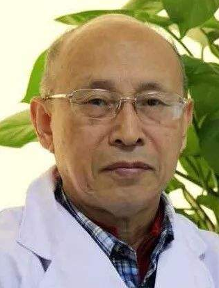
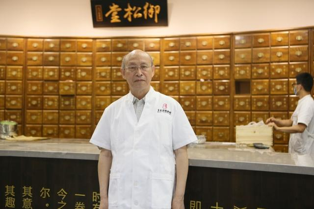

# 光明中医函授大学顾问高荣林传略

高荣林，医学硕士，博士生导师，中华中医内科学会委员，中华中医风湿病学会委员，中医内科心病专业委员会委员、肺系病专业委员会委员、疑难病专业委员会常委兼秘书长，国家药品监督管理局新药评审委员，享受国务院政府特殊津贴。

　　

1944年12月，高荣林出生。1963年，高荣林进入北京中医学院中医系学习。1969年，高荣林毕业。同年，高荣林开始在宁夏西吉县人民医院任职。

1981年，高荣林转至中国中医研究院广安门医院任医生，1996年晋升主任医师，曾任广安门医院心肺科、呼吸科、疑难病科主任。

高荣林继承了路志正教授调理脾胃法治疗冠心病经验的整理研究，并获得国家中医药管理局中医药理论研究二等奖。

高荣林主编了《中医内科临床手册》、《中医睡眠医学》、《中国中医研究院广安门医院专家医案精选》等书籍，著作20余部，并发表学术论文数十篇。

　　

高荣林曾获得中华中医药学会、国家中医药管理局、北京市、中国中医科学院科技奖多项。路志正调理脾胃法治疗胸痹经验的继承整理研究获国家中医药管理局基础研究二等奖，路志正学术思想及经验研究获中华中医药学会科技进步二等奖、北京市科技进步三等奖。《中医湿病证治学》获中华中医药学会科技进步著作一等奖，《董德懋内科经验集》、《中医睡眠医学》获中华中医药学会科技进步著作三等奖。