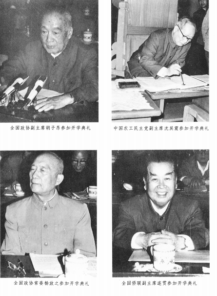
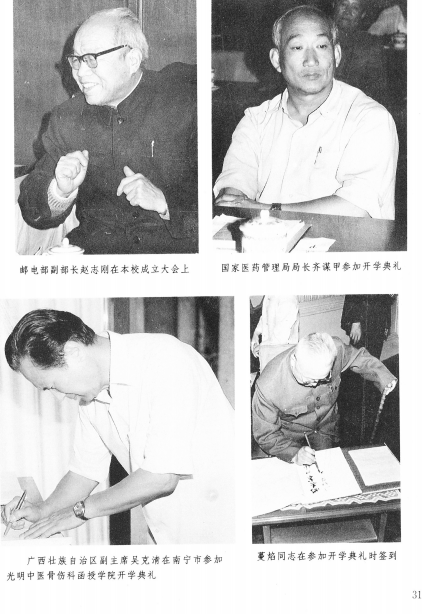

# 光明中医函授大学在京隆重开学

【本刊讯】记者一江报道：

一九八五年五月二十一日下午，光明中医函授大学在北京全国政协礼堂举行了隆重的开学典礼。出席大会的有：全国政协副主席胡子昂，卫生部部长崔月犁，国家计委顾问段云，国家医药管理局局长齐谋甲，《光明日报》副总编刘爱芝，全国侨联副主席连贯，全国政协常委、医药卫生组副组长杨放之，全国政协委员、医药卫生组副组长吕炳奎、王伯岳，北京市副市长陈昊苏，中共中央党校秘书长王介山，全国人大常委委员董建华，农工民主党中央副主席沈其震，全国职工教育委员会副主任浦通修，光明中医函大总顾问童陆生，在京与来京的全国名老中医王绵之、程莘农、刘渡舟、王鸿士、米伯让、史常永、张海岑、颜正华，中宣部、卫生部、团中央、北京市等有关部门领导，以及光明中医函大湖南、安徽、黑龙江、辽宁、北京、青海等十八所分校的负责人和学员代表共一千多人。

　　

大会由函大副校长王德嘉同志主持，在雄壮的国歌声中开始。中共中央政治局委员、书记处书记、全国人大副委员长习仲勋同志在大会将开始时打来了电话，表达他对函大开学的良好祝愿，副校长方药中教授宣读了名誉校长李德生同志给大会的贺信。贺信说：“希望全体教职员工艰苦创业，创造性地工作，毫无保留地传授中医药知识，一定要把函大办好”（全文另发）。会上，白永波副校长宣读了中共中央委员、中国书法家协会名誉主席舒同同志的贺信（全文另发）。

光明中医函大顾问刘爱芝同志代表主办单位《光明日报》社，向大力支持函大创办的社会各界同志表示诚挚的感谢。他向与会代表介绍函大概况说：“函大现已在全国各地建立了十八所分校，下属的函授辅导站也已建立，第二批分校亦在筹建之中。一个全国性的，比较完整的光明中医函授教育网已初步形成，从组织上保证了函大的教学工作落到实处”。

吕炳奎校长接着讲话，他鼓励学员们着意树立光明中医函大的校风，团结，勤奋，严格，务实。要求学员们在掌握基础理论的同时，从现在起就地拜师求教，为临床学习做好准备。他说：“只要每位学员刻苦学习，就一定能成为具有坚实本领的合格中医师”。

函大顾问、著名老中医董建华教授代表中医界讲了话。他向学员们传授了学习中医科学知识的方法：要熟读精思，注重实践。他最后说：“光明中医函大的创办，是深得人心的，我们中医界应当珍惜、爱护、关怀、扶植她，使她越办越好，成为整个中医教育体系中不可分割的有机组成部分。”他的讲话，得到了参会者的普遍赞同。　　

函大名誉校长崔月犁同志发表了重要讲话，他对“文化大革命”期间中医事业遭到的摧残和十一届三中全会以后中医事业的发展用数字做了对比，并进一步从全国乡、镇、县各级中医的分布，谈到中医人才的缺乏和中医机构的现状。他说：“有些中医机构，我打个比方，是‘挂梅兰芳的牌子，唱朱逢博的调子‘，外表看着是中医，里面是西医化。所以，中医的力量就消弱了很多。”他接着说：“光明中医函大的成立并开学是很好很大的一件事。我们卫生部也要专门开会研究中医教育工作，讨论正规和业余大学的教育改革问题。函大开学后，主务是质量第一。祝同学们学习成功"。在会上讲话的还有胡子昂、段云、杨放之、齐谋甲和函大分校校长会议代表、学员代表。大会自始至终洋溢着同心协力、团结奋斗的气氛。参会的一位学员说：“从这个开学典礼便可看出函大的潜力，看到前途的光明”！

------

本文发表于《光明中医》杂志1985年第1期，报道光明中医函授大学开学典礼的情况。

------
