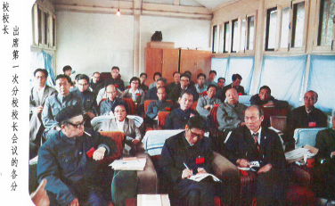
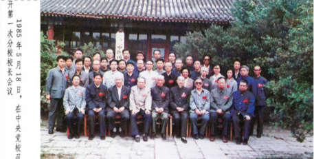

# 光明中医函授大学第一次分校校长会议纪要

一九八五年五月十八日至五月二十一日，光明中医函授大学在北京召开了第一次分校校长会议。会议的中心议题为：统一办学思想、研究教学方法、讨论教学计划、落实教学组织。会期历时四天。《光明日报》社副总编刘爱芝，本校总顾问童陆生，校长吕炳奎，副校长方药中、白永波、王德嘉、王伯岳、王绵之以及全国十八所分校的二十七名校领导参加了会议。副校长周凤梧因故不能参加，来信祝贺会议召开。

　　

开幕式上，到会的校领导讲了话，他们首先感谢各地分校的同志们在很短的时间里组建了分校，为函大的教学工作奠定了基础。吕炳奎校长在会上宣布：函大只要办好，学员考试合格，可以发给毕业证书，承认学历。

白永波副校长兼教育长在会上介绍和阐述了函大的办学宗旨、教学指导思想、课程设置和教学方法。

湖南省分校孙光荣同志汇报了湖南分校的建校招生工作情况。

校长办公室主任彭庆生同志介绍了第一学年的教学计划和经费分配原则。

与会代表分别汇报了分校筹建情况，并围绕会议的中心议题展开了深入细致的讨论。

最后由王德嘉副校长作了总结。

通过讨论，会议达到了统一办学思想、明确办学方向、坚定办学信心的预期目的。

　　

统一认识，团结一致，全力办学。与会代表回顾了中医教育的历史，认为中医通过自学完全可以成为有造诣的中医人才。运用中医函授教育的方式进行中医人才的培育是完全可行的。在谈及目前中医队伍素质日趋下降的状况时，代表们认识到，中医教育工作必须解决中医基本理论教学脱离临床教学、脱离中医特色的倾向，从临床实用出发，将医理寓于临床，汲取历代和当代名老中医成才的宝贵经验，不断探索中医教育规律，致力于开拓中医教育的崭新途径，为振兴中医事业做出应有的贡献。

强调质量，保证重点，讲求实效。在讨论课程设置和教学方法时，代表们提出了很多新颖的意见。一致认为课程设置合理，但在教学工作中要突出重点。建议把重点课程的考试方向分为闭卷考试和开卷笔试两种。闭卷考试课程以七门为宜。其目的在于将学员的基础打牢，为今后临证实践更多地提供实用的知识。采用背诵为主的学习方法曾培养出一代又一代名医，因此，应借鉴古人学习中华民族文化的传统方法。但是对于背诵内容的选择要精练，要切合实用。在教学工作中，要注意中医学诊疗技术与基础理论知识紧密结合的特点。注重实践，在实践中培养学员诊疗疾病的本领是传统的师承授受方法的特色，因此应提倡有条件的学员“投亲靠友，就近拜师”。争取早临床、多临床。传统的师承授受的教育方法为中医事业培养出大量的人才，为中医事业的发展做出了名垂千古的贡献。而这一传统的中医教育方式却遭到不公正的评价，为此，完全有必要为之正名，使人们重新正确认识、对待它。

强调教学质量是贯穿中医函授教学工作中的主导思想。教学工作应注重启发式的教学方法。辅导工作中要注意重点和答疑。编写教学大纲时，应将重点内容标清，分出泛读和精读内容的界限，以便解决教学工作中点面的关系，使学员学会举一反三、触类旁通的思维方法。

集思广益、互相谅解、分担困难。由于考虑到学员的经济负担，我校的学费标准较低，与同类院校相比，相差甚多。尤其在目前社会物价调整的情况下，函大的经费更为困难。面对这种局面，代表们开动机器，集思广益，提出了很多解决困难的具体意见。例如：各地开办门诊部，举办讲习班，出版辅导性读物等，依靠自己的力量克服困难。当公布经费分配方案后，代表们认为总校与分校能够互相体谅，所以欣然接受了这个分配方案，并纷纷表示：为了办好中医函授大学，愿意尽力分担总校的困难。

健全组织、建立制度、发挥优势。在讨论中，代表们充分认识到分校是实施中医函授教育的实体性组织，应重视它在教学工作中的地位。只有分校组织落实，制度健全，工作正常，才能将所有的教学工作落到实处。因此，各分校应抓紧健全组织、建立有效的规章制度等工作。在分校建设工作中，各地要根据自己的特点和优势，建设有自己特色的组织机构，扬长避短，讲求实效地开展工作。坚持因事设人、兼专结合的原则。因各地情况不同，函大在人员编制上不作统一规定；采用经费包干制，所有开支均由分校全权处理，不搞固定模式和“一刀切”。这样有利于分校行使自主权，充分发挥各地的积极性，共同办好中医函授教育。

会议圆满结束了。今后的主要任务是：加强分校、函授辅导站的组织建设工作；落实各项教学任务；组织管理好学员。做好这项工作应大力宣传函大的办学宗旨和教学指导思想，尽量使参加中医函大工作的同志了解和掌握办学宗旨与教学思想，以加强团结，志同道合地开拓新局面。在组织建设工作中要务求扎实，达到办一个，成一个，好一个。采取这样的原则就是为了保证中医函授教育工作切实落到基层，依仗各地同志们的精诚团结，齐心奋斗，那么名誉校长李德生同志“不办则已，办则办好”的指示就会成为现实。

函大本着勤俭办一切事情的原则，将这次会议安排在总校校部内召开。各方面的条件都很简陋，会风朴实，讲求实效。

会议结束了，代表们已返回各地，进一步落实分校和函授辅导站的组建工作。光明中医函授大学定将植根于全国各界人士的真诚支持之中，根深叶茂，花香果硕。

------

本文刊载于《光明中医》杂志1985年第1期
