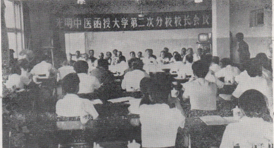
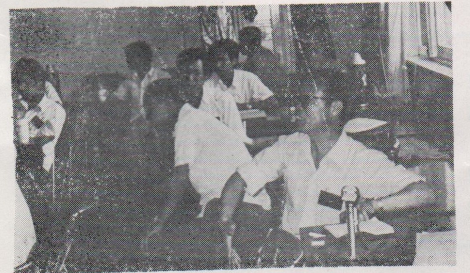

# 光明中医函授大学第二次分校校长会议纪要

（一九八六年六月五日）

光明中医函授大学第二次分校校长会议，于1986年6月2--5日在北京召开，名誉校长李德生、崔月犁，《光明日报》社顾问杨西光出席会议并讲了话。

出席会议的还有：中直机关党委秘书长乔青，卫生部中医司司长田景福，《中国教育报》副总编杨建业，《光明日报》社秘书长卢云，北京市成人教育局社会教育处处长田荣兴。中国食品工业协会副会长韩林光，北京现代管理学院副院长高林，光明中医函授大学总顾问童陆生，顾问董建华、赵绍琴、张震寰、刘炳凡、张海岑、王士相、朱鹤亭、金世元，校长吕炳奎、王恩厚，副校长王伯岳、方药中、巫君玉，张协和、白永波、王德嘉（副校长王绵之、周凤梧因事请假）以及来自全国各分校的代表和特邀代表共52人。

　　

会议议程为：1进行工作总结。2修订教学工作制度，讨论招生、注册、考试办法。

吕炳奎、王恩厚校长分别主持会议并致开、闭幕词，王德嘉、白永波副校长分别作了工作报告和会议总结。

会议第一议题，由王德嘉同志代表总校作工作报告。他指出：光明中医函授大学现在拥有学员44000余人，在各地建立了27所分校、200余个面授辅导站，初步形成了由总校、分校、辅导站组成的三级管理的函授网。各级党政领导同志、民主党派和各界知名人士大力支持函大工作并兼任函大的各级职务，各地的名老中医自告奋勇，组建分校，分担当地辅导站的工作。目前，我校自编教材已出书五种，脱稿七种，正在编写的七种。主办了《光明中医》双月刊。此外，有些分校还自编了部分辅导材料。一年来，各分校所组织的师资队伍中，教授、副教授占10．5％，讲师占53．1％，助教占36．4％，教学人员比例基本符合中医高等函授教育的要求。一年来的办学实践表明，尽管办学中存在着困难、问题、差距，但基本上完成了教学任务，为函大的发展奠定了基础。 

各分校的工作汇报，则从不同侧面总结了各自的工作：

（1）各分校在当地广泛宣传函大办学思想，积极争取当地党政领导的大力支持。如：湖南省原副省长刘亚南、王含馥，湖南省卫生厅顾问崔洪源等同志一再表示：晚年要办好光明中医函大。天津市和平区领导为学员自学小组免费提供辅导房屋。许多基层中医医院在人力、物力上支持了辅导站的工作。

（2）建立教学组织，制定规章制度，目前，各分校组织机构均已完善，在建立辅导站时，注重选择德才兼备的同志担任领导工作。湖南分校常德辅导站站长李伟成同志，负责8个县市431名学员的教学工作，同时，还将老师的备课、学员的食宿等事务均安排得井井有条，锦州分校把7个辅导站建在各县中医院，充分发挥了基层中医的教学力量。辽源、通辽辅导站在各方面都得到了当地卫生局的大力支持，吉林省分校把辅导站建在原有的中医教学医院中，保证了教学工作的正常进行。

（3）注重面授效果，确保教学质量。一些分校的名老中医亲自授课，如河北分校校长、74岁的桑林同志，身带重病亲自为学员授课，保证了教学质量。目前，各辅导站中，完成面授课时最高的达124学时，面授率最高的为牡丹江辅导站，达90％，平均为70％。另外，早临床，多临床，注重临床技能培养，解决床实习问题，已逐渐提到各分校的议事日程。湖南分校计划采取师徒合同式解决这一问题，岳阳市辅导站已初步采取了这一形式。

（4）加强学籍管理，调动学员积极性。各分校根据实际情况，采取不同措施，加强了学籍管理工作。黑龙江省分校在这方面做到了没有误差。各分校还支持学员成立自学小组，从而发挥了学员的主动性、积极性。

　　

在进行会议的第二议程时，代表们展开了热烈、认真的讨论，提出了切实可行的修改意见。代表们一致认为：今后招生，应以面授覆盖地区的农村乡镇、中小城市的青年为主，同时欢迎各级在职医务人员及中、老年中医爱好者报名,对不同学习目的的学员，提出不同的教学要求，对1985级学员的注册，应讲明函大的办学动机，国家教育部门的现行政策，以及知识和文凭的关系，从而引导学员考虑是否继续注册，以便更好为有志于中医事业的同志创造学习条件。对考试办法，大家希望能由总校统一命题，闭卷考试，严格把关，取优舍劣，以保证学习质量,会议期间，李德生同志主持了教育、卫生等部门有关领导同志和函大部分领导成员参加的座谈会。他指出：“中医人才青黄不接．农村缺医少药的情况还没有根本解决,所以，培养中医人才，这是一件大好事！也是一件得人心的事。有中央的重视，有群众的支持，我们的事业就会很快地发展起来！前一段时间，同志们做了很多工作，取得了很大成绩，现在需要做一次通盘研究，把我们的事情办得更好！”他还逐个嘱咐与会同志，要为办好函大出力、献策。

会议期间，崔月犁、田景福、杨西光同志先后讲话，他们的发言更加坚定了代表们办好函大的信心，展示了函大的光明前景，崔月犁同志从我国国情和卫生工作发展战略的高度出发，指出：发展医学教育事业，必须两条腿走路一条是正规的，一条是业余的，他说：“我们办学的目的和方略是符合十亿人民要求的，谁也打不垮！”田景福同志指出：“光明中医函大办学方向、培养目标比较明确。有一套完整的教学制度、教学计划、管理办法。特别难得的是搞了这么多的分校、面授辅导站，这是符合中医特点的，是自学中医面授辅导的强大基础。”在谈到学历问题时，田景福同志认为应该分两步走：

1、社会助学，参加成人自学高考；

2、创造条件，争取国家承认函大的文凭·杨西光同志在代表报社的讲话中指出：“办这个学校（指函大）有两个重要意义：一是发展中医；一是创造适合中医特点的科学的中医教育方式，《光明日报》社给予服务是没问题的，你们要我们办什么事，我们办！

　　

这次会议历时四天。代表们一致认为：

1、面向基层和农村，培养中医临床人才，培养为八亿农民服务的中医人才，是函大办学的方向；利用三级管理的函授教育网对学员进行面授辅导并组织临床实习，是函授大学的优势。

2、从探素适合中医特点和知识结构的中医教育方式出发，函大提出的办学思想与课程设置方案，吸引了越来越多的中医工作者及热心中医的同志，目前，一个以老中医为中坚，中青年中医为骨干，并与热爱中医的社会力量共同组成的函大办学队伍已初步形成，而且将不断发展和壮大。

3、坚持教材改革，不断更新教材内容，以提高教材质量：坚持在编写教材和面授辅导中不断挑选优秀教师，以提高师资水平；坚持早临床、多临床、师徒传授的方法学习临床技能和临证的思维方法，以培养学员“实战"的能力,这是保证教学质量的三个重要条件。

4、应商请中医司组织全国中医专家对光明中医函大教材进行审定，然后由高等教育自学考试指导委员会和中医司确定人选，组成考试委员会；以函大教材为命题依据，统一命题；把光明中医函授大学作为一个整体，对学员进行考试，合格者由国家发给学历证书。

5、目前存在的学籍管理上的一些混乱现象，内部信息交流不够，个别教材误期发放等问题，应引起重视，采取有力措施加以纠正。

代表们回顾一年办学的过程，深感创业难，改革难。然而，通过这次会议，代表们消除了顾虑，提高了认识，增强了信心，明确了方向！为巩固已有成绩和提高函大办学能力，打下了良好的基础。特别是几位领导同志的讲话，令人鼓舞，展示了函大的光明前景。代表们表示，这次会议开的及时，开得成功！对鼓舞斗志、坚持办学、立足改革、探索前进，具有十分重要的意义。回去后，一定把会议精神宣传好、贯彻好，为继续办好函大艰苦创业、努力工作，为实现九十年代中医事业的全面振兴做出贡献！

------

本文载于《光明中医》杂志1986年第二次校长会议特刊
