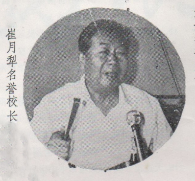

# 名誉校长、卫生部长崔月梨同志的讲话

（一九八六年六月三日）

昨天李德生同志已经讲话，吕炳奎同志也讲了，现在我讲几句。

目前我国各类成人高校已有1246所，在校学生172万，在数量上已接近普通高等教育的规模，我认为成绩很大,但对十亿人口来讲，数目则很小很小，这是我的看法。因为中国是十亿人口，培养人才一条腿走路是不行的！必须是两条腿走路：一条是正规的；一条是业余的。许多事情都是两条腿走路，因为没有不正规的这条腿，群众性就很难贯彻。要调动群众的积极性，动员能够办学的各种各样的力量，发挥大家的积极性及智慧力量，满足十亿人的需要！特别是卫生方面，现在我们高等院校培养出来的是0.6%，八亿农民现在基本用不上高等院校培养出来的人才，但也不能否认公社医院“赤脚医生”成为高等医学院校的水平，也不能否认这个，那里面的人才也不少，因为这么多青年，他们的经验是很丰富的。根据我们这几年的考核，50多万人都成为中级的了，就和过去打仗一样，许多人没有进过军事学院而成为军官，现在搞四个现代化，过去没搞过，还不是在实践中学习？1246所学校，在校生172万，成绩是很大，但对十亿人口来讲，这个数字是很小很小的。卫生方面，我们是0．6（有说0．7），那我们中医可能就是0．06了，十亿人口只有10万人的中医就是万分之一了，这怎么能行呢？咱们还口口声声说办中医要对十亿人民的健康做出贡献，要实现毛主席的遗言等等，你没有专家，没有力量，怎么实现？只能是空话！仅有好的想法是不行的。现在我们感到对非洲、拉丁美洲及对资本主义国家派出传统中医，却捉襟见肘，就是一个非洲，都派不出去，我们外事局要做一个计划，第一步把针灸在非洲普及，在非洲50多个国家想办法向当地医务人员推广针灸，一定受欢迎！而且非常适于他们，第二步推广草药，尤其把地方草药推广在非洲草药非常多，值得推广，现在应当帮助他们发展传统中医，要凭我们这点力量，我看办不到。不是说好多事情不可以办，爱滋病中医可能就有办法，根治我不敢说，但是能延长生命，中医用扶正祛邪，可以增加病人机体抵抗力。

就目前来说，中医有两个函授大学（光明函大和健康报刊大)，拥有十几万学员，若个个都能通过高考委员会的考试，也就十几万，也不能解决问题，数量上、质量上都不能解决问题。所以，我们有一个计划：在15年或20年，60万个生产大队，各生产队至少有一个中等程度以上的中医；6万多个公社（相当于现在的9万多个乡）医院，都有3一5个中等以上中医。八亿农民是欢迎中医的！中医如果在八亿农民中扎根，那是浩浩荡荡的！光重视上面不行，我们考虑问题，要考虑中国最大的特点是有十亿人口，考虑教育问题，如果不考虑十亿人口，那么就是和社会主义建设大脱节！国家教委关于社会力量举办高等学校和中等专业学校试行条例讲到：社会力量办学的状况出现了某些混乱现象，表现在三个地方：

第一：学校的兴办或专业的开设与社会主义建设实际需要相脱节。这我还没发现。我看大脱节是可能的。我们中医如果不从十亿人口来考虑是要大脱节的！要脱离社会主义建设的步伐！至于公社以上的县2200多个，县县都要有中医院，300多专区也得有中医院，29个省也要有，那规模就更大了，需要很多人才，这些人才怎么出来？我们现在24所高等中医院校，一年才造就5000人，十年才5万人，光填补退休的就差不多了，那怎么增加呢？中央提出要从实际出发，什么是实际？我看这就是实际。因为我们搞社会主义建设，就是要逐步满足十亿人民的需要！现在我们被动得很，八亿农民的生活水平成番地上去了，现在能就近就医吗？北京等大城市差不多三分之一以上（有的还要多）的门诊病人，都是乡下来的。我们搞了30多年的社会主义卫生建设了，心里能过得去吗？为人民服务不光是口号，要落实到实处。

第二：有些学校在力所不及或准备不足的情况下仓促上马，难以保证质量。我看世界上办第一个大学时没有教授，地球上办第一个大学时，有教授吗？办任何事情都是由小到大、由简单到复杂，这是辩证法嘛！是事物发展的规律性，哪有4万多人的大学办起来后，教学质量就超过北京中医学院！各种规章制度比正规学校还健全，不可能嘛！什么事情都要有一个过程，看在这过程中，我们的党政领导采取什么态度，是鼓励的态度，还是消极的抓辫子的态度，这是不同的！教育也是存在着这个问题。怎么能发挥大家的积极性，保护积极性，帮助解决问题，改正错误？这个指导思想是从实际出发的，符合我们的情况，少数学校办学思想不端正，以学经商，谋取私利，这是不对的，这只是少数。大多数还是正确的。对待这些正确办学的，是采取鼓励的方针？还是泄气的方针？是不一样的。在这里我不是批评教育委员会的，我只是发表我个人的意见。

中医怎样才能把这两个大学办好？最好能够以后每一个省都有这样一个大学！四川1亿人口，有10万人自学中医，7千万以上的省7个，当然我们不在乎名称，分校也好，或叫其他什么也好，要把工作搞好，但现在这么大的省，怎么发挥各级的积极性？特别大部分是在职的学员多，应当每个省搞一个计划，多长时间给基层培养多少人，现在我们的问题不是盖房子没钱，有钱，房子二年就可盖起来；也不是买设备没有钱，买设备没什么了不起，有钱时很快就买了，关键是人才，三年五年你就出来了？不顶事！但做为我们的需要来讲，做为承担十亿人口的保健任务，承担为世界人民服务的任务来讲（现在咱们已经吹出去了，吹出去了就要按这个做，咱们不能言行不一致）是不行的，差得太多。

今天我非要来一下，是因为昨天没时间。昨天李德生等同志就有关问题也都讲了，我没什么可说的，主要是打打气，看怎么能够把咱们这事情办好！第一不要散了，不要散了就能办好，因为我们办学的目的和方针是符合十亿人民要求的，只要符合这个要求，谁也打不垮！中央现在的路线是正确的，实事求是，一切从实际出发。至于说你一万人里有九千九百九十九人都不够发像清华、北大那样文凭的资格，那关系不大！现在是批评了单纯文凭观点吗？胡耀邦同志没有文凭，总书记不是一样当吗？赵紫阳同志是中学文凭，没有“总理训练班”的文凭，总理不是一样当吗？还得看实践！当然，学校是学理论，学业务专业知识是主要的，百分之八、九十的力量要放在这里，但中医现在问题不少，我看师带徒问题还没有解决。

文凭不是主要的，你只要有能力，早晚会有文凭；你没有能力，一考就考垮了，文凭也得不到，以后我们和教委商量，是否可以给我们点权？叫我们能考试，我看这就可以了。发文凭教委去发，李鹏同志去发，副总理发文凭荣誉更大！我们考试如果够标准，请李鹏同志发，好不好？（热烈鼓掌）

总之这次会议很重要，我看一年应开这样一次会，大家交流经验，巩固它，提高它。至于哪些地方经费缺一些，要多方面想办法，咱们既干，就不能空着手干！卫生部也考虑一下：看中医专款里怎么样，看后半年怎么安排？总之咱们要干下去，关键是组织教学力量，没有好人教不出好学生！北京社会大学开学时我说大话，说：“我们业余的应跟清华北大比较比较，看水平究竟怎么样"，当然我们不是那个专业，指的是质量，所以教师要好好选一选。另外，教师不能老是尽义务，多少也要给些待遇嘛！

我看关世雄同志的观点是不错的，苏联那时六百多万学生都是像毛主席说“群众这条腿'培养的。苏联才两亿多人口，如果按这个比例，我国就要培养三千万大学生，这是多大的数字！在这里也可以看出我们面临的任务是多么艰巨！

我这里就不再多说了，最后感谢大家为中医事业培养人才！

（根据录音整理，未经本人审阅）

------

本文为名誉校长、时任卫生部长崔月梨同志在光明中医函授大学第二次校长分校校长会议上的讲话，载于《光明中医》杂志1986年第二次校长会议特刊
