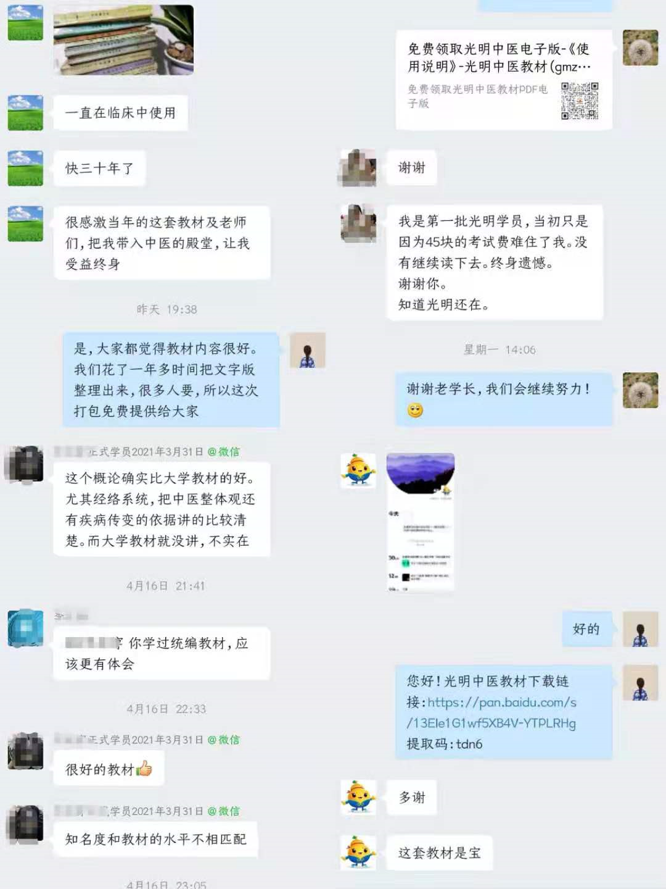

# 关于光明中医网校

光明中医函授大学是名老中医为防止中医传承中断而创立的中医大学，坚持按照中医规律进行教学，培养了大量的合格中医人才。但是八、九十年代，国家中医政策频繁变动，有的学员凭借光明中医毕业证拿到了中医执业证书，也有很多学员虽然辛苦学习了四年，却无法得到中医执业资格。这是近代中医界最大的憾事。

函大坚持自力更生的原则，不拿国家的教育经费，因此在规模上无法与国有中医药大学相比。随着时间的推移，各位名老中医逐渐去世，吕炳奎校长也于2003年以90岁高龄去世。2005年，由于政策原因，光明中医不得不闭校。学校资料最后的保管者是原学校办公室主任范竹雯老师。范老师现为光明中医杂志社社长。

光明函大停办后，有很多校友想重新办学，但多限于政策与经费的原因，难以如愿。 

为了让名老中医的心血能够得以延续，让中医学习者能走上正确的学习道路，范竹雯老师的弟子李文强、高明哲发起了光明中医传承平台（光明中医网校），目的是帮助大家**系统**学习中医。网校在范老师和老校友的支持下，继承了光明中医的教学思想，并做了很多与现代化结合的工作，具体包括：

1、为了方便学员阅读和检索教材，网校组织人员历时一年半，完成了光明中医教材主要课程800多万字的的电子化工作。电子版教材向社会免费开放，学员可以免费领取。

2、对于有毅力系统学习中医的学员，网校提供在线学习平台，安排了主要课程的学习计划和作业问题，学员可以以较低的成本使用。

3、对于习惯看视频学习的学员，网校邀请校友录制了部分课程的教学视频。

网校希望能和各位中医同道一起努力，让中医薪火相传，造福人民！

