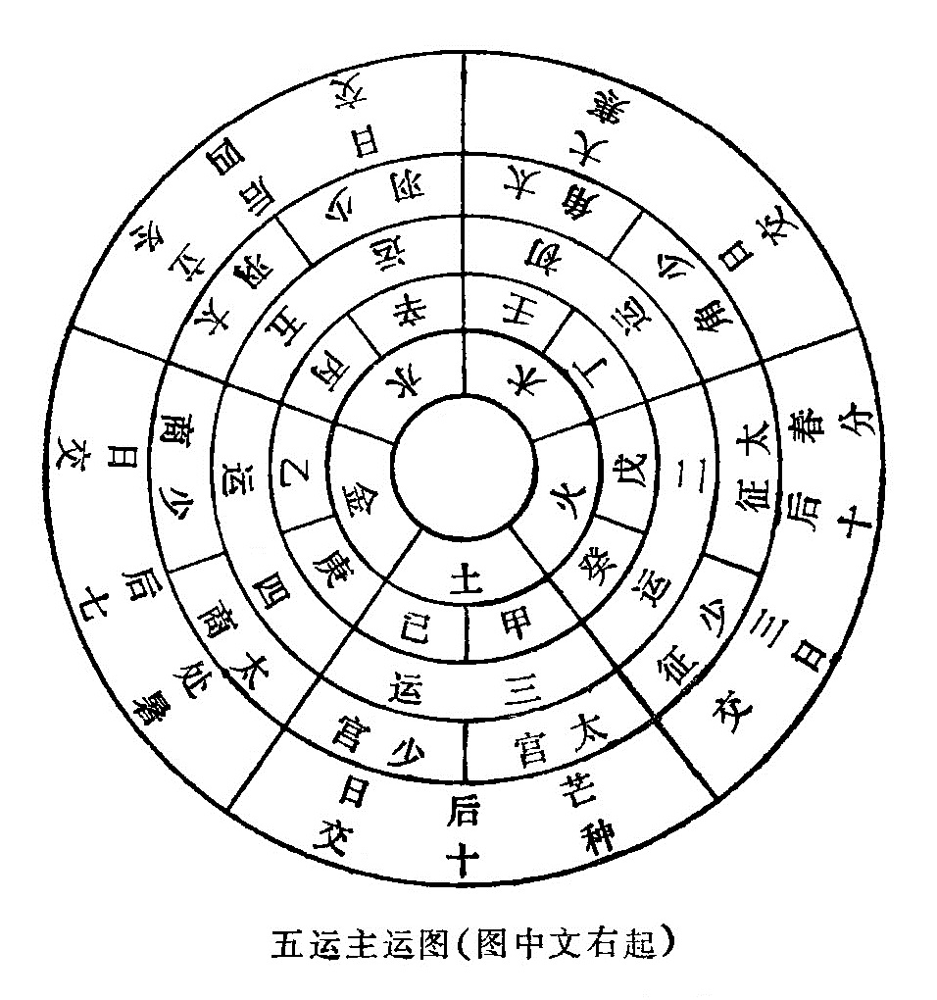
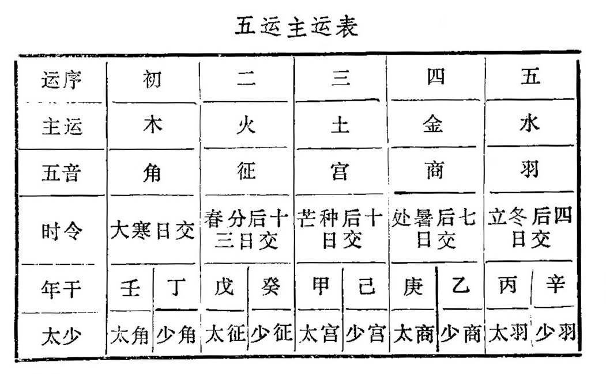
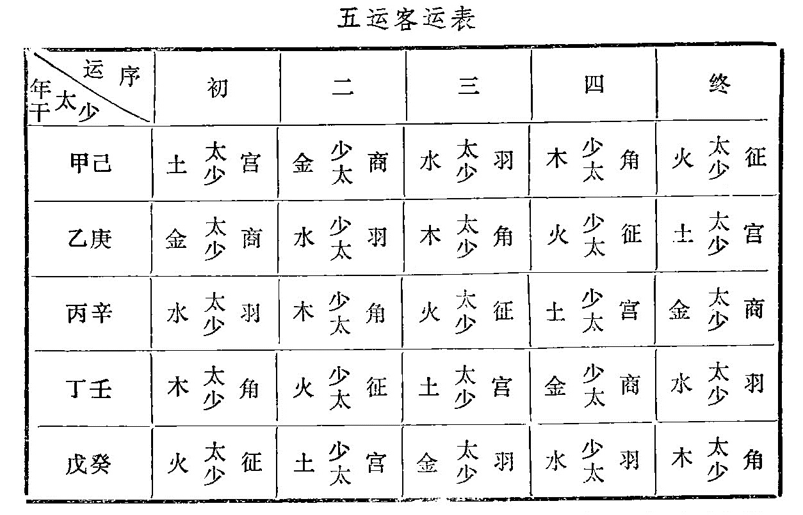

### （二）五运

五运，指五行之气的运动，包括一年五个季节气候变化的运动规律，和统主一岁的五种气象的运动规律。前者叫“五运主时”，后者叫“五运主岁”。为了概括和说明五气（风、火、湿、燥、寒）的基本性质及其运动规律，故分別以木运、火运、土运、金运、水运相称。同时又根据五行属性配以天干，所以张介宾说：“五行之应天干，是为五运。”

五运有主运、客运、大运的区分。主运以一年为一周期，主一年四季的正常气候变化；客运也是以一年为一周期，主一年四季的异常气候变化；大运以五年为一周期，通主五年内每一年的气候变化。但是推演运算的方法各不相同，下面分别说明。

* * *

#### 1、大运

以五年为一周期，统主一岁的五运之气，叫做大运，又称中运。五运之气，配以天干，每两干统主一运，用以说明全年气候的变化，所以又叫做“十干统运。”

十干统运是：逢甲己年为湿土用事，统主一年运气；乙庚年为燥金用事，统主一年运气；丙辛年为寒水用事，统主一年运气；丁壬年为风木用事，统主一年运气；戊癸年为炎火用事，统主一年运气。五年一轮转，周而复始，照此轮周十二次，即为六十年的大周期。这是运气学说作为探讨气象变化规律的一种方法。如《素问•天元纪大论》说：“甲己之岁，土运统之；乙庚之岁，金运统之；丙辛之岁，水运统之；丁壬之岁，木运统之；戊癸之岁，火运统之。”

为什么称为中运？

是说五运之气经常处于天气和地气之间，故称中运。天气和地气上下相交之处，所谓“气交之分”，相当于大气的底层，是人类生活在大自然中的位置。《素问•六微旨大论》说：“上下之位，气交之中，人之居也。”

由于在上的天气和在下的地气不断进行上升下降的运动，当天气不足时，地气则随之上升；地气不足时，天气则随之下降。但是运气居天地之中，气交之分，无论上升下降的气流，都必须通过这一中间地带，所以天气下降时，居中的运气必先之而降；地气上升时，居中的运气必先之而升。《素问•六元正纪大论》说：“天气不足，地气随之，地气不足，天气随之，运居其中而常先也。”这里的“天”和“地”应当包括空间因素和地面因素，正由于这两种因素相互作用，导致了各种天气现象的发生。

为什么十干统运的五行配属又有所不同呢？

因为十干统运的五行配属是根据天象变化，即星辰之间的变化来确定的，故与按五行方位配属的十干有所不同。这在《素问•五运行大论》中有明确的记载：“《太始天元册文》，丹天之气，经于牛女戊分；黅天之气，经于心尾已分；苍天之气，经于危室柳鬼；素天之气，经于亢氐昴毕；玄天之气，经于张翼娄胃。所谓戊已分者，奎壁角轸，则天地之门户也。夫候之所始，道之所生，不可不通也。”

这说明十干统运的五行配属，是根据天象变化来确定的，有着实测基础。

* * *

#### 2、主运

主运，即五运之气分主一年五个季节的正常气候，历年不变，周而复始。它和四季的意义相似，春季为木运，夏季为火运，长夏为土运，秋季为金运，冬季为水运。用以说明常年气候变化的常律。

主运每年从木运开始，按照五行相生的次序运行，直至水运为止。每运主七十三日零五刻，一年共得三百六十五日零二十五刻，正合日行周天之数。

列图如下：

初运的木运是从什么时候开始的？初运木运是从大寒节当日开始（具体时间要根据年支的阴阳属性来定，见后五运各年交司时刻表），至春分后十三日交火运（二运）；芒种后十日交土运（三运）；处暑后七日交金运（四运）；立冬后四日交水运（终运）。五行气运就是这样相互沿袭，分主一年五季的气候，年年如是，终而复始，成为常年气候运动变化的一般规律，所以《素问•六节脏象论》说：“五运相袭，而皆治之，终朞之日，周而复始，时立气布，如环无端，候亦同法。”

五运之气虽然分主各个季节，但因统主一年的岁运不同，对各个季节的气候变化必然产生一定的影响，因此五运之气就有太过不及之分。太过，是运气的偏盛；不及，是运气的偏衰。如果既非太过，又非不及，那就属于完全正常的平气了。为了进一步分析主运五季太过不及的变化，采用了“五音建运”以反映五行气运的规律；“太少相生”以反映阴阳互根的变化；“五步推移”以反映不同岁运的影响。兹就上述推算方法，分别进行说明：

1）五音建运

五音，即宫、商、角、徵、羽。这是古代的音阶，又分别属于牙、舌、喉、齿、唇部发出的声音。《乐书》引刘歆云：“宫者，中也，为四音之纲，其声重厚；商者，章也，其声敏疾；角者，触也，其声圆长，经贯清浊；徵者，祉也，事也，其声抇抑递续；羽者，宇也物也，其声低平掩映，自高而下。”

为什么要用五音建运呢？

这与古代采用律管飞灰测候时令有关。五音清、浊、髙、下、长、短的变化，是随着五个季节不同的气运而发生的，所以古有“五音为五行之音”的说法。唐•徐坚在所著《晋书》中说：“角，触也，象诸阳气触动而生；征，止也，言物盛则止；商，强也，谓金性之坚强；羽，舒也，阳气将复，万物孳育而舒生；宫，中也，中和之道，无往而不理。”为此把五音分别建立在五运之中，即角为木音，建于木运；征为火音，建于火运；宫为土音，建于土运；商为金音，建于金运；羽为水音，建于水运。再根据五音的太少，即年干的阴阳，去推求五运太过不及的情况。

五音是与五行之气有一定的联系。用它来建运，无非把五音作为符号，以便区分太少，说明五行气运的太过与不及，其音义大略如此。兹列表于下：

主运运序配音表

运序 | 初 | 二 | 三 | 四 | 终  
---|---|---|---|---|---  
主运 | 木 | 火 | 土 | 金 | 水  
五音 | 角 | 征 | 宫 | 商 | 羽  
季令 | 春 | 夏 | 长夏 | 秋 | 冬  
  
2）“太”，即太过，有余；“少”，即不及，不足。这里的太过不及，是用运气的阴阳来说明的，阳为太过，阴为不及。所以太属阳，少属阴。阴与阳本来是相互资生、促进的，所谓“阴以阳生，阳以阴生”，因此太少相生，即是阴阳相生的意思。

由于十干主运要区分阴阳，所以五音建运也有阴阳的区分。十干中以甲、丙、戊、庚、壬为阳，乙、丁、己、辛、癸为阴，凡阳干均属太，阴干均属少。把五音建于五运之上，再根据十干的阴阳来区分五音的太少，这样就能进一步说明运气的太过与不及。例如：甲己为土运，配以宫音，而甲为阳土，则属太宫；乙为阴土，则属少宫。乙庚为金运，配以商音，而庚为阳金，则属太商；乙为阴金，则属少商。丙辛为水运，配以羽音，而丙为阳水，则属太羽；辛为阴水，则属少羽。丁壬为木运，配以角音，而壬为阳木，则属太角；丁为阴木，则属少角。戊癸为火运，配以征音，而戊为阳火，则属太征；癸为阴火，则属少征。这是所谓“五音别太少。”

五音的太少又怎样相生的呢？五运通常是按五行相生次序运行的，既然把五音建于五运之中，五音必然随着五运的顺序而相生。所谓相生，就是相互资生促进，这是指自然气候变化中的一种规律。但五音的太少相生，是反映五行阴阳之气的相互资生。例如。甲己均为土运主治之年，但甲为阳土，所生是阴金之乙，此即太宫生少商；阴金之乙，所生是阳水之丙，此即少商生太羽；阳水之丙，所生是阴木之丁，此即太羽生少角；阴木之丁，所生是阳火之戊，此即少角生太征；阳火之戊，所生是阴土之己，此即太征生少宫。又己为阴土，所生是阳金之庚，此即少宫生太商；阴水之辛，所生是阳木之壬，此即少羽生太角；阳木之壬，所生是阴火之癸，此即太角生少征；阴火之癸，所生是阳土之甲，此即少征生太宫。这就是五音的太少相生。

太少反复相生，阴阳相互作用，于是有正常的运动变化，这是符合自然规律的。

五音建运太少相生表

年干 | 甲 | 乙 | 丙 | 丁 | 戊 | 己 | 庚 | 辛 | 壬 | 癸  
---|---|---|---|---|---|---|---|---|---|---  
属性 | 阳土 | 阴金 | 阳水 | 阴木 | 阳火 | 阴土 | 阳金 | 阴水 | 阳木 | 阴火  
五音 | 宫 | 商 | 羽 | 角 | 征 | 宫 | 商 | 羽 | 角 | 征  
太少相生 | 太 | 少 | 太 | 少 | 太 | 少 | 太 | 少 | 太 | 少  
  
3）一年中，木运、火运、土运、金运、水运分主五个季节，始于木而终于水，历年不变，周而复始，这是主运的特点。但是它在一定程度上要受大运的影响和支配，因此，每年的初运是太角还是少角？就要根据当年年干的阴阳属性来决定，这样才能对五运各自的太过不及作出分析，所以要采用五步推运的方法。例如：年干是甲，甲为阳土，中运属太宫。即从太宫土运本身依次上推，直至初运的角为止，便可见到生太宫的是少征，生少征的是太角。因而甲年主运的初运便是起于太角。太少相生，太角生少征（二运），少征生太宫（三运），太宫生少商（四运），少商生太羽，是为终运。

己年为阴土，中运属少宫。即从少宫土运本身依次上推至初运的角，便可见到生少宫的是太征，生太征的是少角。因而己年主运的初运便是起于少角。太少相生，少角生太征（二运），太征生少宫（三运），少宫生太商（四运），太商生少羽，是为终运。

乙年为阴金，中运属少商。即从少商金运本身依次上推至初运的角，便可见到生少商的是太宫，生太宫的是少征，生少征的是太角。因而乙年主运的初运便是起于太角。太少相生，则太角生少征（二运），少征生太宫（三运），太宫生少商（四运），少商生太羽，是为终运。

庚年为阳金，中运属太商。即从太商金运本身依次上推至初运的角，便可见到生太商的是少宫，生少宫的是太征，生太征的是少角。因而庚年主运的初运便是起于少角。太少相生，则少角生太征（二运），太征生少宫（三运），少宫生太商（四运），太商生少羽，是为终运。

丙年为阳水，中运属太羽。即从太羽水运本身依次上推至初运的角，便可见到生太羽的是少商，生少商的是太宫，生太宫的是少征，生少征的太角。因而庚年主运的初运便是起于太角。太少相生，则太角生少征（二运），少征生太宫（三运），太宫生少商（四运），少商生太羽，是为终运。

辛年为阴水，中运属少羽。即从少羽水运本身依次上推至初运的角，便可见到生少羽的是太商，生太商的是少宫，生少宫的是太征，生太征的是少角。因而辛年主运的初运便是起于少角。太少相生，则少角生太征（二运），太征生少宫（三运），少宫生太商（四运）。太商生少羽，是为终运。

丁年为阴木，中运属少角。初运即从少角本身起算，太少相生，则少角生太征（二运），太征生少宫（三运），少宫生太商（四运），太商生少羽，是为终运。

壬年为阳木，中运属太角。初运即从太角本身起算，太少相生，则太角生少征（二运），少征生太宫（三运），太宫生少商（四运），少商生太羽，是为终运。

戊年为阳火，中运属太征。从太征火运上推一步，便是少角。因而戊年主运的初运便是起于少角。太少相生，则少角生太征（二运），太征生少宫（三运），少宫生太商（四运），太商生少羽，是为终运。

癸年为阴火，中运属少征。从少征火运上推一步，便是太角。因而戊年主运的初运便是起于太角。太少相生，则太角生少征（二运），少征生太宫（三运），太宫生少商（四运），少商生太羽，是为终运。

可见五运之气，总是以年干阴阳来区分太少，然后逐步上推至角，再从角而推至羽，这样就可分析各运之气的阴阳盛衰了。

4）各年五运交司时刻

申、子、辰年

初运：大寒日寅初初刻起。

二运：春分后第十三日寅正一刻起。

三运：芒种后第十日卯初二刻起。

四运：处暑后第七日卯正三刻起。

五运：立冬后第四日辰初四刻起。

巳、酉、丑年

初运：大寒日巳初初刻起。

二运：春分后第十三日巳正一刻起。

三运：芒种后第十日午初二刻起。

四运：处暑后第七日午正三刻起。

五运：立冬后第四日未初四刻起。

寅、午、戌年

初运：大寒日申初初刻起。

二运：春分后第十三日申正一刻起。

三运：芒种后第十日酉初二刻起。

四运：处暑后第七日酉正三刻起。

五运：立冬后第四日戌初四刻起。

亥、卯、未年

初运：大寒日亥初初刻起。

二运：春分后第十三日亥正一刻起。

三运：芒种后第十一日子初二刻起。

四运：处暑后第七日子正三刻起。

五运：立冬后第四日丑初四刻起。

(《类经图翼》）

兹将五运主运，列表于下：

* * *

#### 3、客运

客运，指每年五个季节的异常气候变化，因其每岁有变更，如客之往来，故称之为“客运”。

为什么每年客运所主的气候都有变更呢？因为每年五季的气候在一定程度上要受统主一年的中运之气的影响，所以客运与历年不变的主运不同，它要随着每年的中运而变化。具体来讲，客运是以每年的中运为初运，循着五行太少相生的次序，分作五步，运行于主运之上，每步仍为七十三日零五刻，逐步运行，十年一轮周，终而复始。例如：

甲己年为土运所统，甲为阳土，运属太宫。因此，逢甲年便以太宫阳土为初运，按五行太少相生次序，则少商阴金为二运，太羽阳水为三运，少角阴木为四运，太征阳火为终运。逢己年为阴土，便以少宫阴土为初运，太商阳金为二运，少羽阴水为三运，太角阳木为四运，少征阴火为终运。其余按此类推。可见它与主运每年始于角而终于羽是不相同的。兹列表如下：

客运定局的程式，在《素问•六元正纪大论》也有记载，如：

壬年：太角（初正）、少征、太宫、少商、太羽（终）；

戊年：太征、少宫、太商、少羽（终）、少角（初）；

甲年：太宫、少商、太羽（终）、太角（初）、少征；

庚年：太商、少羽（终）、少角（初）、太征、少宫；

丙年：太羽（终）、太角（初）、少征、太宫、少商；

丁年：少角（初正）、太征、少宫、太商、少羽（终）；

癸年：少征、太宫、少商、太羽（终）、太角（初）；

己年：少宫、太商、少羽（终）、少角（初）、太征；

乙年：少商、太羽（终）、太角（初）、少征、太宫；

辛年：少羽（终）、少角（初）、太征、少宫、太商。

程式中所注的“初”，指每年主运的初运，“终”，指每年主运的终运，“正”指当年主运和客运的五步太少相生是一致的。壬年的初运是太角，丁年的初运是少角，主客运同步，故称为“正”。

总的说来，大运（中运）、主运、客运各有特点，大运是推算六十年的气象变化，以及一年之中气候变化的太过不及；主运是推算一年五个季节的正常气候变化；客运是推算六十年中每年五个季节的异常气候变化。但都要利用天干的阴阳五行属性进行推演，例如阴阳干互为起运，太少相生，五行顺序，五步推移等，都是相同的。不同的是，大运从土起算，主运从木起算，客运则不固定，随大运而转移。主运年年始于角，终于羽，居恒不变，而客运则以本年的大运为初运，十年周遍十干，终而复始。三者的推算方法虽然不同，但都是为了探索和说明自然气候变化的不同规律。

* * *

#### 4、五运三纪

无论任何一个周期的气候变化，有正常就有反常，有偏盛就有偏衰，因此五运之气可分为太过、不及、平气三种不同情况，所以称为“五运三纪。”

所谓太过，是指运气偏盛而有余；不及，指运气偏衰而不足；平气，即正常之气，既非偏盛，又非偏衰。尽管气候变化万千,总不外乎这三种情况。所以《素问•五常政大论》称之为“三气之纪”，用以概括自然气候变化中的几种规律，正如高士栻所说：“木、火、土、金、水，有平气，有不及之气，有太过之气，皆其常也。天气制于上，运气主于中，百物生化，五虫孕育，有盛有衰，是其政也。”为此，《内经》在《素问•气交变大论》、《素问•五常政大论》诸篇，都分别进行了系统的论述，如何区别运气的太过、不及与平气？主要根据年干的阴阳属性以及年干和年支的关系来确定。凡年干属阳（甲、丙、戊、庚、壬），均主岁运太过；年干属阴（乙、丁、己、辛、癸），均主岁运不及。例如：甲己年为土运统治岁气，甲为阳干，是为土运太过之年，在六十年的周期中，凡六甲年（甲子、甲戌、甲申、甲午、甲辰、甲寅）主运，均为湿土用事，可以出现雨湿之气流行，土气独旺的局面。己为阴干，是为土运不及之年，在六十年的周期中，凡六己年（己巳、己卯、己丑、己亥、己酉、己未）主运，均为岁土不及，可以出现湿土之气不行，风气旺盛的局面。

平气又是怎样产生的？它是根据年干和年支的关系来确定的。在岁运不及的年份，如果年干能得到年支的帮助，便由不及而变为平气，所谓“运不及而得助”，这是形成平气的一种原因。例如癸巳年的年干属于火运不及，但能得到年支巳火的相助，而癸巳年的火运则为平气了。在岁运太过的年份，如果年干受到年支司天之气的制约，所谓“运太过而被抑”，便由太过而变为平气，这是形成平气的另一种原因。例如戊辰年的年干属于火运太过，但是受到辰年太阳寒水司天之气的制约，而戊辰的火运则为平气了。

此外，还有每年初运交接的第一天（大寒节），如果当年的年干与月干、日干或时干相合，也可称为平气，这就是所谓的“干德符”，即年干与月干、或日干、时干符合相济的意思。

总之，阴阳五行的气运在一定程度上都是以维持某种相对平衡为主要法则，它的相生相制，说明自然气候本身具有一种调节机制，使亢盛的将被削弱，弱小的会得到加强，旧的平衡被破坏，新的平衡又建立，大气中各种物理过程，都要服从这一规律，正如《素问•气交变大论》所说：“五运之政，犹权衡也，高者抑之，下者举之，化者应之，变者复之，此生长化收藏之理，气之常也，失常则天地四塞矣。”

《内经》对大气运动的这一认识，在今天也是有意义的。

