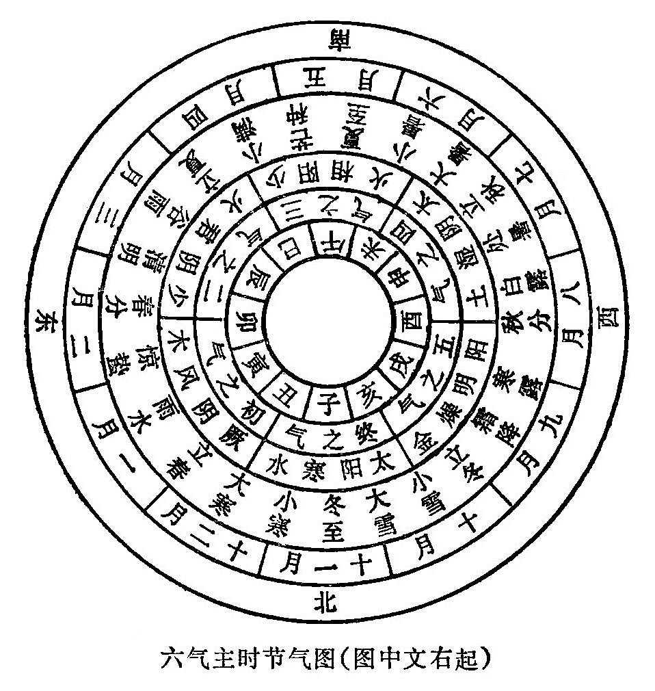
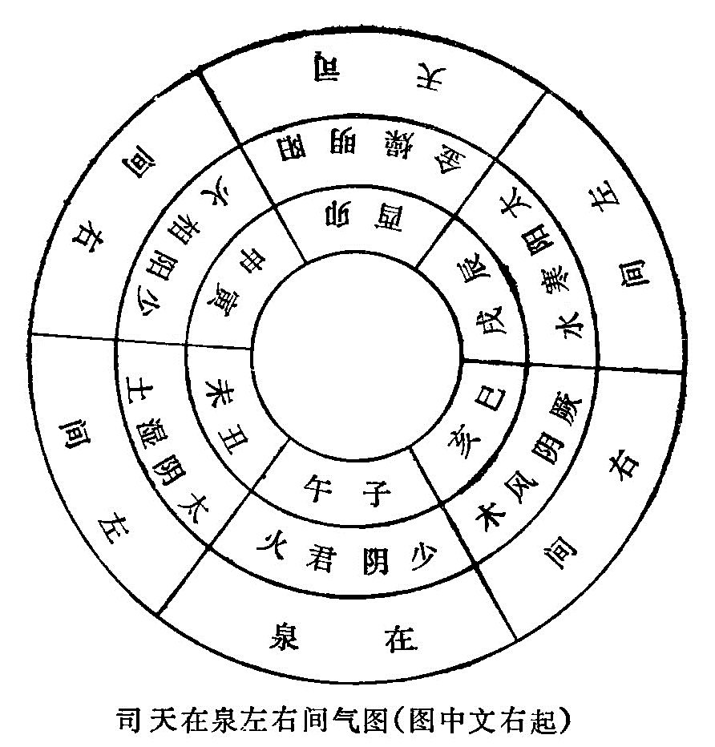
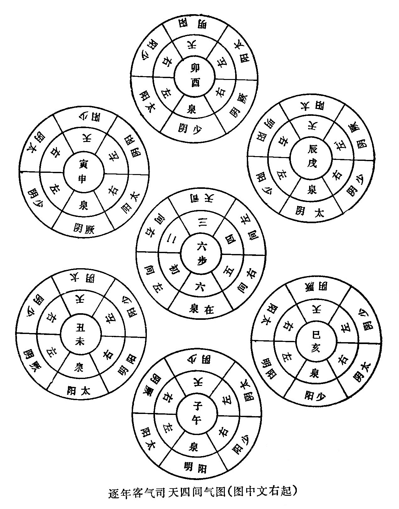
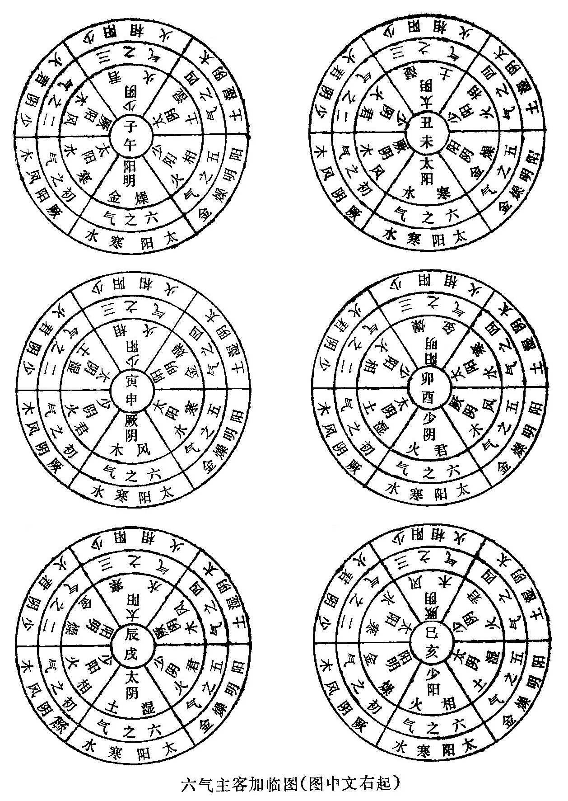

### （三）六气&

六气，即风、火、暑、湿、燥、寒六种不同的气候特征。五运和六气都要分主一年各个季节、气候的变化，不同的是，五运代表空间因素，它与天体的运转直接有关。气候变化本身是多种因素相互作用的结果，其中太阳辐射、下垫面状况、大气环流，人类活动都是影响气候变化的主要因素，而五运六气正是力图把这些影响气候变化的重要因素联系起来，去探索各种气候变化的运动规律。

每年的六气，分主气、客气、主客加临三种情况，主气用以测常，客气用以测变，主客加临，即是把主气和客气的关系结合起来，进一步分析气候的变化及其影响。推求的方法，是以六气配合十二地支，再根据纪年地支与六气的关系来进行推衍分析。

* * *

#### 1、十二支与六气

干支运用到运气学说中，天干主要是配合五运来运用，地支主要是配合六气来运用，即所谓“天干取运，地支取气。”

十二支配合六气，不能离开三阴三阳，正如《素问•五运行大论》所说：

“子午之上，少阴主之；丑未之上，太阴主之；寅申之上，少阳主之；卯酉之上，阳明主之；辰戌之上，太阳主之；巳亥之上，厥阴主之。”

上，即指在上的天气，亦即司天之气所在的位置。如子、午年，则为少阴君火之气主司天之位；丑、未年，则为太阴湿土之气主司天之位；卯、酉年，则为阳明燥金之气主司天之位；辰、戌年，则为太阳寒水之气主司天之位；巳、亥年，则为厥阴风木之气主司天之位。它与前面十二支按五行方位配属是不同的。如下表：

厥阴风木 | 少阴君火 | 少阳相火 | 太阴湿土 | 阳明燥金 | 太阳寒水  
---|---|---|---|---|---  
巳亥 | 子午 | 寅申 | 丑未 | 卯酉 | 辰戌  
  
为什么六气要这样配合十二支呢？这包含有天地阴阳二气相互作用的道理在内，即《素问•天元纪大论》所说：“动静相召，上下相临，阴阳相错，而变由生也。”天属阳，主动；地属阴，主静。动静相召，就是天气感召地气，地气感召天气的意思。上面的天气下临于地，下面的地气上临于天，这叫做上下相临。天地阴阳二气相互交错，相互作用，必然就会引起一系列的变化。但阴阳两个方面有主有从，因此王冰在《玄珠密语》中提出正对化之说，刘温舒根据王冰的论述并作解释说：

“六气分上下左右而行天令，十二支分节令时日而司地化。上下相召，而寒、暑、燥、湿、风、火与四时之气不同者，盖相临不一而使然也。六气司于十二支者，有正对之化也。然厥阴所以司于巳亥者，何也？谓厥阴木也，木生于亥，故正化于亥，对化于巳也。虽有卯为正木之分，乃阳明燥金对化也，所以从生而顺于巳也。少阴所以司于子午者，何也？谓少阴为君火尊位，所以正得南方离位，故正化于午，对化于子也。太阴所以司于丑未者，何也？谓太阴为土，土属中宫，寄于坤位西南，居未分也，故正化于未，对化于丑也。少阳所以司于寅申者，何也？谓少阳相火，位卑于君火也，虽有午位，君火居之，火生于寅，故正化于寅，对化于申也。阳明所以司于卯酉者，何也？谓阳明为金，酉为西方，西方属金，故正化于酉，对化于卯也。太阳所以司于辰戌者，何也？谓太阳为水，虽有子位，以居君火对化，水乃伏土中，即六戊天门戌是也，六己地户辰是也，故水虽土用，正化于戌，对化于辰也。此天之阴阳合地之十二支，动而不息者也。”(《素问入式论奥》）

可见构成十二支正化对化的条件，一是与所在位置有关，二是与所主时令有关，但都含有阴阳五行相生的意义。

* * *

#### 2、主气

主气，是主治一年六个季节的正常气候变化，故称为主时之气。因其居恒不变，静而守位，故又称为地气。

主气分主一年二十四节气，分为六步，每步主四个节气，计时六十天八十七刻半，初气始于厥阴风木，终于太阳寒水，按五行相生次序运行，年年不变。六气主时，是从上年的十二月中的大寒起算，经过立春、雨水、惊蛰，到二月中旬的春分前夕，属厥阴风木当令。此时斗建从丑中到卯中，正当阳气向上升发的季节，为一年春季之始，故以厥阴风木为初气。从二月中旬的春分起算，经过清明、谷雨、立夏，到四月中旬的小满前夕，属少阴君火当令，此时斗建从卯中到巳中，正是阳气逐渐旺盛的季节，又为一年夏季之始，故以少阴君火为二气。从四月中旬的小满起算，经过芒种、夏至、小暑到六月中旬的大暑前夕，属少阳相火当令，此时斗建从巳中到未中，正是暑气流行的季节，君相同气相随，故以少阳相火为三气。从六月中旬的大暑起算，经过立秋、处暑，白露到八月中旬的秋分前夕，属太阴湿土当令，此时斗建从未中到酉中，正是湿气最盛的季节，虽然新秋初到，炎暑渐消，但湿土郁蒸之气仍在，故以太阴湿土为四气。从八月中旬的秋分起算，经过寒露、霜降、立冬，到十月中旬的小雪前夕，属阳明燥金主令，此时斗建从酉到亥中，正是燥气最盛的季节，燥为清凉而又干燥之气，故以阳明燥金为五气。从十月中旬的小雪起算，经过大雪、冬至、小寒到十二月中旬的大寒，属太阳寒水当令，此时斗建从亥到丑中，正是寒气最盛的季节，天气至此，行遍一周，故以太阳寒水为终气。时序气候的变迁，反映了五行相生的规律，正如《素问•六微旨大论》说：“愿闻地理之应六节气位何如？曰：显明之右，君火之位也。君火之右，退行一步，相火治之；复行一步，土气治之；复行一步，金气治之；复行一步，水气治之；复行一步，木气治之；复行一步，君火治之。”

六气之间具有相互承制、约束的关系。这种承制、约束的关系，对气候变化起到一种自然调节的作用。《素问•六微旨大论》说：“相火之下，水气承之；水位之下，土气承之；土位之下，风气承之；风位之下，金气承之；金位之下，火气承之；君火之下，阴精承之。”“下”，指下承之气，因位居本气之后，所以称下。“承”，即随即，指接着而来的制约之气。六气之间要相互制约，才能防止太过不及，保持相对平衡，所以任何一气的下面，都有相应的制约之气。当某一气出现亢盛的时候，随即就有另一气去制约它。否则六气失去自然调节，就会产生很大的破坏作用，给生物界带来严重威胁，故《素问•六微旨大论》说：“亢则害，承乃制，制则生化，外列盛衰，害则败乱，生化大病。”兹列图如下：

* * *

#### 3、客气

客气，即是在天的三阴三阳之气，因其运动不息，年年有变，与固定的主气不同，犹如客之往来，故称为客气。

客气的运行也分六步，以阴阳先后为次序，即先三阴，后三阳。三阴以厥阴为一阴，少阴为二阴，太阴为三阴；三阳以少阳为一阳，阳明为二阳，太阳为三阳。两者结合起来，其次序为：一厥阴，二少阴，三太阴，四少阳，五阳明，六太阳。厥阴主风木之气，少阴主君火之气，太阴主湿土之气，少阳主相火之气，太阳主寒水之气。客气虽然和主气同样是分六步运行，但次序则完全不同，并且随着年支的变化而变化。《素问•六微旨大论》说：“上下有位，左右有纪。故少阳之右，阳明治之；阳明之右，太阳治之；太阳之右，厥阴治之；厥阴之右，少阴治之；少阴之右，太阴治之；太阴之右，少阳治之。此谓气之标，盖南面而待之也，故曰：因天之序，盛衰之时，移光定位，正立而待之，此之谓也。”

“上下有位”，是指司天在上，在泉居下的位置。上下确定以后，司天和在泉的左右间气也随之而定。根据六步客气在天的位置“面南而待之”，即可发现少阳的右面是阳明管理的；阳明的右面是太阳管理的……，这是客气与三阴三阳的同步规律。但六气为本，三阴三阳为标，风、寒、暑、湿、燥、火是六气的物质基础，三阴三阳只不过是六气的标象。这些都是根据天气变化的次序，时令盛衰的不同，而且通过观测日影以后才确定的位置，所谓“移光定位，正立而待之”。

客气的三阴三阳分布于上下左右，互为司天，互为在泉，互为间气，构成了以六年为一周期的气候变化，随着年支的演变，每年客气的盛衰均有所不同。推算客气，首先要确定司天和在泉，司天，在泉的左右，即为间气。下面分别予以说明。

* * *

##### 1）司天在泉

司天，就是主管天令的意思。通俗地讲，就是当令的气候。这是三阴三阳为客气时所表现的天气变化。在泉，即在下的地气，就是与司天相对之气，它是地气在不同的岁运影响下所产生的不同气候。司天象征在上，主上半年的气运；在泉象征在下，主下半年的气运。如子午年是少阴君火司天，则阳明燥金在泉；丑未年是太阴湿土司天，则太阳寒水在泉；寅申年是少阳相火司天，则厥阴风木在泉；卯酉年是阳明燥金司天，则少阴君火在泉；辰戌年是太阳寒水司天，则太阴湿土在泉；巳亥年是厥阴风木司天，则少阳相火在泉。《素问•六元正纪大论》说：“岁半以前，天气主之，岁半以后，地气主之。”即是说，上半年的客气，称为司天；下半年的客气，称为在泉。司天和在泉，就是值年客气的统称。

六步客气在天的位置是：司天在上，在泉在下，司天、在泉的左右，即间气所在的位置。所谓上，是指正南方位；所谓下，是指正北方位。司天的位置在正南方主气的三之气上，在泉的位置在正北方主气的终之气上。《内经》常用“上”字来代表司天，“下”字代表在泉，左右代表间气。如《素问•五运行大论》说：“天地者，万物之上下；左右者，阴阳之道路。所谓上下者，岁上下见阴阳之所在也。左右者，诸上见厥阴，左少阴，右太阳。见少阴，左太阴，右厥阴。见太阴，左少阳，右少阴。见少阳，左阳明，右太阴。见阳明，左太阳，右少阳。见太阳，左厥阴，右阳明。所谓面北而命其位，言其见也。”

这里的上下，就是指司天、在泉。司天在上，在泉在下，万物化生于其间，故天地为万物的上下。这里的左右，就是指间气。间气是用来纪步的，故左右为阴阳的道路。所谓上下，也即是该年司天在泉位置的阴阳。如子午年少阴司天在上，相对地阳明在泉在下；丑未年太阴司天在上，相对地太阳在泉在下。这里“上见”，是指司天。左右，是指司天的左右间气。故厥阴司天，则左见少阴，右见太阳；少阴君火司天，则左见太阴，右见厥阴。其余均可按此类推。为什么说这里所说的左右是指面向北方时所见的位置呢？因为司天的位置在正南方，面对着的是正北方在泉的位置，“面北而命其位”，是说明司天所定的左右是面向北方时所定的左右，它与在泉面向南方所定的左右相反。《素问•五运行大论》又说：

“何谓下？曰：厥阴在上，则少阳在下，左阳明，右太阴。少阴在上，则阳明在下，左太阳，右少阳。太阴在上，则太阳在下，左厥阴，右阳明。少阳在上，则厥阴在下，左少阴，右太阳。阳明在上，则少阴在下，左太阴，右厥阴。太阳在上，则太阴在下，左少阳，右少阴。所谓面南而命其位，言其见也。”

这里的“下”，是指在泉。这里的“左右”，是指在泉的左右。如己亥年厥阴风木司天在上，在下的在泉之气便是少阳，少阳在泉的左间是阳明，右间是太阴。其余均可按此类推。这里所说的左右，是指面向南方时所见的位置，它和司天面向北方所定的左右恰恰相反。

六气的运转，是按纪年的年支顺序进行的，六年一轮周，每一年都有值年的司天、在泉和间气。司天之气，自上而右转，下降于地；在泉之气，自下而左转，上升于天。左右旋转一周，于是回归原来的位置，故《素问•五运行大论》说：“动静何如？曰：上者右行，下者左行，左右周天，余而复会也。”

客气是按阴阳的先后与阴阳之气的多少为序的，即先三阴，后三阳（厥阴、少阴、太阴；少阳、阳明、太阳）所以值年的司天和在泉，总是阴阳相对。阴阳之气的多少相对，如一阴司天，则一阳在泉，二阴司天，则二阳在泉，三阴司天，则三阳在泉。反之，三阳也是如此。

客气六步，除司天和在泉外，其余四步称为间气，分别位于司天、在泉的左右。由于司天在泉的南北方位不同，司天和在泉的左间和右间便恰恰处于相反的位置。按客气与主气的相应位置来看，主气的三之气上是客气的司天，主气的四之气上，便是司天的左间；主气的二之气上，便是司天的右间；主气的终之气上是客气的在泉，主气的初之气上，便是在泉的左间；主气的五之气上，便是在泉的右间。四步间气，随着司天在泉而转移，它包含有阴阳升降的意义在内。每年六气的变化，司天之气起着决定性的作用；如《素问•至真要大论》说：“厥阴司天，其化以风；少阴司天，其化以热；太阴司天，其化以湿；少阳司天，其化以火；阳明司天，其化以燥；太阳司天，其化以寒。”

这就是客气司天的气化规律。兹列司天在泉左右间气图如下：

此外，客气司天还可能出现以下两种情况：

第一种：客气的胜复变化。胜，指偏胜之气；复，指报复之气。前者是气的主动抑制作用，后者是气的被动反抗作用。客气的胜复，是说客气有所胜则有所复。“有胜即有复”，这是气候变化在异常情况的一般规律，也是气候变化的一种自然调节作用。一年中，若上半年发生某种太过的胜气，下半年即有与之相反的复气发生，如上半年热气偏胜，下半年即有寒气来复。上半年是司天主政，下半年是在泉主政，这实际上是司天之气有胜，则在泉之气有复。当然，胜复之气并非每年都有。胜复的变化，不仅六气存在，五运也有类似情况。五运中，若有某运偏胜，即有另一运以报复之，如木运不及，金气胜木，木郁化火，火则克金而为复。不过六气和五运的胜复有所不同，六气之复，是所郁之本气复发；五运之复，是为子复母仇。

第二种客气的不迁正，不退位。“不迁正，不退位”，这是《素问》遗篇《刺法论》中提出的。所谓“不迁正”，就是值年的司天之气不能应时而至，原因多由前一司天之气太过，以致影响值年司天之气，因此气候失常，即《本病论》所说：“司天不得其迁者，即前司天以过交司之日，即遇司天太过有余日也，即仍旧治天数，新司天未得迁正也。”

所谓“不退位”，就是主司天之气过时而不退，继续行令，以致该气延长，气候不符合常律。即《本病论》所说：“所谓不退者，即天数未终，即天数有余，名曰复布政，故名曰再治天也，即天令如故而不退位也。”

例如子午年少阴君火司天，如果火热之气太过，留而不去，至次年的气候变化仍然出现少阴君火之气的特点，这就是少阴君火不退位，相应地就会影响左右间气的升降，形成“升不前，降不下”，因此破坏了客气的正常规律。由此可知，“不退位”即司天之气的“至而不去”，“不迁正”，即司天之气的“至而不至”，都是客气司天气候的异常现象。

##### 2）客主加临

什么叫客主加临？就是将每年轮值的客气加在固定的主气之上，便称客主加临。临，是会合的意思。客气是“动而不息”，属于天气；主气是“静而守位”，属于地气。把客气和主气结合起来，主要是便于分析它们之间的关系，借以推测各该年四时气候的变化。《素问•五运行大论》说：“上下相遘，寒暑相临”。这里的“上”即指客气；“下”即指主气。上下相遘，即司天在泉之客气与主时之气相互交遘。这里的寒暑是泛指六气。寒暑相遘，即是指客气的司天、在泉、左右间加临于主气之上。根据主客之气是否相得，或顺或逆，便可分析其变化。正如《普济方·五运六气图》说：“以客加主，而推其变。”所谓客主加临，即是将司天的客气加在主气三气之上，在泉之气加在主气的终之气上，其余四个间气，自然以次相加。例如：

子午年少阴君火司天，阳明燥金在泉。主气的初气是厥阴风木，客气的初气则为太阳寒水。主气的二气是少阴君火，客气的二气则为厥阴风木。主气的三气是少阳相火，客气的三气则为少阴君火。主气的四气为太阴湿土，客气的四气亦为太阴湿土。主气的五气是阳明燥金，客气的五气则为少阳相火。主气的六气是太阳寒水，客气的六气则为阳明燥金。

丑未年太阴湿土司天，太阳寒水在泉。主气的初气是厥阴风木，客气的初气亦为厥阴风木。主气的二气是少阴君火，客气亦为少阴君火。主气的三气是少阳相火，客气的三气则为太阴湿土。主气的四气是太阴湿土，客气的四气则为少阳相火。主气的五气是阳明燥金，客气的五气亦为阳明燥金。主气的六气是太阳寒水，客气的六气亦为太阳寒水。其余均可按此类推。兹列图如下：

客主加临，即是把天气和地气结合起来分析四时气候的变化。客主加临有两种情况：①主客之气是否相得。将客气加于主气之上，凡客主之气相生，或客主同气，便为相得；如果主客相克，或主气克客气，便为不相得。相得者，主气候正常，人体不易发生疾病；不相得，则气候反常，容易引起疾病的产生。正如《素问•五运行大论》说：“气相得则和，不相得则病。”就是针对主气与客气的这种关系来讲的。②主客之气的顺逆。客气加于主气之上，又有顺和逆的不同情况，凡主客相生，或客气胜(克）主气，则为顺，反之则为逆。所以说：“主胜逆，客胜从”。从，即是顺的意思。为什么客气制胜主气是正常的呢？因为主气主常令，是固定不变的，客气轮流值年，为时是短暂的。如果主气制胜客气，则客气便不能司令，所以为逆；相反，客气制胜主气，但为时短暂，对主气影响不甚，所以是正常的。此外，还有另一种情况，即是客气少阴君火加于主气少阳相火之上的时候，由于两者都属火，用生克关系无法解释，只好根据君火相火之间的主从关系来加以区别。君火为主，相火为从，因此把君火加于相火之上称为顺，相火加于君火之上称为逆。即所谓“君位臣则顺，臣位君则逆”。

