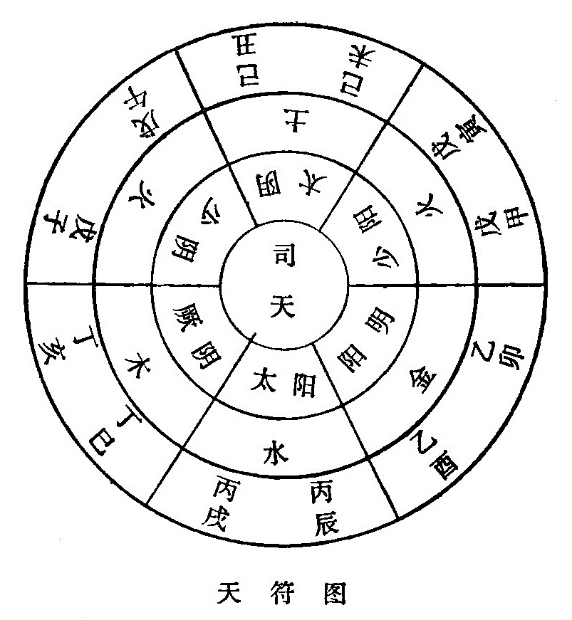
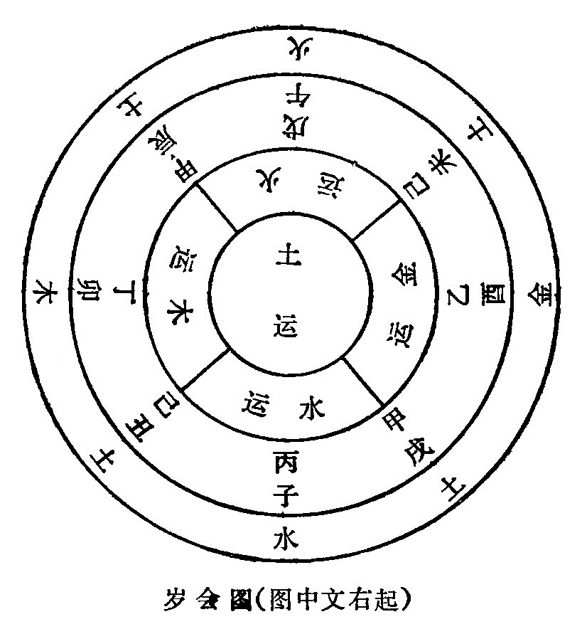
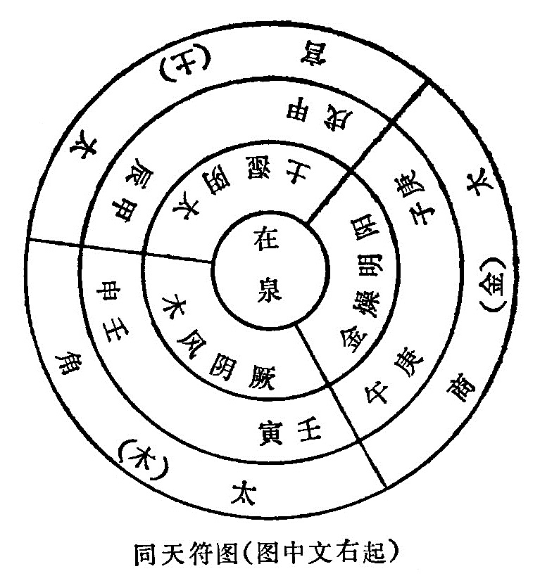
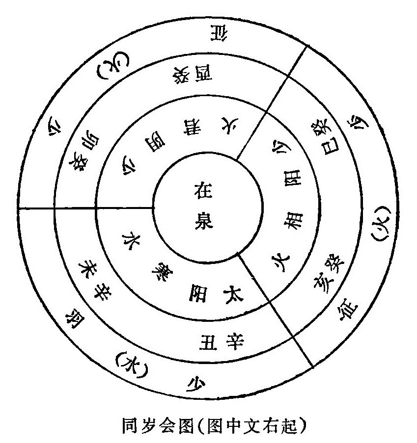
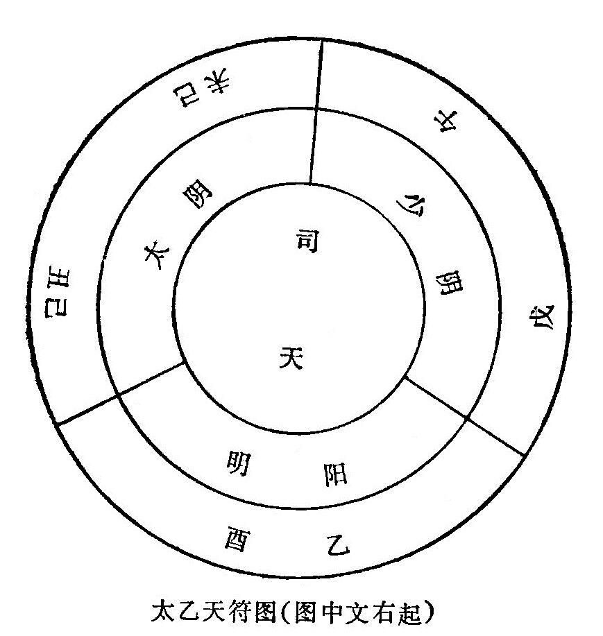

### （四）运气同化&

运、气同化，就是五运与六气的同类化合。运与气在六十年变化中，除互为生克，互为消长外，还有二十多年的同化关系。为什么产生这样的关系？因为运与气在遇到彼此性质相同的情况下，往往容易联系在一起，产生同一性质的变化。正如《素问•六元正纪大论》说：“愿闻同化何如？岐伯曰：风温春化同，热臐昏火夏化同，胜与复同，燥清烟露秋化同，云雨昏瞑长夏化同，寒气霜雪冰冬化同。此天地五运六气之化，更用盛衰之常也。”

时令季节和气候变化是有密切联系的，就一般情况而言，有什么季节到来，便有什么样的气候出现，所以风温之气与春天的木运同化，炎热之气与夏天的火运同化等等。这就是一年中上下左右，主客运气相互化合的原因。但相合有多有少，如果以多合多，则盛者愈盛；以少合少，则衰者愈衰。由于运与气的相合有多有少，所以就产生了盛衰互用的规律。

运同司天之气与在泉之气化合，由于运有太过不及，气有司天在泉的不同，因而便有天符、岁会、同天符、同岁会、太乙天符五种不同年份，兹分别叙述如下：

* * *

#### 1、天符

天符，即中运之气与司天之气相应而符合。就是说，中运值年的天干与客气司天的地支，彼此的五行属性相同，便称为天符。如《天元纪大论》说：“应天为天符”，即是岁气应司天便是天符的意思。在六十年中，符合“天符”的年份有十二年，如《素问•六微旨大论》说：“土运之岁，上见太阴；火运之岁，上见少阳、少阴；金运之岁，上见阳明；木运之岁，上见厥阴；水运之岁，上见太阳。奈何？曰：天之会也，故《天元玉册》曰天符。”

所谓“上见”，是指司天。“土运之岁，上见太阴”，即己丑、己未年。己为土运，丑未是太阴湿土司天，土与湿同化，故此二年称为天符。“火运之岁，上见少阳、少阴”，即戊寅、戊申、戊子、戊午年。戊为火运，寅申为少阳相火司天，子午为少阴君火司天，火与暑热同化，故此四年为天符。“木运之岁，上见厥阴”，即丁巳，丁亥年。丁为木运，巳亥是厥阴风木司天，风与木同化，故此二年为天符。“水运之岁，上见太阳”，即丙辰、丙戌年。丙为水运，辰戌是太阳寒水司天，水与寒同化，故此二年为天符。“金运之岁，上见阳明”，即乙卯、乙酉年。乙为金运，卯酉为阳明燥金司天，燥与金化同，故此二年为天符。图示如下：

以上己丑、己未、戊寅、戊申、戊子、戊午、乙卯、乙酉、丁巳、丁亥、丙辰、丙戌十二年都是中运与司天之气相会合同化，故均属“天符”。

* * *

#### 2、岁会

岁会，是岁运与年支的五行属性相合，同时又得五方之正位，便称为岁会。《素问•六微旨大论》说：“木运临卯，火运临午，土运临四季，金运临酉，水运临子，所谓岁会，气之平也。”所谓“临”，就是本运加临本气。如丁卯年，丁为木运，卯在东方属木的正位，故称“丁运临卯”。戊午年，戊为火运，午在南方属火的正位，故称“火运临午”。甲辰、甲戌、己丑、己未四年，甲己均属土运，而辰戌丑未都是分布在寄旺之位，即四季之末，故称“土运临四季”。乙酉年，乙为金运，酉在西方属金的正位，故称“金运临酉”。丙子年，丙为水运，子在北方属水的正位，故称“水运临子”。凡此丁卯、戊午、甲辰、甲戌、己丑、己未、乙酉、丙子八年都是本运临本气，本气上承本运，所以称为“岁会”。即《天元纪大论》所说的：“承岁为岁值”。值，即是会遇的意思。以上所列举的丁卯、戊午、乙酉、丙子四年，支运相合，又居于子午卯酉经纬线的正方，即四方地支的正位，故又称为“四直承岁”。而其它年份，虽然也有岁运与相合的（如壬寅、庚申、癸巳、辛亥年），因其不居正位，故不称为“岁会”，但也可以“类岁会”相称。图式如下：

* * *

#### 3、同天符

凡逢阳年，太过的中运之气，与客气在泉相合而同化的，就叫“同天符”。为什么这样称呼？因为太过的中运之气不是与客气的司天之气相合，而是与客气的在泉之气相合，但客气的司天在泉，均属于天气范畴（与主气相对而言），故虽不是“天符”，但与“天符”有相同之处，故称为“同天符”。《素问•六元正纪大论》说：“太过而同地化者三，……甲辰，甲戌太宫，下加太阴。壬寅，壬申太角，下加厥阴。庚子，庚午太商，下加阳明。如是者三，加者何谓？曰：太过而加同天符。”这是说，在六十年中，岁运太过而与客气在泉之气相合的有三，即甲辰、甲戌，壬寅、壬申、庚子，庚午年份。甲辰、甲戌年，甲为阳土太宫，属土运太过，而客气的在泉之气是太阴湿土，以在上之运加于在下的在泉，于是土湿相合而同化。壬寅、壬申年，壬为阳木太角，是木运太过，而客气的在泉之气是厥阴风木，以壬木下加于在泉的厥阴风木，故风木相合而同化。庚子、庚午年，庚为阳金太商，属金运太过，而客气的在泉之气是阳明燥金，以庚金下加于在泉的阳明燥金，故金燥相合而同化。以上甲辰、甲戌、壬寅、壬申、庚子、庚午六年，都是太过的中运与在泉之气相同，所以称为“同天符”。图示如下：

* * *

#### 4、同岁会

凡逢阴年，不及的中运之气与在泉之气相合而同化的，叫做“同岁会”。本来是中运之气与年支之气相合才能称做“岁会”，现在仅取年支所主的在泉之气相合，也是大同而小异，所以称为“同岁会”。如《素问•六元正纪大论》说：“不及而同地化者三，癸巳、癸亥少征，下加少阳。辛丑、辛未少羽，下加太阳。癸卯、癸酉少征，下加少阴。如是者三，不及而加，同岁会也。”

在六十年中，“同岁会”共有六年，即辛未、辛丑、癸卯、癸酉、癸巳、癸亥。其中癸卯、癸酉、癸巳、癸亥是阴年，中运为火运不及，属少征，巳、亥是少阳相火在泉，卯、酉是少阴君火在泉，均属火运不及，故中运与在泉相合而同化。辛丑、辛未年，中运为水运不及，属少羽；丑、未是太阳寒水在泉，均属水运不及，故中运与在泉相合而同化。由此可知，不及的中运之气与在泉之气相同，都叫“同岁会”。

列图如下：

* * *

#### 5、太乙天符

既是天符，又是岁会，叫做“太乙天符”。如《素问•六微旨大论》说：“天符岁会何如？曰：太乙天符之会也。”在六十年中，戊午、乙酉、己丑、己未四年，均属太乙天符。太乙天符的含义，就是司天之气、中运之气、岁支之气三者会合主令，即《天元纪大论》所说的“三合为治”。例如：戊午年，戊为火运，午为少阴君火司天，这既是中运与司天同气的“天符”，又是中运与岁支同气居于南方正位的“岁会”。乙酉年，乙为金运，酉为阳明燥金司天，既是中运与司天同气，又是中运与岁支同居西方正位。己丑、己未年，己为土运，丑未为太阴湿土司天，既是中运与司天同气，又是中运与岁支同居土位。以上四年，均为司天、中运、岁支三气会合的年份，这是难得而可贵的，所以尊称为“太乙天符。”

图示如下：

运与气的同化关系，虽有天符、岁会、同天符、同岁会、太乙天符的不同，都是用以说明运与气相合的年份，便于进一步分析气象的常变。运气相合，彼此虽然没有克复，使气象变化处于比较稳定的状态，但却因此而形成气候比较单纯，一气偏胜独治，这样就容易给人体和其它生物界带来一定的损害，正如《运气论奥》说：“一岁之中，有此上中下三气，各行其令，而气偶符会而同者，则通其化。虽无复之变，则有中病徐暴之异。”《素问•六微旨大论》也指出：“天符为执法，岁会为行令，太乙天符为贵人。曰：邪之中也奈何？岐伯曰：中执法者，其病速而危；中行令者，其病徐而持，中贵人者，其病暴而死。”一年之中，岁运、司天、在泉三气是各行其令的，一旦自然会合，贯通在岁气之中，形成了比较强大而单纯的气候变化，所以《内经》分别以“执法”、“行令”、“贵人”来形容它的力量和作用。执法位于上，故为“天符”邪气所伤，则发病迅速而严重；行令位于下，故为“岁会”邪气所伤，则病势徐缓而持久；贵人统乎上下，故为“太乙天符”邪气所伤，则病势急剧而有死亡的危险。在六十年中，计有天符十二年，岁会八年，太乙天符四年，同天符，同岁会各六年，共三十六年，除去重复的十年外，只有二十六年，《素问•六元正纪大论》所谓“二十四岁”，是未将“岁会”的不同年份（即不与天符，同天符相同的丁卯、丙子年）计算在内的缘故。

