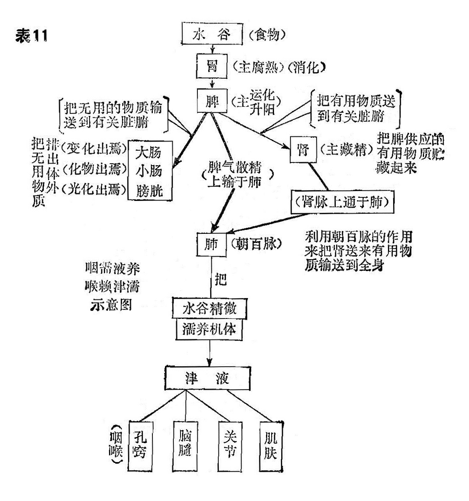

## 虚火喉痹<small>之一（慢性咽炎）</small>

慢性咽炎，是旷日持久的慢性咽部病变，尽管病变位置明明在咽部，可是中医在习惯上还是称为喉痹或喉风。充其量讲究一些的话，在上面再冠以“慢”或“阴虚”来区别于急性的。

它为咽喉病中最常见的多发病，而且还有患者患病在身而自己不知。据国内统计，在城镇居民中，其发病率占咽喉科病的10〜20%，刻下还在不断上升中。除幼儿、儿童外，任何年龄的男女都可发生，其中尤以青壮年为多，如果嗜好烟、酒、辣者更多。

《内经》里有五处“喉干”病，但都非指慢性的。《金匮要略•血痹虚劳病篇》的“虚劳、里急……咽干口燥，建中汤主之”的咽干，可以目为世界上最早论述到的慢性咽炎。《诸病源候论》中十三种咽喉，只有“状或痒或痛，如甘䘌之候”的尸喉，符合于慢性咽炎。《千金要方》的“耿耿如物，常欲窒痒痹涎唾”。《太平圣惠方》的“尸咽喉痒痛”，《圣济总录》的“尸咽喉”等，也都是慢性咽炎。可知在唐、宋以来，慢性咽炎逐步被重视起来。直至《普济方》的“咽干”及论“虚热”证，则对慢性咽炎的认识又提高了一步。之后，《医方类聚》中的“咽喉痛，含化糖霜即愈”。“咽干，涕唾如胶，或肾气不足，心中悒悒，目视𥉂𥉂，少气，……甘草汤方……等。则在15世纪时对慢性咽炎的认识与处理又达到了一个新的境界。

至清代，对它的认识和处理、已经达到了成熟阶段。但十分可惜，疗效总不能使人满意，诚如《喉科心法》所谓：“即老医亦难以下手”。那末如何来提高疗效？则不能不重复以上一句话，是依靠准确的“辨证论治”和病员的耐心接受治疗。

历代名称：慢性咽炎的名称，也如急性一样凌乱。虽然《内经》有“嗌干”一名，但非慢性。《金匮要略》的“咽干”可能是最早的名称。之后为《诸病源候论》的“尸咽喉”。但近来的“尸咽喉”又作为“喉结核”同义词。

在喉科专著鼎盛的时期——清代，谈论慢性的也很少很少，唯以下几书稍稍涉猎一二。《景岳全书》的“格阳喉痹”。《医宗金鉴•外科心法》的“慢喉风”。《喉科指掌》的“喉疳”、“劳碌喉风”、“辛苦喉风”。《重楼至钥》的“鱼鳞风。”《喉科秘制》的“阴毒喉痹”。《喉科紫珍集》的“喉节”、“气子”。《喉科枕秘》的“阴毒喉风”。《喉科心法》（潘氏）的“阴症喉痹”、“气虚喉痛”、“血虚喉痛”、“阴虚喉痛”。《秘传喉科十八证》的“弱证喉癣”。

〔症状及检查〕

除了长期的病程及时重时轻为主要标志之外，还有以下几个必需具备的特征：

1.干燥：基本上任何一个慢性咽炎，都有干燥感觉。从一般性干燥思饮之外，最严重的可以饮水也难以滋润。在薄暮、子夜或多讲言语时更为严重。甚至可波及鼻咽及喉部。

2.疼痛：都很轻微，也有并无疼痛者。主要为干燥导致的燥裂痛。重症当然也可以出现撕裂样痛及烧灼痛。疲劳和多言，也可加重或引起作痛。

3.痒感：也是一个常见的症候群之一，所以常引起咳嗽。事实上这种痒感也是由于干燥所导致。在狂咳时，只有饮水可以抑制。所以称之为喉源性咳嗽。

4.烧灼感：经常伴随干燥而出现。

5.清噪：咽部稠厚而粘性如胶的分泌物增多，而且附丽于粘膜难以咯去，于是患者经常须要作吭、喀等清嗓运动来想把它排除。

6.异物感：由于咽部缺乏津液的滋养而致食物通过不能顺利下咽。即使不在饮食时，也以无津液而产生鲠介感。这种异物感可以引饮流汁时或之后片刻，得以暂时消失。与癔性咽喉异感症有所不同。

除此之外，还有四个症状，也较多见：

1.胸闷：病人可以清楚地主诉，在胸前及两膺，有闷塞感觉。叹息后可宽畅片刻。

2.两颈侧有牵掣感：严重的甚至误以为落枕。

3.咽部反射敏感：晨起漱口刷牙，即引起恶心呕吐。检查时压舌板未触及舌头，即可泛恶。

4.偶有耳鸣，听力障碍。也有耳中憋气作闷者。

一般都不耐多言，言语一多，喉头倍形不适。更有少数患者，伴有消化不良，肠功能紊乱、头昏、失眠及容易感冒等病。

检查所见，咽壁各部，呈暗红色充血（中医称晦暗型），而且不象急性的呈㳽漫性。干燥少液，严重的可使后壁粘膜如包在糖果上的受潮玻璃纸一般。

小血管曝露扩张，网布。古人称之为“如海棠叶背”或“如哥窑纹”。

咽后壁增生的淋巴滤泡呈颗粒状突起。又如蟾蜍背上皮肤。或相互溶合成团，凸出于粘膜表面，形同浮雕。周围萎缩的粘膜，呈惨白色，古人称为“如网油状”。萎缩的粘膜与充血的淋巴滤泡形成红白相映，称为“污红”。

两侧索经常肥大。

〔诊断〕

长期时轻时重的咽部不舒服，感有干燥、微痛、或微痒，在疲劳、多言后必然加重。咽部慢性充血，后壁淋巴滤泡增生，周围粘膜萎缩。其备了以上诸症者，可以诊断为本病。

〔常见证因〕

本病中医一直认为是肺肾阴虚和肾阴不足两者，所以称阴虚喉风或阴虚喉痹。但根据笔者统计，真正属此两者至多占20%而已，而出于脾土衰虚者十居七、八。常见的病证，不外有三：

1.劳伤损气，肺怯金亏：凡过于劳累者，气分必伤，经常累月后肺气日损。此外大气污染，肺先受害，也是使肺气损伤。肺主输布，这样肺气本已损伤，再加输布津液的功能障碍，属于肺经的喉那有不干不病之理。还有急性咽炎的反复发作，咽头炎症长期存在，于是演变为慢性了。所以这型的病，就是容易感冒，急性发作也频频而作。

2.肾虚火旺、燥津烁津：一般都为肾水不足，难以制火。这种火，例称虚火或阴火，又称无根之火或龙雷之火。它是命门有余之火。肾属阴脏，内寓水火（即真阴与真阳），两者必需保持平衡，即所谓“水火既济”。一旦肾水以各种原因而亏损太过，即失去制火的功能，于是使肾阳偏旺而化火。火一旺反过来烁水，水被烁而更衰，即产生枯涸现象。水枯则津液干槁，当然无法来养咽喉。

3.脾虚难化精微，津难上承：这一点，从来很少有人注意，可是笔者体会特深。咽需液养，喉赖津濡，否则即干枯失润，失润则病。脾主运化，也就是消化饮食和输布精微。把这种营养成分通过肺的作用（肺朝百脉）而运输和散布到全身。见表11示意：

至于造成这种脾虚不化精微的原因很多，但大体上不外乎以下几种，见表12：

由此可知，表11可使津液干枯的致伤点有四处，一在肾，肾虚则无以藏精。二在肺，肺虚则难以输布精微于肌体各处。三在脾，脾衰土弱，不化精微而无以灌溉孔窍。四在津液的本身，在热性传染性病的高烧盛热下，必然烁津劫液而干枯。前三者在慢性咽炎中出现。后一者在急性传染病后期出现，不属本病范围。

〔辨证论治〕

（一）辨证要领

1.肺怯金虚：大多出于急性咽炎之反复发作不休者。或一向气血双亏之体，撄患急性咽炎而无痊愈倾向者。还有不少嗜烟烟瘾较大的，更有一部分为生活或工作长期接触有害气体者。全身症状为神疲乏力，食欲不振，睡眼难酣多梦，小便频频而量少。在休息时可以减轻些，在劳累或天气骤变时加重。局部自觉症状为微干微痛，痰涎较多而易咯。但有一种难以用语言表达的不舒服感。脉象细、小、软，舌质淡白无华而瘦。

局部所见：咽部充血不明显，后壁淋巴滤泡及侧索稍有增生。

2.肾虚火旺：全身性症状大多眩晕头痛，急躁易怒，情绪不易稳定。局部干燥严重，频频求饮以缓解。有烧灼感觉的刺痛。也有阵发性作痒，痒后即干咳不止，而且这种咳嗽愈咳愈难受。少痰，即使有也稠厚难咯。严重的进食不能流利，往往借汤水以下送。大便干结难解，常有便秘。脉多细数或虚数。舌少苔甚至无苔，质红绛瘦瘪。

局部所见：咽粘膜呈晦暗型充血（少数也有红艳型的）小血管曝露网布。后壁淋巴滤泡散在性增生，部分粘膜萎缩，致红白相间，斑斓污红。整个咽峡少液而干，其中更以后壁尤为明显。

3.脾虚土弱：病程也是漫长，甚至十年八年无愈意者。全身症状，大便溏薄或不成形。四肢沉重无力，胸前窒闷，入冬畏寒怕冷甚于旁人，咽头亦不舒适，但较虚火的为轻，口干燥而不思饮水，舌薄苔，亦有薄腻者，质嫩、胖、淡白，甚至舌边有齿印，脉软弱无力。

局部可见：咽粘膜很少充血，严重的有水肿感，后壁淋巴滤泡为团块状增生，无干燥现象。

或谓慢性咽炎出现以上全身的：局部的证状，当然是脾虚无疑，但也有咽喉干燥，烧灼刺痛，局检为弥漫性充血，粘膜干枯少液，小血管扩张暴露，后壁淋巴滤泡散在性增生及污红。全身证状有心烦易怒，形体瘦弱，频频求饮，大便干结，舌少苔或无苔；甚至出现裂纹或剥脱，脉细数等。难道也是脾虚吗？是的，不过它不是脾阳虚而是脾阴虚。

要知脾胃有阴阳之分，人身的营血、津液、脂膏之类的液体物质，都是由脾阴（胃阴）来灌溉滋生的，所以“或谓”所说的一切症状，都是脾阴不足的反映，脾阴及胃阴，又称胃液。《成方便读》在补阴益气煎中谓： “夫胃者，卫之源、脾者，营之本，脾阴虚，即营血亏耗”。

总之，很不受人注意的《素问•阴阳类论》篇，“喉咽干燥，病在土脾”。确有指导意义。

脾阳虚与脾阴虚，经过细致观察，还是不难鉴别的。

表13  脾阳虚与脾阴虚对照表

| 主诉   |      |      |        |      |        |          |        |        |          | 检查   |          |          |      |                  |              |
| ------ | ---- | ---- | ------ | ---- | ------ | -------- | ------ | ------ | -------- | ------ | -------- | -------- | ---- | ---------------- | ------------ |
| 证状   | 疼痛 | 干燥 | 烧灼感 | 痒感 | 异物感 | 吞咽     | 痰涎   | 咽干   | 饮料温度 | 充血   | 粘膜表面 | 粘膜萎缩 | 唾液 | 后壁淋巴滤泡增生 | 小血管       |
| 脾阳虚 | 有   | 有   | 无     | 无   | 少有   | 顺利     | 多而稀 | 不思饮 | 喜温     | 不充血 | 润       | 不明显   | 正常 | 团块状           | 不扩张不暴露 |
| 脾阴虚 | 有   | 有   | 有     | 有   | 有     | 偶有不利 | 少而稠 | 思饮   | 喜凉     | 充血   | 枯       | 严重     | 少   | 散在性           | 扩张暴露     |

（二）论治要点

本病以内服药为主，而且以汤剂的效果为显著，不过疗程漫长，往往至少五十剂、最多一百五十剂。只要辨证明确，服药连续不断，禁忌烟、酒、辣三者，基本上都可治愈。

1.肺怯金虚：取法益肺生金，常用代表方有百合固金汤，养阴清肺汤之类，必要时加阿胶。

2.肾虚火旺：当潜阳育阴，生津养液法，常用代表方有知柏八味汤，左归饮之类，严重的大补阴丸。为了生津有力，可参用乌梅、玉竹、花粉、石斛之类。

3.脾虚土弱：凡脾阳虚者，可用补脾培土法，常用代表方有参苓白术散，为了升提清阳以促使脾气加速醒复，所以除高血压者之外，可参用升麻、葛根、柴胡等升提药品。

脾阴虚者，除了用参苓白术散之外，另可参用益胃汤、增液汤、沙参麦冬汤等方。更讲究一些，加西洋参、石斛。

有时出现阳气衰极者，可用补中益气汤或益气聪明汤。利于长期进药者，可取丸剂。

辅助治疗：最好的外用药，首推西瓜霜。每天喷3～4次。

《重刊梅氏验方新编》弁言中的“于梅（露）雨时捕集蜒蛐，与梅子同腌。遇喉症，辄应手而愈”。的确，这是慢性咽炎的最好噙化剂。

如属阴虚的，用增液汤，泡水代茶，作饮料。阳虚的，用炒焦米仁，泡茶代饮，作饮料。长期饮用，也有一定疗效。

除了以上三者为常见之外，在临床上还有各型各色的慢性咽炎。例如五志之火内燃的，那么纵然是慢性、我们仍然需要清火。还有由污染导致的，那末务须清火解毒。而有由鼻炎而续发的慢性咽炎，则当治疗鼻炎。

〔调护〕

1.戒多言，言多损气，气损致津伤。

2.生活和工作，需在空气新鲜的环境里。《寿世保元》认为：“人卧室宇，当令清净。净则受灵气，不净则受故气。故气乱人”。

3.注意劳逸结合。《素问•上古天真论》认为“不妄作劳，故能形与神俱而尽终其天年”，过度操劳者，必伤必病。《尚书旅契》：“玩人丧德，玩物丧志。”玩物是过分优逸的同义词。志丧者形必涣散衰败。

4.严禁烟、酒、辣。《顾氏医镜》：“烟为辛热之魁，酒为湿热之最。凡姜椒芥蒜及一切辛辣热物，极能伤阴”。

5.注意营养。《素问•阴阳应象大论》：“精不足者，补之以味”。《素问•五常政大论》：“谷肉果菜，食养尽之”……等都是强调营养的。

6.注意锻炼。《素问•四气调神论》的：“夜卧早起，广步庭前”，以及《吕氏春秋•尽数》的：“流水不腐，户枢不蠹，动也”。都是强调身体的锻炼。

7.治疗要有信心、恒心。因为本病一则病程漫长，治疗不易，往往容易失去信心。再则本病有时也可以苟安于一时，治疗就为之放松。因之一定要有信心和恒心，才能有治愈之日。

〔文献摘录〕

1.气分有热：《医学见能》：“凡白喉症（白色喉症、指虚证的慢性病），无论癣（喉结核）、烂（萎缩的粘膜）、疳（中医习惯把一切慢性病称为疳）、蚀（指角化或溃疡），总属气分热也”。

2.嗜酒：《医学入门》：“虚火、固饮酒，则动脾火”。

3.忿怒：《医学入门》：“忿怒，则动肝火”。

4.色欲：《医学入门》：“色欲，则动肾火”。

5.疲劳：《喉科指掌》：“辛苦喉风，因日夜辛苦而发”。

6.七情：《医彻》：“喉痹，属七情所伤者”。

7.忧思：《医宗金鉴•外科心法》：“慢喉风，……亦有忧思太过而成者”。

8.阴阳不和：《太平圣惠方》：“夫尸咽者，……皆阴阳不和，脾肺壅滞”。

9.龙雷之火：《景岳全书》：“格阳喉痹，由火不归源，则无根之火客于咽喉”。

10.阴虚火旺：《景岳全书》：“皆肾阴亏损，水不制火而然”。

11.肝肾两虚：《喉科指掌》：“劳碌喉风、肝肾两亏，发于关内”。

12.肾阳虚：《喉科心法》：“由其人肾阳本虚，寒邪乘袭，直中其经，逼其微阳上浮而为咽痛”。

13.虚火刑金：《黄氏纪效新书》：“喉痹久延，痛且干，虚火刑金之彖。”

14.金不生水、水不制火：《枫江陈萃田外科临证》：“喉痹咽鲠、红丝缠绕，……，金不生金水，水不容火”。
