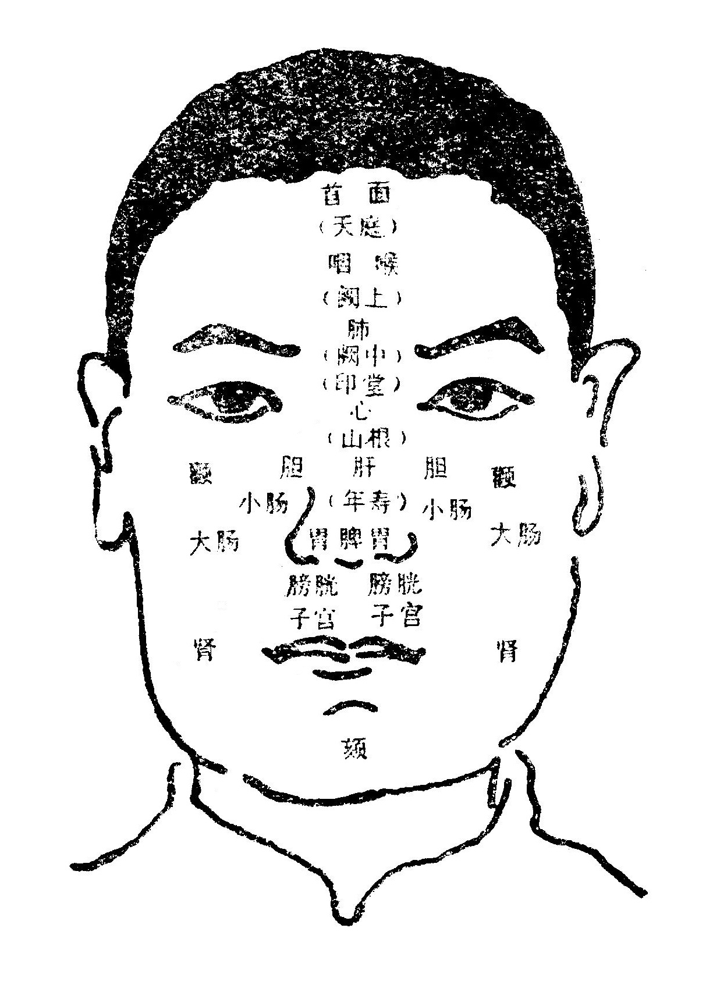

## 望诊

**1.天有五气，食人入鼻，藏于五脏，上华面颐，**

**肝青心赤，脾脏色黄，肺白肾黑，五脏之常。**

**食**  Sì，读饲，义同饲。    **颐**  yí ，读移，颊部。

人是离不开自然环境影响的，故天以五气饲养人类，因为气通于鼻，故五气从鼻而入，风气入肝，暑气入心，湿气入脾，燥气入肺，寒气入肾。人受五气，而养五脏，五脏得养，其精气则上华于面，肝之精华，化为色青；心之精华，化为色赤；脾之精华，化为色黄；肺之精华，化为色白；肾之精华，化为色黑。这都是自然界五气通过五脏吸收转化而显示于颜面的，所以是五脏的正常色泽。

**2.脏色为主，时色为客，春青夏赤，秋白冬黑。**

**长夏四季，色黄常则。客胜主善，主胜客恶。**

**客**  去来不定。    **长夏**  zhǎng，读涨。滋生发育叫做长。

主色，就是五脏原来的正色（又叫脏色），人的形质不同（即所谓五形之人），其主色也不同。如火形之人，面色一般是微红而鲜明，木形之人，面色一般微青而光润等。但不论何形之人，都以黄色正色，即黄中带红，黄中带青而巳。人与自然有着密切关系。不同时令应该具有不同的面色，这就是客色（又叫时色）。客色来去不定是随着四时气候变化而变化的。因为，春气通于肝，肝主藏（回）血，其色当青；夏气通于心，心主发血，其色当赤；秋气通于肺，肺主洁血，其色当白，冬气通于肾，肾主滤血，其色当黑；长夏四季之气通于脾，脾主生（统）血，其色当黄。这是四时常色。主色是人之脏气所生，客色是岁气（岁时之气)影响人体的变化，所以岁时不同，人的脏气应该随着时令发生一定的感应和变化。人适应自然变化的客观反映是正常现象。因此“客胜主善”，就是说明岁时之气胜人的主气是顺的。否则，人的主气胜岁时之气为逆，即春时当青反白，夏时当赤反黑……。因此说“主胜客恶”。必须注意：主色、客色都属于正常的颜色，不是病色。

**3.色见皮外，气含皮中。内光外泽，气色相融。**

**有色无气，不病命倾，有气无色，虽困不凶。**

**含**  hán，读咸，包容。  **融**  róng，读容，化合。**倾**  qīng，读青，危亡。

青、黄、赤、白、黑，显然彰于皮之外者为五色，隐然含于皮之中者为五气。内充外泽，则气色并至，才是无病的征象。若五色显露于外，而没有五气的隐含充实于皮内，则为有色无气，是病色虽自身感觉无病也是生命倾危之象。《内经》说：“色至气不至者死”。所以说“有色无气，不病命倾”。若面色虽然浅淡不泽，但神气生动内外条达，则为有气无色，不是凶险之象。《内经》说“气至色不至曰生”。所以说“有气无色，虽困不凶”。

按“得神者昌，失神者亡”。若是神采奕奕，目光灵敏，神态自然，言语清楚，即便色脉不太正常，也无大凶大险；否则，即使色脉未见多大的异样，而神滞情迷，脏色外露，则都属于病重危象。

**4.缟裹雄黄，脾状并臻。缟裹红肺，缟裹朱心。**

**缟裹黑赤，紫艳肾缘。缟裹蓝赤，石青属肝。**

**缟**  gǎo，读稿，古代的一种白色罗绢。  **臻**  zhēn，读珍，到达。  **石青**  碧玉

五脏反映在颜面上的色泽，应该是色气并至的，得神的。如白罗裹雄黄，映出白中透黄之色，是脾之气色并至的容状。如白罗裹浅红罩白之色，是肺之气色并至的容状。如白罗裹朱砂，深红正亦之色，是心之气色并至的容状。如白罗裹黑赤，映出黑中透赤，紫艳之色，是肾之气色并至的容状。如白罗裹兰赤，映出兰中扬红，石青之色，是肝之气色并至的容状。这里应当注意的是，文中所举的缟和雄黄、朱砂等，都是用以比喻色泽的。临床上所见的容颜色泽，绝不是和这些实物一模一样，只有在实践中多观察，多揣摩，多比较，才能逐渐领会其含义。

**5.青如苍壁，不欲如蓝。赤白裹朱，衃赭死原。**

**黑重漆炲，白羽枯盐，雄黄罗裹，黄土终难。**

**苍壁**  苍是青色，壁是好的玉石，苍壁就是青石玉面。**衃赭**  pēi zhě，读胚者。衃是败恶凝集的血，呈赤黑色。赭是一种矿物，呈赤褐色。  **重**  chóng，读虫。 **炲**  tái  读台，由烟凝积成的黑灰。  **白羽**  白鹅毛。

此说明四时百病，五脏、五部、五官、五色生死的诊法。

《内经》说：“青欲如苍壁之泽”。即青石色，有生气的青色。“不欲如蓝”，即靛叶色，没有生气的青色。衃血，即凝集的血，赭，即代赭石，《内经》说：“赤欲如白裹朱”，即正赤色，有生气的红色。“不欲如赭”，即赭石之色，没有生气的红色。重漆，光润的紫檀色。炲，煤黑色，即地上苍枯的黑土。《内经》说：“黑欲如重漆”，即有生气的黑色。“不欲如炲”，即没有生气的黑色。白羽，白有光泽，枯，枯骨，盐，食盐，均无光泽。《内经》说：“白欲如鹅羽”，即有生气的白色。“不欲如盐”，即枯骨、食盐之色，没有生气的白色。《内经》说：“黄欲如罗裹雄黄”，即黄中透红之色，有生气的黄色。“不欲如黄土”，即沉滞无神，干枯的黄土色。各种疾病见到恶色，一般是凶险的。五脏虽病，但是胃气尚存，那么反映出来的五色也就鲜明、润泽，各种疾病见到这种善色，一般是良好的现象。

以上5条，概述了四时、五脏应见的正常面色和不应见的反常面色，从而观察疾病的轻重，顺逆，以预测其生死安危。

**6.天庭面首，阙上喉咽。阙中印堂，候肺之原。**

**山根候心，年寿候肝。两旁候胆，脾胃鼻端。**

**颊肾腰脐，颧下大肠。颧内小府，面王子膀。**

**当颧候肩，颧外候臂。颧外之下，乃候手位。**

**根傍乳膺，绳上候背。牙车下股，膝胫足位。**

**阙**  quē，读缺，即眉心。 **颊**  jiá，读夹，脸的两侧从眼到下颔的部分。    **颧**  quán，读权，即眼下，两腮上突出的颜面骨。    **膺**  yīng，读英，胸前两旁隆起的部位。

两眉之间，名为印堂，又称阙中，在面部中间的最高之处，是相关肺病的部位；印堂的上面，名为阙上，阙上到头发边缘，名为天庭，天庭处在整个面部最高最上的地方，是相关头面疾病的部位；阙上处在天庭和印堂之中，所以是相关头面及咽喉疾病的部位，印堂略向下，在两眼之间，名为山根，又称下极，是相关心病的部位；年寿即鼻梁两旁，由于胆附于肝，故是相关胆病的部位；年寿下面是鼻的尖端，称为准头，是相关脾病的部位，准头两侧鼻孔之上，名为方上，由于脾胃相连，是相关胃病的部位；两耳前方偏下的两颊，是相关两肾的部位，由于两肾位居背脊之处，与腰肚脐相对，所以又相关腰脐的疾病，颊内颧骨下面，是相关大肠疾病的部位；颧骨内侧，是相关小肠疾病的部位。从鼻端的准头上到天庭，这一部位，统称为明堂，从准头下至颏，称为面王，面王包括人中、承浆的部位，是相关子处（即精室，血海）和膀胱疾病的部位。

面部不仅主要反映体内各脏腑疾病在面部相应的有关部位，而且也反映肩、臂、手、膺、股等部位的疾病。根傍，相当于两眼内眼角的地方，是相关前胸乳部疾病的部位；绳骨相当额部两侧的转角处，是相关背疾的部位；牙车骨，相当颊骨下方，是相关下肢、股、膝、胫、脚疾病的部位。

面部各相关部位，以额部主头面；五脏除肾外，肺、心、肝、脾挨次向下排列在中央；六腑则排列在两侧；肢节又居于六腑之外。某处色泽有了异常，就可以推测到相应的各种病变。（附图）

**7.左颊部肝，右颊部肺。额心颏肾，鼻脾部位。**

**部见本色，深浅病累，若见他色，按法推类。**

左颊，肝之部。右颊，肺之部。额上，心之部。颏下，肾之部。鼻者，脾之部（此据《素问．刺热篇》划分五脏与面部相关的部位）。本部见本色，浅淡不及或深浓太过者，皆病色。如鼻，是脾的部位，见黄本色，则为本经自病，此为正邪。若见白色，则为子盗母气，为虚邪。若见赤，则为母助子气，为实邪。若见青色，则为彼能克我，为贼邪。若见黑色，则为我能克彼，为微邪，所谓“按法推类”者，就是其余各脏的诊法均以此类推。本节的面部分脏腑部位和上节的脏腑相关部位，各有不同。原则上以上条所述为主要依据，本条所述可作资料参考，一般适应于儿科。

脏腑虽然藏于体内，而藏象则显于外表。从面部的神色和形态的观察，可以了解整体的变化。因为面部内应脏腑，为经络所会，气化所通，神色所发，所以通过面部的诊察，可以了解脏腑、经络、气化、神色等方面的病变。

**8.黄赤风热，青白主寒。青黑为痛，甚则痹挛。**

**㿠白脱血，微黑水寒。痿黄诸虚，颧赤劳缠。**

**痹** bì，读闭，闭但不通。    **挛**  luán，读峦，踡曲不能伸直。    **㿠**  huǎng，读恍。    **痿**  wěi，读委，痿弱无力。

黄、赤为阳色，一般反映阳证，所以主风、主热；青、白、黑为阴色，一般反映阴证，所以主寒、主痛。若黑甚，在脉则麻痹，在筋则拘挛。晄白者，浅淡白色，主大出血、脱血。若无吐衄下血，则为脾不生血，不荣于色。微黑者，浅淡黑色，主肾病水寒。痿黄者，浅淡黄色，主诸虚病。两颧深红赤色者，为阴火上乘，主虚损劳疾。

**9.沉浊晦暗，内久而重。浮泽明显，外新而轻。**

**其病不甚，半泽半明。云散易治，抟聚难攻。**

**抟**  tuán读团，凝聚。

色深为沉，主病在内，若更浊滞晦暗，主久病与重病。色浅为浮，主病在外。若得光泽明显，主新病与轻病。若其色虽不枯晦，亦不光泽，主不甚之病。凡诸病之色，如云撤散，主病将愈易治；抟聚凝滞，主病进难治。

上条以内外、上下、左右分顺逆，此条以浅深，晦明，聚散分顺逆。

**10.舌赤卷短，心官病常。肺鼻白喘，胸满喘张。**

**肝目眦青，脾病唇黄。耳黑肾病，深浅分彰。**

**卷**  juàn 音义。    **眦**  zī，读恣。眼角。

舌为心之官，正常的舌色应该是润泽的淡红色，正常的舌形应该柔软而伸缩自如。若舌色过分鲜红（舌赤），就是心病。色深赤焦卷，属邪气实的心病；色浅红滋润而短，属正气虚的心病。鼻为肺之官，鼻色发白，属肺有病。鼻色浅白，喘而不满，属于正气虚的肺病；鼻色深白，喘而胸满多属寒邪饮实的肺病。目为肝之官，眼角出现青色，常反映出肝有疾患。眼角深青色，多属肝经风热所致之实证；色浅青的多属肝虚证。口唇为脾之官，正常的口唇颜色应该是红的。如果口唇出现黄色，就是脾有病，唇色深黄，甚至枯燥，常见于实证，例如内热便闭；如果口唇色浅黄而没有血色，常见于正虚证，例如久泻或小儿脾虚疳病等。耳为肾之官，正常的耳色，应该是黄红而润活。如果耳色青黑，就是肾有病。耳色深沉黯黑，是肾病实证，耳色浅黑，是肾病虚证。所谓深浅分彰者，即浅淡为虚，深浓为实，分明彰显。耳的形色，不仅是肾病的反映，同时也可反映全身病患，如危重病证，常常见到耳轮枯槁。

**11.视色之锐，所向部官。内走外易，外走内难。**

**官部色脉，五病交参。上逆下顺，左右反阽。**

锐  ruì，读瑞， 尖锐。    阽  diàn，读店。临近（危险）

色之尖处为锐，是诊察疾病起始、传变等的依据。视其色之锐处所向何官、何部，则知起自何官、何部。其传乘（如肝病传脾，木邪乘土之类）、生克（土生金，金克木之类）、顺逆（相生力顺，相克为逆），也就自然清楚了。如锐处向外，是从内部走向外部，则为脏传腑，腑传表，属易治之病。锐处向内，是从外部走向内部，则为表传腑，腑传脏，属难治之病。而且，以五部、五官、五色、五脉、五病推移相参，则又有微甚生死之别。凡病色从下冲明堂而上至额，则为水克火之贼邪，属逆。从上压明堂而下至颏，则为火侮水之微邪，属顺。还有，男子以左为主，女子以右为主。男子之色，自左冲右为顺，自右冲左为逆，女子之色，自右冲左为顺，自左冲右为逆。逆，就是反，相反是临近危险的征象。前以内外部位分顺逆，后以上下、左右分顺逆，不可不辨。

本节的“锐处”，指向，以及男女左右顺逆，是古人相传下来的望诊法，在临床运用时只能供以参考。

**12.黑庭赤颧，出如拇指，病虽小愈，亦必卒死。**

**唇面黑青，五官黑起。擦残汗粉，白色皆死。**

在天庭额部出现拇指状，成条、成块的一团黑色，抟聚不散，一般说这是心阳垂绝的现象。倘若是赤色的，而且出现于两颧，就是“水火相射”，阴虚阳亢之候，故病者虽或小愈，亦必卒然而死。病人唇面青黑，及五官忽然出现黑中夹白，面色象将残留的汗与粉揩去后那样，或者白无光泽，说明病人的内脏已起了特殊变化。虽暂时不觉得有什么病象，但最终会因内脏病变而危及生命。

第8-12条概述面部的异常表现。从观察人体外表的形态和色泽，以测知人的病候，并判断其预后。

**13.色生于脏，各命其部。神藏于心，外候在目。**

**光晦神短，了了神足，单失久病，双失即故。**

**了了**  清爽的样子。

五色生于五脏，并反映在面上的一定的部位，神藏于心，虽不能直接捉摸得到，然“外候在目”。它能够通过两眼反映出来。若目光晦暗，这是“神短”，是将要患病或病势严重之候，若目睛清莹，了了分明，此为神气充足，是没有疾病，或病将愈之候。所以，在诊察疾病时，色与神都要注意。“色”或“神”单失，则主久病。“色”与“神”双失，则主即死。

人的神气好坏，从两眼中可以判断出来。所谓神气，就是有光、有体，光是眼光明亮，体是指目中的润泽。这种“精气内含”既不向外浮露，又不蒙混不清，就是人有胃气的表现，也就是有色有神、有光有体的健康现象。

**14.面目之色，各有相当。交互错见，皆主身亡。**

**面黄有救，眦红疹疡。眦黄病愈，晴黄发黄。**

疹 zhěn  读诊，皮肤丘疹。    疡  yáng，读阳，疮疖。

颜面和两眼，各有其相宜的色泽。如面之色：肝青、心赤、脾炎、肺白、肾黑。如目之色泽：瞳人应是黑色，乌珠（黑睛）应是微黑透青，白睛应是白色，内外两眼角应见微红色。假如眼睛的颜色有异常的变化，而颜面也失掉了正常色泽，这叫做交互错见，都是疾病严重的反映。《素问·五脏生成篇》说：“面黄目青，面黄目白，面黄目黑，皆不死也，如面青目赤，面赤目白，面青目黑，面黑目白，面赤目青，皆死也”。惟面色黄者，为脾土未败，五行有救，皆不死也。若伤寒（指恶寒发热的表证）两眦皆红，则为发疹疡之兆，两眦皆黄，则为病将愈之征。若两睛通黄，是湿热内盛，为发黄疸之候。

**15.闭目阴病，开目病阳。朦胧热盛，时瞑衄常。**

**阳绝戴眼，阴脱目盲。气脱眶陷，睛定神亡。**

**朦胧** méng lóng，读蒙龙，昏礞视物不清。    **瞑**míng，读明，闭目。  衄  nǜ ，读育。鼻出血。

凡病人开眼喜见人的是阳证，闭目怕见人的是阴证。因为开眼是由于阳气盛，闭眼是由于阴气盛的缘故。若是眼目朦胧、昏糊、暗浊、不清爽的属热，甚至是热邪传里热盛之证。当患衄血的病人，有时常见闭眼，两眼向上直视，叫做戴眼，则为阳气断绝之候。视不见物，叫做目盲，则为阴脱之候。目眶忽陷，则为气脱之候。睛定不转，则为神亡之候。眼睛能够视物辨色，主要是由五脏精气上注于目所致。所以，眼的色泽和神情有异常，对诊断疾病，有极为重要的意义。

以上三条，概述望面察色与望目察神的要点。《内经》十分重视目部的望诊，认为面与目都是望诊的重要部位。《灵枢·大惑论》：“五脏六腑之精气，皆上注于目而为之精”。故目诊可以测知五脏的变化。

**16.肝病善怒，面色当青。左有动气，转筋胁痛。**

**诸风掉眩，疝病耳聋。目视𥆨𥆨，如将捕惊。**

眩  xuàn，读悬（去声），视物不明。    𥆨 huāng，读荒，目不明。

怒者肝之情志，故病则好怒。青色者，肝之色，故病则面色当青，肝之部位在左，故病则左胁有动气而胁疼。肝主筋，故病则转筋，掉者，动摇抽搐。眩者，眼昏黑不明。肝主风，故病则掉眩。疝病属肝，故病疝气。肝与胆为表里（足少阳胆经入耳），故病耳聋，此皆肝实之病。若肝虚，则目视𥆨𥆨无所见，因肝开窍于目，肝虚则胆弱，故不时似有人将捕之，而惊悸不定。

人体解剖部位，肝是处在上腹部的右方，但《内经》里有“肝左肺右”的说法。这其实前者是指肝的实体，后者是指肝的功能气化。即肝的实体居于右，肝的气化居于左，所以肝脉亦见于左关。古代医生从经验中体会到肝病患者左边行“动气”（即有一种跳动的感觉）。

**17.心赤善喜，舌红口干。脐上动气，心胸痛烦。**

**健忘惊悸，怔忡不安。实狂昏冒，虚悲凄然。**

怔忡  zhēng chōng，读征冲。心跳不安。

赤者心之色，故心病则面见红色。喜属心的情志，所以心病时，可有自喜自笑的神情表现。心开窍于舌，故病则色红赤。心主热，故病则口干心烦。心之部位在上，故病则脐上有动气。心居胸中，故病则心胸痛，并健忘，惊悸，怔忡，不安。热乘心实，则发狂昏冒。神怯心虚，则凄然好悲。

**18.脾黄善忧，当脐动气。善思食少，倦怠乏力。**

**腹满肠鸣，痛而下利。实则身重，胀满便闭。**

黄者脾之色，故病则而色黄。忧思，属脾的情志，故病则常常有忧思的神情表现。脾之部位在中，故病则当脐有动气。脾主味，故病则食纳少而不化。脾主四肢，故病则倦怠无力。脾主腹，故病则腹满痛，肠鸣而下利，此皆脾虚之病。脾主肌肉，故实则病身重，腹胀满，大便闭。

**19.肺白善悲，脐右动气。洒淅寒热，咳唾喷嚏。**

**喘呼气促，肤痛胸痹。虚则气短，不能续息。**

洒淅  sǎ xi，读撒（上声）西，恶风寒的样子。

白者肺之色，故病则面色灰白。悲属肺的情志，故病则常常有悲、愁的神态出现。肺之部位在右（居心之上），故病则右（胸）胁有动气。肺主皮毛，故病则洒淅恶寒发热肤痛。咳嗽唾痰，喷嚏流涕，喘呼气促。胸者肺居其中，覆盖于心上，故病则胸痹而痛，肺虚则胸中气少，故喘咳气短不能续息。

**20.肾黑善恐，脐下动气。腹胀肿喘，溲便不利。**

**腰背少腹，骨痛欠气。心悬如饥，足寒厥逆。**

溲  Sōu，读搜，大小便主要是指小便。

黑者肾之色，故病则面色发黑。恐属肾情志，故病则易感恐怖。肾之部位在下，故病则脐下有动气。肾主水，故病则水蓄，腹胀，肿满，喘不得卧。肾开窍于二阴。故病则大小便不利。肾主骨，肾与膀胱相表里，故病则小便不利少腹满，肾病往往腰背俱作酸痛。肾主欠，故病则常打呵欠。肾邪上乘于心，故病则心下悸浮或空如饥。诸厥属下，故病则是寒而厥逆。

以上5条，原于《素问·阴阳应象大论》。简述了面色与五脏疾病及证候之间的关系，面部各部位分属脏腑，是面部望诊的基础。脏藏于内，象现于外，色与部位相结合，从外以知内，能更进一步了解病因、病机、病位、病性及病情、病势的变化。

**21.黑色无痛，女疸肾伤。非疸血蓄，衄下后黄。**

**面微黄黑，纹绕口角。饥瘦之容，询必噎膈。**

噎膈  yē gé，读椰格，胸膈阻塞，吞咽梗阻，饮食不下。

当病人面上出现黑色（或青黑色），一般多属痛症。如果身上没有疼痛，就可能是由于肾虚内热，肾阴虚损所致的女劳疸（症状的特点是面额上发黑）。如果又不是劳疸，就可能是淤血蓄积在里。凡是由于淤血所致的面黑，一般在衄血或下血后，黑色就渐渐褪去，面色由黑转黄，这是因为淤积得以排除的缘故。若病人面色微黑而黄(即浅淡的黧色），同时在嘴角现出一些皱纹，这如果不是蓄血症，往往是患噎膈病，都由吞咽梗阻而不能进饮食，常导致饿死。

**22.白不脱血，脉如乱丝。问因恐怖，气下神失。**

**乍白乍赤，脉浮气怯。羞愧神荡，有此气色。**

乍  zhà，读炸，暂，忽。

病人面色发白，一般说，是失血的虚弱颜色，若无脱血之证，通过问诊可能得知是恐怖导致的。恐则血随气下，故色白。恐则神随气失，故脉如乱丝。乍白乍赤，是气血不定之色，脉浮气怯，神气不安之象。通过问诊则可知是因为中心羞愧，羞则气收，故气怯，愧则神荡，故脉浮，举此情、色二端，一以诊病，一以诊情，余可类推，总在临证者神而明之，灵活运用四诊方法，才能得出正确的诊断。

**23.颈痛喘疾，目裹肿水。面肿风水，足肿石水。**

**手肿至腕，足肿至踝。面肿至项，阳虚可嗟。**

观察病人，若见颈人迎脉跳动显著的，往往是喘症比较剧烈。目裹（眼胞）上下肿者，主有水气之病。肿从面部起始的，名曰“风水”，症见恶风、脉浮、有时有热，或骨节疼痛、身重等症，是属阳水的范畴。若肿从足胫部起始的，并有脉沉，腹满，无气喘等症状，是属于阴水范畴。若手肿至腕，足肿至踝，面肿至项，则往往是阳气虚结的严重证候，实质不属于水肿病。

**24.头倾视深，背曲肩随。坐则腰痿，转摇迟回。**

**行则偻俯，立则振掉，形神将夺，筋骨虺颓。**

偻  lóu，读楼，曲背。    俯  弯腰。    虺颓   huī tuí ，读悔推（阳平），疲惫衰败

《内经》说：“夫五藏者，身之强也(五脏为人身之根本，根本巩固，则身体强健）。头者精明之府，头倾视深（头倾斜而目陷无光），精神将夺矣。背者，胸中之府（五脏的俞穴皆在背），背曲肩随，府将坏矣。腰者肾之府，若腰痛而转摇艰难，肾将惫矣。膝者，筋之府，屈伸不能，行则偻俯，筋将惫矣。骨者，髓之府，不能久立，行则振掉，骨将惫矣。凡此形神将夺，筋骨虺颓之形状，故皆主死候也”  （均见《素问·脉要精微论》）

**25.胃之大络，名曰虚里。动左乳下，有过不及。**

**其动应衣，宗气外泄。促结积聚，不至则死。**

**宗气**  也称大气，积于胸中，也就是维持生命的元气。**促**  脉象名称，“数时一止名为促”。**结**  脉象名称，“缓止须将结脉呼”。

胃之大络，名曰虚里（在胸部左乳下第四、五肋的部位），贯膈络肺，出于左乳之下，这个脉络的搏动，正常情况下是动不应衣的，因以候宗气的强弱。若动之微而不见，则为不及，主宗气内虚。若动之应衣而甚，则为太过，主宗气外泄。若三、四至一止（结），或五、六至一止（促），则主有积聚。若绝不至者，则主死。因为虚里内面正是心脏，故探索虚里的搏动情况，审诊疾病的变化，前人颇为重视。

以上25条摘自《医宗金鉴·四诊心法要诀》概述了望面色、望神气、望身形等法。五色之诊首贵内含神气。故前哲于望诊之中一则曰“神色”，再则曰“气色”，神色者内含光采，气色者内蕴精华。观察形体病态，可知内脏的坚脆，气血的盛衰，邪正的消长。观察动静姿态，可以根据“阴主静，阳主动”的理论来认识面色、神气、形体，这对疾病的预后有密切关系，但望诊不是绝对可据的，还要四诊合参。

### 附1：幼科望诊歌诀（《医宗金鉴·幼科心法要诀》）

#### **【望神色】**

**欲知小儿百病原，先从面部色详观；**
**五部五色应五脏，诚中形外理昭然。**
**额心颏肾鼻脾位，右腮属肺左属肝；**
**青肝赤心黄脾色，白为肺色黑肾颜。**
**青主惊风赤火热，黄伤脾食白虚寒；**
**黑色主痛多恶候，明显浊晦轻重参。**

**惊风**  是儿科疾病中以抽风为主要症状的一个病名，凡小儿在发病过程中不论任何原因出现了搐、搦(nuó，读糯)、掣（chè，读撤）、颤、反、引、窜视等候的统称“惊风”。

要了解患儿各种疾病的原因，首先应详察面部的气色，因为面部是十二经总会的地方，根据“有诸内必形诸外”的原理，五脏内在的变化，可以从面部上与其相应的五部、五色表现出来，察看小儿面部的气色，就能够了解到五脏的病变。五部就是：天庭头额属心、下颏地角属肾、鼻准属脾、右颊属肺、左颊属肝。五色是青赤黄白黑，以脏而论：肝病多现青色、心病多现赤色、脾病多现黄色、肺病多现白色、肾病多现黑色。以证候而论：现青色的多是惊风证候；现红色的多是火热证候，现黄色的多主伤脾伤湿或伤食的证候；现白色的多属虚寒证候；现黑色的多属疼痛，而且病多危恶。此外，前人在长期的临床实践中，从小儿面部的气色变化，更可测知疾病的新久和预后。如气色光泽、五色鲜明的多是新病，证多轻而易治；气色沉暗、五色晦浊的是久病，证多重而难疗。然而暴感外邪的病证，如面带晦暗尚无妨碍，久病内亏，颜色娇艳的更多危重。

**部色相生为病顺，部色相克病多难；**

**相生实者邪助病，相克虚者正难堪。**

观察面部的气色，还可根据五行生克的关系来判断病变的轻重顺逆，一般五部五色符合五行相生的为顺，符合五行相克的为逆，以脾病为例而言，脾在五行中属土，黄色是它的正常色泽，在发病过程中，如果见了红色，就是火生土的象征，多是顺证，轻证，预后良好；反之，如见青色，就是木克土的象征，多为逆证，重征，预后不良。其它各脏的病变也可以同样按照此理来推论。又如气血未衰，在部色相生的情况下，虽有外邪助病，也易治疗，若久病气血虚弱，又遇部色相克，大多正气不支，每难速愈。

**天庭青暗惊风至，红主内热黑难痊；**

**太阳青惊入耳恶，印堂青色惊泻缠。**

**风气青惊紫吐逆，两眉青吉红热烦；**

**鼻赤脾热黑则死，唇赤脾热白脾寒。**

**惊泻**  是小儿病证之一，临床主要表现为泄泻色青，伴有微热惊惕（tí，读踢）不安。  **风气**  风，指风池，在眉毛下面；气，指气池，在眼睛下面。

临床上诊察小儿，不但要注意现症，还要从现症中注意疾病发展趋势，例如天庭部位现于青暗色的，多是将要发生惊风证候的表观。见红色的多是内热病证，见黑色的预后大多不良。太阳部位见了青色的多是惊风证候，如果这种青色蔓延到耳部的，则多属险恶证候，不易治疗。印堂部位见青色的是“惊泻”证。眉下的风池，眼下的气池，出现了青色的多是惊风。见了紫色的多为呕吐上逆病证。又如两眉颜色发青的是一种无病的正常色采，若见红色的，则多是烦热证候。鼻准部位见红色的，多是脾经有热，如果一旦出现了黑色，则多属不治之证。口唇红色的多是脾经有热，色白的多是脾经有寒。

**左腮赤色肝经热，右腮发赤肺热痰。**

**承浆青惊黄呕吐，黑主抽搐病缠绵。**

**此是察色之大要，还将脉证一同参。**

**承浆**  穴名，  在下颏部位，颐前唇下凹陷中。

左腮发红的，多是肝经有热；右腮发红色的，多是肺热痰盛。承浆部位见了青色的，多是惊风病，症见黄色的多主呕吐；如果出现色黑的，则多属缠绵日久不愈的抽搐病证。

以上是察小儿色的基本知识，为诊治小儿疾病的重要一环。但小儿为哑科，望色断病之法有时可据，有时亦不可据，亦必查明病因，详审苗窍，细观指纹，静验见证，兼察声音、臭味，四诊合参，才能作出正确的诊断。

#### **【察指纹】**

**初生小儿诊虎口，男从左手女右看；**

**次指三节风气命，脉纹形色隐隐安。**

**形见色变知有病，紫属内热红伤寒；**

**黄主脾病黑中恶，青主惊风白是疳。**

**虎口**  在手大指、次指交叉之间。    **疳**  病名，泛指小儿营养不良、毛发焦稀、肚大脐突的一种慢性疾病。

初生及未满三岁的小儿，得了疾病，可以根据食指内侧上廉（边）所显露脉络的形色，来判断病情，这就是诊虎口三关。（一般是男孩先看左手，女孩先看右手）。食指近虎口第一节叫风关，第二节叫气关，第三节叫命关。正常指纹的形色，是红黄隐隐可见。倘若发生病变，则指纹的形态、颜色就会随着病的变化而变化。看指纹的方法，应将小儿抱向阳光充足的地方，医生用自己的一只手把握住小儿的食指尖端，另一只手的拇指或食指轻轻地从命关向虎口的方向推去，目的是促进气血的流畅，使指纹明显易见，然后再根据指纹的颜色、部位、形态等进行诊察。若指纹深红紫暗的，属于邪热内郁；纹色浮露而潮红的，是外邪初入，病在肌表；若纹色淡红莹亮，多是中气怯弱，营卫不充，证属虚寒的表现。纹色黄的，病在脾胃，纹色黑，是一种中恶的证候；纹色发青的，多是惊风抽搐，纹色发白的，又多属于疳积病症。

**风关病轻气关重，命关若见病多难；**

**大小曲紫伤滞热，曲青人惊走兽占。**

**赤色水火飞禽扑，黄色雷惊黑阴痫；**

**长珠伤食流珠热，去蛇吐泻来蛇疳。**

**弓里感冒外痰热，左斜伤风右斜寒；**

**针形枪形主痰热，射指射甲命难全。**

**曲紫**  是纹形弯曲、颜色发紫的一种指纹。    **曲青**  是纹形弯曲、颜色发青的一种指纹。    **阴痫**  病名，是痫征中阴性的一种证候。

指纹形色只见于第一节风关的，病浅易治，现于第二节气关的，病较深重，纹形上侵到第三节命关时，病势深而难治。若纹形弯曲，颜色发紫的，是主伤食内热证候；颜色发青的，多属被人或走兽所惊吓；颜色发红的，多系被水火或飞禽所惊吓；颜色发黄的，多是被雷电所惊吓，颜色发黑的，多属阴痫病的表现。还有纹形园长象长珠样的名曰长珠纹，多主饮食所伤的证候；纹形一点红色象流珠之状的，名曰流珠纹，多是内热之证。还有纹形上尖长而下微大象蛇去之形的，名曰“去蛇纹”，主伤食吐泻证候；上微大而下尖长象蛇来之形的，名曰“来蛇纹”，多属疳膨食积之证。还有纹形如弓，弯向中指，称为“弓里纹”，多主感冒外邪的证候；纹形弯向拇指的，称为“弓外纹”，多属痰热内盛的现象。还有纹形斜向中指的，称为“左斜”，多主外伤风邪；斜向拇指的，称为“右斜”，多主外感寒邪。还有纹如悬针形的或如枪形的，皆主痰热内热的证候。若纹形直透三关，射甲透指的，称为“通关射甲”，这是一种肝木亢盛，脾气大败的现象，证多危险。

**纹见乙字为抽搐，二曲如钩伤冷传，**

**三曲如虫伤硬物，水纹咳嗽吐泻环。**

**积滞曲虫惊鱼骨，形似乱虫有蛔缠，**

**脉纹形色相参合，医者留神仔细观。**

还有纹形如乙字的，也是一种惊风抽搐证候的表现；纹形弯曲象钩子一样的，是脾胃被生冷所伤的一种现象；纹形有三道弯曲象蚯蚓一样的，是被坚硬难化食物所伤的一种表现。还有纹形如水字的，是主咳嗽症；纹形如环的，又属吐泻疳积。一般积滞的证候，多现弯如曲虫的纹形；惊风的证候，多出现鱼刺样的纹形。至于纹形弯曲排列象乱虫一样的，多是蛔虫缠扰肠胃的一种象征。以上是诊指纹的大概情况，但在诊察时，必须与全身症状、形色等合参，相互印证，才不致误事。

诊虎口指纹，是小儿诊法之一，在临床上多用之以辅助诊断。一般纹浮主病在表，纹沉主病在里，纹色红的多主外感风寒，纹色紫的多主内热；纹色淡的为虚，纹滞推之不动为实。纹在风关的主病轻，纹至气关的主病重，纹至命关的主病危。即所谓：“浮沉分表里，红紫辨寒热，淡滞定虚实，三关测轻重。”如能很好地掌握，一般已足运用。关于其它各种纹形的主病，现在临床已很少应用。

### 附2：吴坤安察舌辨证歌（《辨舌指南》）

#### 辨舌纲领

病之经络、脏腑气血、表里、阴阳、寒热，虚实，毕形于舌，故辨证以舌为主。而以脉证参之，这是诊法之要。

舌诊的部位：满舌属胃，中心亦属胃，舌尖属心，舌根属肾，两边属肝胆，四畔属脾。又舌尖属上脘，舌中属中脘，舌根属下脘。

舌诊的形色：白苔肺经，绛苔心经，黄苔胃经，鲜红胆经，黑苔脾经，紫色肾经，焦紫起刺肝经，青滑肝经。

舌苔二字应分别来看，“舌”，指舌质，“苔”指苔垢，因舌是用来候元气盛衰的，苔是用来察病证深浅的。

**1.六淫感症有真传，临证先将舌苔看；**

**察色分经兼手足，营卫表里辨何难。**

凡诊伤寒（百病皆然），当先察舌之形色，分别足经手经，卫分营分，在表在里，再参脉证施治。伤寒兼六气（风、寒、暑、湿、燥、火）而言，故曰六淫感证。

**2.白肺绛心黄属胃，红为胆火黑脾经；**

**少阴紫色兼圆厚，焦紫肝阳阴又青。**

此条统论手经足经，以舌的形色来区辨。凡临证见舌无苔而润，或微白而薄，即是太阳（膀胱经），太阳与肺同主表，邪尚在表故舌无苔而或薄白。绛红（深红色）属心，黄苔属阳明（胃），红色属少阳（胆），黑苔属太阴（脾），紫色属少阴（心），焦紫属厥阴（肝）阳邪，青滑属厥阴阴邪。

**3.表白里黄分汗下，绛营白卫治分岐；**

**次将津液探消息，泽润无伤涩已亏。**

此以下辨表里营卫治法。白苔属表，当汗。黄苔属里，当清、当下。绛苔为营分之热，宜清忌表。白苔为卫分之邪，宜汗忌清。再以舌燥润，验其津液存亡。不拘何色，但以润泽为津液未伤，燥涩为津液已耗，凡热病最注重存津液，因此，故宜深察舌的燥润。

**4.白为肺卫仍兼气，绛主心营血后看；**

**白内兼黄仍气热，边红中白肺津干。**

病邪侵入人体是先到卫分，卫分不解，然后才入气分。气分不解，由气入营，营分不解，然后入血分，卫气营血，逐层递进。如何察舌而知邪之所在呢？白内兼黄，仍属气分之热，不可用营分药。白苔边红，此温邪入肺，灼干肺津，不可辛温过表，清轻凉散为当。因伤寒之邪从肌表而入，以舌苔之黄白，分表里而汗下；温暑之邪从口鼻吸入，以舌之绛白，分营卫而清解。

**5.卫邪可汗宜开肺，气分宜清猛汗难；**

**入营透热犀地妙，到血未清地与丹。**

凡舌苔白润而薄，邪在卫分可汗，开肺即是开太阳，如麻黄苏叶之类。如舌苔白而厚，或兼干，是邪已到气分，只宜解肌清热，如栀子连翘薄荷之类，不可用辛温猛汗。若寒邪化热过卫入营，或温邪吸入竟入营分，则舌质红绛而干，惟犀角、生地最能透热于营。邪在营分不解，渐入血分，则发热不已，宜消血分之热，鲜生地，牡丹皮之类可清血分之热。

**6.白黄气分流连久，尚冀战汗透重关；**

**舌绛仍兼黄白色，透营泄卫两和间。**

凡舌苔白中带黄，日数虽多，其邪尚在气分流连。可望战汗而解。若舌红绛中仍带黄白等苔色，是邪在营卫之间，当用犀地连翘以透营分之热，翘、薄以散卫分之邪，两解以和之。此乃透营泄卫之要法。

以上6条概论舌质、舌苔、分经、分部、阴阳、表里、寒热、虚实的错综变化，脏腑、三焦、卫气、营血的辨证层次，是辨舌的纲领。

#### 伤寒温病

##### 黄白舌苔

**7.白而薄润风寒重，温散何妨液不干;**

**燥薄白苔津已少，只宜凉解肺家安。**

此辨风寒与风热治法不同，凡风寒初入太阳则舌无苔，或生苔白润而薄，此寒邪重，津液不亏，用辛温发汗即可。如白苔虽薄而燥，或舌边舌尖带红，此风热之邪，伤于气分，病在太阴手经，津液已少，不可过汗，只宜轻清凉解肺分，如桑、杏、连、翘、薄荷、淡竹叶之类。

**8.苔若纯黄无白色，表邪入里胃家干；**

**更验老黄中断裂，腹中满痛下之安。**

舌苔纯黄无白，邪入胃经，热而未实，宜辛凉重剂如白虎汤之类以清散漫之热，若焦黄断裂，热入胃腑而燥实，宜调胃承气汤下之则安。

**9.太阴腹满苔粘腻，苍朴陈苓湿结开；**

**黄燥还兼胸痞满，泻心陷胸二方裁。**

湿邪结于太阴，则胸腹满闷，舌苔白而枯腻或黄而润滑，宜苦温以开之，如苍朴二陈二芩之类。若苔黄而燥，胸中痞满，此阳邪结于心下，按之痛者，热痰固结，宜用小陷胸法；呕吐尿涩者，湿热内结，宜用泻心法。

**10.微黄粘腻兼无渴，苦泄休投开泄安；**

**热末伤津黄薄滑，犹堪清热透肌端。**

舌微黄薄滑，邪在肺卫结于上焦气分，宜杏仁、白蔻、桔、橘、轻苦微辛开泄上焦气分以达邪，不可用陷胸、泻心苦泻之法。黄苔虽主里，如苔薄滑者，是热邪尚在气分，津液未伤，宜栀、豉、翘、薄之类，轻清泄热透表。此两条，舌色似里而实表，不可作里证治。

**11.湿留气分苔粘腻，小溲如淋更快联；**

**湿结中焦因痞满，朴陈苦温泻之安。**

粘腻舌苔是内有湿邪的反映。白而粘腻者寒湿，更验其小便不利，大便反快，为湿邪痞满，乃寒湿之邪结于中焦宜用厚朴、苍术、二苓、二陈之类苦温以开泄。若舌黄粘腻，痞闷呕吐，大小便俱不利，此是湿热结于中焦，宜用泻心之类苦寒以开泄。

**12.上焦湿滞身潮热，气分宣通病自痊；**

**湿自外来著肌表，秦艽苏桂解肌先。**

舌苔或白或微黄而粘腻不渴者，总属湿邪。但湿自内出，常结于中焦而成痞满。若湿自外来，上焦气分受之，每见潮热自汗，医者表之不解，清之不应，不知热自湿中来，只要宜通气分，如三仁汤之类，气分湿去，则热可自止。若冒雨雾湿邪，留于太阳肌表，发热自汗不解，口不渴饮，身虽热，不欲去衣被，舌灰苔白粘腻，宜杏苏、二陈、秦艽、茯苓之类，解肌和表，湿邪自去。

**13.湿热久蒸成内著，厚黄呕吐泻心权；**

**若兼身目金黄色，五苓栀柏共茵煎。**

**著**  音义同着。

湿热内着，从饮食中得之，嗜酒人多此。苔必厚黄粘腻，病满不饥，呕吐不纳，惟泻心汤最效，黄连、干姜、赤苓、半夏、枳实、茵陈、通草之类。湿热内结，若误治必致成疸，宜茵陈五苓散之类。

以上论黄白舌苔，前2条论风寒，后5条论湿证。

##### 红绛舌苔

**14.舌绛须知营分热，犀翘丹地解之安；**

**若兼鲜泽纯红色，胞络邪干菖郁攒；**

**素有火痰成内闭，犀黄竺贝可加餐。**

**攒** zǎn，读赞（上声），积聚。

舌绛红是邪入营分，宜用犀翘等清透。舌纯红鲜泽是邪入包络。病轻，用菖蒲，郁金开之，病重用牛黄丸、至宝丹、紫雪丹芳香开窍，若痰热结闭，加西黄、川贝、天竺黄清火化痰。

**15.心承胃灼中心绛，清胃清心势必残；**

**君火上炎尖独赤，犀兼导赤泻之安。**

黄苔而中心绛是心受胃火熏灼，于清胃药中加清心，如犀连承气汤之类，如舌尖独赤起刺是心火上炎之故，可用犀角合导赤散以泻之。

**16.若见边红中燥白，上焦气热血无干；**

**但清膈上无形热，滋腻如投却疾难。**

舌质边红，苔中心燥白，是上焦气分无形之热，其邪不在血分，切勿妄投滋腻之药。宜轻清凉解为治，如凉膈散去芒硝、大黄加石膏，能清膈上无形之热。其邪不在气分，若妄投滋腻，必然增病。

**17.绛舌上浮粘腻质，暑兼湿秽欲蒸痰；**

**恐防内闭芳香逐，犀珀菖蒲滑郁含。**

绛舌粘腻上浮，暑湿酿蒸，恐痰浊蒙闭心包，宜用菖蒲、郁金，藉其芳香逐秽，犀角以透营分暑邪，琥珀、滑石清暑利湿，如痰浊膠结，宜宣窍涤痰，用川贝、天竺黄之类。

**18.白苔绛底因何故，热因湿伏透之难；**

**热毒乘心红点重，黄连金汁乱狂安。**

舌苔白而舌质绛者，热被湿遇。宜化湿以透热，如犀角、滑石、茯苓、猪苓、苡米、茵陈之属。舌现红星点点，是湿温病热毒乘心，证必昏谵狂乱，非黄连、金汁不解。如无金汁则以人中黄代之。

**19.舌绛碎生黄白点，热淫湿䘌欲生疳；**

**古名狐惑皆同此，杂症伤寒仔细探。**

**䘌**  ni，  读逆，  虫的病。   **狐惑**  虫症（惑当作𧌒）。

舌绛碎而有黄白腐点，多是虫症的反映。因为湿热邪毒，蕴久不宣，蒸腐气血，化为淤浊，物腐而后虫生。《金鉴》以牙疳、下疳分狐惑，与《金匮》所言似有不同，但伤寒余毒，湿𧌒为害则同。

**20.舌绛不鲜枯更萎，肾阴已涸救之难；**

**紫而枯晦凋肝肾，红泽而光胃液干。**

**萎**wěi，读尾，干枯。    **涸**  hé，读盒，枯竭。

舌形紫晦如猪肝色，绝无津液者为枯，舌形软缩，伸不过齿为萎，这都说明肝肾之阴干涸衰败，难治。若淡红光润鲜明者，是胃津干，急用甘凉濡润之药以救胃阴，如鲜生地、鲜石斛、蔗
浆、梨汁之类。

以上论红绛舌苔。

**21.黄苔方知邪入里，黑兼燥刺热弥深；**

**屡清不解知何故，火燥津亡急救阴。**

**弥**mí，读迷，更加。

舌红苔黄固知邪已入里，若舌苔黑燥，扪之起刺，则阳明热极，然无痞满之症，不宜下而宜清，如清之不应，肠中燥屎与热邪固结，土燥水亏，胃液已干，急宜甘寒凉润以救胃阴，阴液充溢，二便自通，不可妄下。

**22.黑滑太阴寒水侮，腹疼吐利理中宜；**

**更兼粘腻形浮胖，伏饮凝痰开逐之。**

舌苔黑滑，为太阴（脾）之虚寒，所谓水寒侮土，宜理中汤温之。若更兼粘腻浮胖，是湿痰寒饮伏于太阴，宜温运药以开遂痰湿，如二陈、厚朴、白蔻、姜汁合五苓之类。

**23.舌见边黄中黑腻，热蒸脾湿痞难禁；**

**吐呕便闭因伤酒，开泄中焦有泻心。**

舌苔边黄，中心腻黑，是胃热蒸动脾湿，蕴结中宫，以致痞满呕吐、便闭、尿短，嗜酒人多此证，宜用泻心汤开泻中焦。

##### 寒湿温暑入气入营

**24.寒湿常乘气分中，风兼二气自从同；**

**重将黄白形中取，得诀才将脉症通。**

寒湿二气入气分，风兼寒湿亦入气分，不入营分。风兼湿热或入气分，或入营分。气分之邪于舌之黄白取之，营分之邪于舌之红绛取之，得此要诀，再将脉证兼参，则可辨证明确。

**25.温邪暑热走营中，兼入太阴气分同；**

**吸受心营并肺卫，暑温挟湿卫营通。**

温暑二气常入营分，兼入气分。因温暑之邪都从口鼻吸入，则上焦先受，故或入心营，或入肺卫，或先卫后营，惟湿邪常走气分，暑必挟湿，暑挟湿则三焦营卫可以通入。

以上2条论寒湿温暑之入气入营。

##### 温热病伏气所发

**26.伤寒入里阳明主，热病阳明初便缠；**

**先白后黄寒化热，纯黄少白热蒸然。**

伤寒由表入里，先太阳后阳明，故舌苔先白后黄，见证初起恶寒，热病自里出外，是伏气所发，初起即以阳明为出路，故舌苔纯黄少白，见证壮热不恶寒，胸腹灼手，以此为辨。

**27．热病无寒惟壮热，黄芩栀豉古今传；**

**恶寒发热伤寒症，发汗散寒表剂先。**

此条亦述伏气所发的热病，切不可辛温发汗，如仲景《伤寒论》阳明篇之栀豉汤、白虎汤，少阳篇之黄芩汤等，皆可辨证选用。若发热恶寒脉浮紧，则宜投发汗散寒表剂为先。

**28.少阴温病从何断，舌绛须知木火燃；**

**目赤耳聋身热甚，栀翘犀角牡丹先。**

凡温病热病，初起皆纯热无寒（初起亦有微恶风寒者，但很快即消失），热病发于阳明，温病发于少阳，当以何法断之？但看舌苔，黄燥为阳明热病，绛赤为少阳温病。温病宜用犀角、鲜生地、栀子、连翘、丹皮、赤芍之类以清宣透发，以解木火之郁热，大忌汗散。

以上3条论温热病由于伏气所发，以舌苔辨之，甚为精当。

**29.若是温邪从上受，窍中吸入肺先传、**

**芩翘栀豉桑蒌杏，气燥加膏肺分先；**

**邪入心营同胆治，再加玄麦郁菖鲜。**

温邪从内发者，从少阳胆经治之，若因天时睛燥太过，其气从口鼻吸入，则上焦心肺受邪，舌苔白燥边红，治在气分，宜以黄芩、连翘、栀、豉、桑叶、瓜蒌、杏仁等轻清之品以清气分之热。如气分热炽口干燥，则加生石膏，却热以存津。如舌色鲜红，治在营分，邪入营分与少阳胆经同法，亦用犀、地、丹皮之类，再加玄、麦、郁金、菖蒲以心开窍。

**30.寒温二气前粗辨，暑湿相循病必缠；**

**湿病已陈粘腻舌，只将暑症再提传。**

伤寒温病的舌诊已辨析在前，暑与湿合，燥湿则碍热，清暑则碍湿，病难速解。湿病已陈现粘腻舌苔。“陈”，是布列。根据粘腻舌是湿胜的表现，但暑必挟湿，要提防传变。

上文论伤寒温病，以下言暑邪湿温。

#### 暑邪湿温

**31.暑伤气分苔因白，渴饮烦呕咳喘连；**

**身热脉虚胸又满，无形气分热宜宣；**

**蒌皮贝杏通芩滑，栀豉翘心竹叶煎，**

**或见咳红荷叶汁，痞加朴蔻郁金川。**

暑伤气分、饮阻中焦，故苔白而烦呕喘咳，身热胸满，治从肺卫，药宜清宣，如蒌、川贝、杏、蔻、栀、豉之类，如肺气怫郁，则暑邪逆入营中可见咳红，又宜用清络宁血之法。

**32.暑入心营舌绛红，神呆似寐耳如聋；**

**溺淋汗出原非解，失治邪干心主宫；**

**犀滑翘丹元地觅，银花竹叶石菖同；**

**欲成内闭多昏昧，再入牛黄即奏功。**

暑热之邪、上蒙清窍则耳聋，不与少阳同例，忌用柴胡。暑邪乘于包络则神昏，宜清心开闭，如《温病条辨》之清营汤，安宫牛黄丸之类。

**33.暑湿合邪空窍触，三焦受病势弥漫；**

**脘闷头胀多呕吐，腹痛还防疟痢干；**

**栀豉杏仁芩半朴，银花滑石郁红安。**

**红** 指橘红

暑湿合邪，从口鼻吸入，则三焦气分受病，头胀、脘闷、呕吐，这是邪初入的见症，其势尚轻，故只宜用栀豉等以清气分。暑湿之邪留于“膜原”则发疟；入于肠胃则成痢，治宜随证用药。

**34.湿温气分流连久，舌赤中黄燥刺干；**

**咯血毋庸滋腻入，耳聋莫作少阳看；**

**三焦并治通茹杏，金汁银花膏滑寒；**

**若得疹痧肌内透，再清痰火养阴安。**

凡暑湿合邪，轻则气分微结，重则三焦俱病，清解不应，即属湿温重证，肺气不得宣畅则酿成脓血，咯血是热伤肺络，不可用滋腻药，耳聋是湿蒙清窍，不可作少阳治，治当急清三焦，气分一松，则疹痧得以外达，再议清火清痰，渐入养阴之品。

此条阐明湿温重证的治法，惟恐人见咯血而误作阴虚治，见耳聋误作少阳治。

**35.苔形粉白四边红，疫入膜原势最凶；**

**急用达原加引药，一兼黄黑下匆匆。**

**膜原** 脾与胃以膜相连之处。

舌苔粉白而厚、四边红降者，是瘟疫之邪入于膜原。其势最凶，顷刻传变，绝不可轻视，宜用达原饮，分三阳（太阳、阳明、少阳）加引经药透之达之。如舌变黄燥，乃疫邪入胃，加大黄下之，如变黑色，入里尤深，用承气下之，疫势甚者，其舌一日三变，由白变黄，由黄变黑，当数下之。

**36.若见鲜红纯绛色，疫传包络及营中；**

**清邪解毒银犀妙，菖郁金黄温暑通。**

舌绛鲜红，疫邪自卫入营，逆传包络及营分，汗下两禁，当从三焦立法，惟宜清营解毒，逐秽开闭，如犀角、银花、菖蒲、郁金、西黄、金汁之类，与温暑治法相通。较上条自表入里大不相同。

上条由膜原入胃，自表传里，故可从足经用药；此条疫邪由卫入营，从手经用药，与温暑大致相同。

**37.温邪时疫多斑疹，临证须知提透宜；**

**疹属肺家风与热，斑因胃热发如兹。**

此条温暑斑疹与伤寒发斑不同。疹暑肺经风热，斑是胃家伏热，小如粟粒为疹，大如片状为斑。时疫斑疹兼有毒气，均宜宣透清解热毒。

**38.疹斑色白松肌表，血热如丹犀莫迟；**

**舌白荆防翘薄力，舌红切忌葛升医。**

斑疹发于气分，其色淡红而白者，色苔亦白，宜荆、防、蝉蜕、连翘、薄荷、牛蒡之类宣透达表。若见赤斑丹疹，邪在营分血分，舌必绛赤，宜犀角、连翘、鲜生地、人中黄、金银花之类，透营解毒，大忌升麻葛根足经之药。

以上2条述斑疹在气在营，不可用伤寒辛温之法施治。

**39.凡属正虚苔嫩薄，淡红微白补休迟；**

**厚黄白腻邪中蕴，诊者须知清解宜。**

不拘伤寒杂症，正气虚者，其舌苔必娇嫩而薄，或淡红或微白，皆可投补。若见黄而厚，白而腻，总属内邪未清，不可遽进补药。

此条凭舌苔以验其虚实，是分别宜补宜清的总诀。若唇淡舌白，润滑而有齿印，足徵脏腑阴寒，则又宜温中回阳之法。
