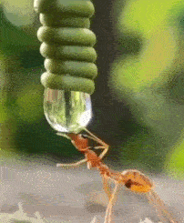

# 绪言

建国以来的中医教材以光明中医教材口碑为最好。这套教材是80年代，由老中医司长吕炳奎集合当时最好的一批名老中医共同编写出来的，实用性非常强。很多人通过这套教材踏入中医之门，成为合格中医师。有“中医ICU”之称的李可老中医，认为其是“最好的中医教材”，推荐广大中医从业者学习。

这套教材的学习特点是先难后易。开始学习的时候难度比较大，需要学习者在花费大量时间反复研读后，才能悟出背后的真意。很多学习者因为无法突破前面的难点，失去学习信心，导致半途而废。而本书的主要目的就是要降低学习者前期学习的难度。

中医学的基础理论是由各种晦涩概念组建起来的，比如阴阳、天地、五行、六气、三阴三阳、气血津液、表里、寒热、虚实等等。中医对这些概念的解释非常抽象。大多数初学者，包括经过四年专业学习的中医院校学生，花了很多时间依然读不懂。而基础理论不清晰，则在使用针、砭、灸、药等方法调理人体的时候，就没有方向，效果也差强人意。就像盖房子地基不牢固，盖起的房子一碰就倒，非常脆弱。

因此如何把这些概念用简单、具体的方式讲解清楚，是对中医意义重大的事情，也是本书要解决的重点问题。我们将教材各个课程中对这些概念的讲解做了详细的整理，然后用生活中常见的现象进行了解释，同时附上教材及经典原文，这样既保证了解释的正确性，又达到了容易理解的目的。

这里，我们抛开那些难懂的概念，举一个简单例子来解释中医是如何看待人体的，中医到底在做什么？如下图：

图1：人体内驱动蛋白移动囊泡

图2：自然界蚂蚁喝水

第一张图为国外某大学制作的动画，演示人体内细胞有序工作，形成了一个细胞社会。第二张图为自然界蚂蚁喝水的过程。可以看出，两者有很大相似之处，都是一种生命活动。

中医是把人的身体理解为一个类似温室花园的小自然界。人体中的各种细胞看做温室中的花草鱼虫。中医是养护生命的医学，其原理和园丁养护温室花草的道理很相似，以调节生命所处的环境平衡为主要任务。

养护花草有四大要素，阳光、水、土壤、空气，缺一不可。园丁的责任就是经常关注花园中这四大要素是否适量平衡，比如水少要浇水、水多要排水，其他要素也是如此。环境调节好后，花草自然会长的好。园丁不太需要关注花草树木的物理特性或者化学成分，比如树干硬度是多少，花朵鲜艳的颜色是因为哪些化学成分等等。那是物理学家和化学家的工作，大家分工不同。

同样对应人体而言，人的脏腑、皮、肉、筋、骨等组织器官也是生命，像花草树木一样由细胞构成，在合适的环境中能够自行生长。所以人体也需要类似自然界四大要素的东西来构成一个适宜生命生长的内在环境。

无论是自然界也好，还是人体也好，都包含了大量复杂的物理、化学变化，以及各种微小生命的活动。想搞清楚这些变化的细节是很困难的一件事情。中医的做法不是要搞清楚这细节，而是帮助人体搞好内在的环境平衡。人体内在的环境平衡了，这些小生命就能够健康的生长和工作。达到这个目的，并不需要了解细节的物理、化学变化，而是需要了解人体整体的能量与物质的产生、传输、分配以及人体的固、液、气态物质互相配合的原理，并且知道如何判断失衡的部位、性质，并能进行调节。掌握这些技能，就可以调理好人体的内在环境。这与园丁不是化学家、物理学家，却依然可以养好花草的道理是一样的。

所以说中医的思维是园丁思维。学习中医的人一定要明白这一点，否则很容易被现代医学对人体的细节研究搞偏方向。 

那好，有了这种中医思维，我们就可以开始进入中医的世界了。

李文强

2020年11月06日 

