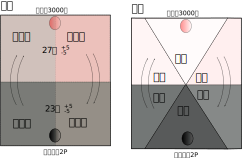

# 第一章 阴阳平衡

中医中大量使用了阴阳概念，所以学习中医，必明阴阳二字之含义。本章将对阴阳概念做出清晰的解释。

## 1、阴阳平衡与失衡

### 1.1、阴阳平衡是世间万物的规律，不只用于中医

阴阳平衡是中国传统的概念，可以用于解释各种事物。其本质上是指各种事物为了正常的运转，在很多指标上都有其合适的度。让指标保持在合适的范围内，使事物正确的运转，是为平衡。指标超出正常范围，使事物的运转失常，是为失衡。这本是生活中很常见、很简单的道理。

阴阳的传统解释非常抽象，导致很多人不能直观的理解阴阳的含义。这里我们用一个简单的例子来解释”阴阳“。

下面是一个房间温度平衡的例子。

**假设我们有一个20平米的房间，用作卧室。**

**我们希望室温控制在25度上下，波动不超过5度，也就是20--30度之间，这是一个适宜温度范围，住起来比较舒服。**

**如果室温波动超过5度不到10度，表明室温出了问题，但还不算严重。比如若向下处于15度-20度之间，称为寒；若向上处于30-35度之间，称为热。寒与热都视为居住功能受到影响，但勉强可住。**

**如果室温波动超过10度，处于低于15度或者高于35度的情况，视为失去居住功能。**

**为了实现这种温度控制，我们配备了一台2匹制冷空调、一个3000瓦电暖气用来调节室温。**

**暖气可以让温度上升，称为阳。空调可以让温度下降，称为阴。**

这段话描述的小例子，已经把阴阳常见的要素包含在内了，下面解释一下：

1、这个例子首先确定了功能，功能是卧室，用来住人。这点很重要，因为功能决定了平衡点。如果房间功能是用来住人，室温平衡点是25度。如果房间用来做冷库，平衡点要定在-10度。所以我们谈阴阳、谈平衡，一定要先说清楚功能是干什么。不同的功能决定了不同的平衡点，进而决定了不同事物的阴阳属性。

2、平衡点确定后才能谈阴阳：这个例子中，以25度作为平衡点，那么低于这个温度的物体都算阴，比如房间里放一个10度左右的物体，因为它能让房间温度下降，所以算阴。但是如果房间作为冷库，平衡点在-10度，那么放一个10度左右的物体，就算阳，因为它的温度比平衡点高。由此可见，一个物体是阴还是阳，是指其相对平衡点而言。

在中医教材中，用阴阳基本属性和事物本身的阴阳属性来解释。这种描述很抽象，难以让人快速理解阴阳的本质。比如教材说阴阳基本属性中，热的属阳，寒的属阴。那么多少温度为热、多少温度为寒呢？其实这里隐含着以人的体温作为平衡点，高于人的体温为热、为阳，低于人的体温为寒、为阴。如果换一个事物，平衡点变化，原来的属阴属阳也会变化。  

比如一个10度的物体，人的触觉感受会觉得是凉的，属阴。但是把它放到冷库里，它又属阳。那这个物体到底是阴还是阳呢？可见，如果不以平衡点作为前提，是无法谈阴阳的。同一个事物，相对不同的平衡点，其阴阳属性是不确定的。任何事物的阴阳属性都以其相对平衡点的差异而定。

> 阴阳的基本属性可归纳如下：凡是动的、升的、浮的、上的、外的、热的、明的、无形的等等属阳；凡是静的、降的、沉的、下的、内的、寒的、暗的、有形的等等属阴。即天在上、无形属阳；地在下、有形属阴。日是明亮的、热的属阳；月是晦暗的、寒冷的属阴。疾病中的热证、实证、表证属阳；寒证、虚证、里证属阴。
>
> 阴阳的基本属性是绝对的、固定的，但事物本身的阴阳属性却是相对的、变动的。这种事物本身的阴阳属性的相对性和变动性，一方面表现为在一定条件下相互关联的相对事物之间可以互相转化，即阴可以转化为阳、阳可以转化为阴；另一方面表现为一事物内部阴阳属性的无限可分性，即“阴中有阳，阳中有阴，阴阳之中复各有阴阳”（《类经·阴阳类》）。
>
> 《中医药学概论-阴阳五行学说-阴阳的基本属性》

> *清阳与浊阴都是相对的概念，在不同的地方，有着不同的含义。*
>
> *《黄帝内经讲解-清阳浊阴的升降出入》*

### 1.2、阴阳失衡的描述与调节

中医用虚、实来描述失衡的原因性质，用补、泻来描述失衡的调节方法。

#### 虚

该有不够就是虚（“精气夺则虚”）。虚会导致房间调节平衡的能力不足，受到一般的干扰就会产生失衡。

在我们这个例子中，如果空调出了毛病，输出冷气的能力下降一半，导致夏天气温正常变热的时候，不能提供足够的冷气，这就是虚，因为空调属阴，所以这是**阴虚**。

空调没有提供足够的冷气，导致室温上升到30度以上，超出了正常范围，称之为**热**。

这种因为阴虚(空调能力不够)而导致的热，称为**虚热**。

同理，如果暖气出问题，提供热气能力下降，为**阳虚**。由此导致冬天的时候，室温低于20度，称为**寒**。因阳虚而寒，称为**虚寒**。

> 阳虚则表现为虚寒；阴虚则表现为虚热。
>
> 《中医药学概论-病机》

过度的虚称为亡。阴虚到极点，称为亡阴。阳虚到极点称为亡阳。

> 若阴津耗损到极点，可以出现亡阴证；阳气虚衰到极点，可以出现亡阳证。
>
> 《中医药学概论-病机》

#### 实

不该有而有就是实(“邪气盛则实”)。实是说房间受到超出常规的干扰，这样即使自身调节平衡的能力是正常的，也会因为干扰的力量过大而失衡。

本例中，如果空调、暖气的功能都没有问题，但是有人在房间里面生了一堆火，导致房间温度上升，此时即使空调全力开动，依然不能维持室温在合理范围。室温升到30度以上，成为“热”。这个热是因为不该有的火造成的，所以是**实热**。

同理，如果在房间里放一大块冰，导致室温下降到20度以下，暖气开大也无法调节，成为“寒”。这种寒叫**实寒**。

#### 调节平衡的方法（补、泻）

了解了虚实寒热的道理，那么调节的方法也就自然明白了。

如果是空调或者暖气的问题，那就修理空调或暖气，这就是**补**。空调为阴，修理空调就是补阴。暖气为阳，修理暖气就是补阳。

如果是房间里多了火或者冰，那就把它们清理出去，这就是**泻**。把火弄出去叫“**泻热**”，把冰弄出去叫“**散寒**”。

所以说“虚则补之，实则泻之”。总的来说，补虚叫做扶正，泻实叫做祛邪。所以说中医的治法无非扶正祛邪而已。

#### 虚实共存

因**虚**指正气不足，**实**指邪气过多，所以同一个部位**虚实**两者并不对立，可以共存；不同部位则可以此处**虚**而彼处**实**。一般来说，单纯的正气虚或者邪气实往往只是疾病的初起阶段，病因单一，治疗相对简单。慢性病、老年病、严重疾病往往是正气虚与邪气实共存，既有一个部位的虚实共存，也有不同部位的此虚彼实等等。解决这种问题要根据轻重缓急，确定先补还是先泻，或者补泻同用。如果补泻同用，又有补泻同等力度，或者重补轻泻、轻补重泻的区别。

#### 错误的调节

一定要注意，必须分清虚实，再采取对应的补泻方法；如果判断错误，比如本来是有火的实热，误判成了虚寒，采取了补阳（增强暖气）的措施，就会火上浇油，让室温更加偏离平衡点。或者本为虚寒，误判为实热，采取泻热的方法等等，都会造成更严重的问题。

> 阳明病，不能食，乃胃中虚寒所致...医者误认...手足濈然汗出，大便初硬后溏为胃家实热，妄用苦寒攻下之品，使中气更为虚寒，胃失和降，而生哕逆，此即“攻其热必哕”。...病本属胃家虚寒，攻下则犯虚虚之戒，因而有哕逆之变。
>
> 《伤寒论讲解-194条》

所以一定不能让虚的更虚（虚虚）、实的更实（实实），不能犯虚虚实实的错误，这是中医需要遵循的最基本原则。

> **无盛盛，无虚虚，而遗人天殃，无致邪，无失正，绝人长命**
>
> 《黄帝内经-五常政大论》

> 张景岳说：“人之疾病，无过表里寒热虚实，只此六字业已尽之，然六者之中又惟虚实二字为最要，盖凡以表证、里证、寒证、热证无不皆有虚实，既能知表里寒热而复能以虚实二字决之，则千病万病可以一贯矣，且治病之法无逾攻补，用攻用补，无逾虚实。”
>
> 《黄帝内经讲解-治则学说-补虚泻实》

> **经曰：“虚虚实实，补不足，损有余，”是其义也。余脏准此（4）**
>
> 《金匮要略》

扶正的方法可能会有留邪的隐患。比如我们想补一个地方的水，但是水没有流到这个地方，去了它处，使不缺水的地方水过多，就反而补出了邪气。祛邪的方法往往会伤正。比如我们想排除一些废水，同时也可能把好水一同排掉了，这就伤了正气。所以无论是扶正还是祛邪，都要注意对应的负面作用。

很多不愿意系统学习的中医爱好者，不识药性，不懂辨证，在不能全面把握人体虚实状态的情况下，往往只看见到一方面之虚，看不到其它方面的实，进而片面用药，犯虚虚实实之戒，造成严重后果的例子非常常见。

> 暮世之病也，则不然，治不本四时，不知日月，不审逆从，病形已成，乃欲微针其外，汤液治其内，**粗工凶凶，以为可攻，故病未已，新病复起**。
>
> 《素问-移精变气论篇》

#### 小结

保持指标平衡的要素称为正，其能力不足称为**正虚**。原则上，维持指标平衡的能力越强越好。比如城市楼房与农村平房相比较，楼房维持平衡的能力强，遇到狂风、暴雨、寒潮的时候，楼房更具有抵御这些外邪的能力，所以人们更喜欢住楼房。对于人来讲，健康的人抵御外界风、寒、暑、湿的能力强，也就是维持自身平衡的能力强大。反之，不健康的人维持平衡的能力弱，稍受干扰就有疾病发生。

不该有的干扰平衡的因素称为邪，过多叫**邪实**。原则上最好没有邪，如果有的话要控制在一个可接受的范围内，不要超过人的调节平衡能力，超过则发病。

注意，虚、实是描述病态失衡情况的用词，正常情况一般不用这两个词。维持平衡的要素足够叫**正气足**，破坏平衡的因素很少叫**邪气弱**，两者是正常平衡的必要条件，不用虚、实描述。所以基本**没有正实、邪虚的说法**。中医经典中偶尔有用”实“来表示”正气充实“之意，情况不多，结合语境不难判断。

如果该有的要素超出了正常的量，就会由正变为邪。比如如果暖气的控制出现问题，在室温已经较高的情况下，依然大功率输出热气，使室温上升到30度以上。热气本为维持室温平衡的要素，但此时超过了所需的量，就转变为破坏平衡的邪气，造成邪实的情况。

> 阳胜则人体功能亢奋而见热证；阴胜则人体功能抑制而见寒证。
>
> 《中医药学概论-病机》

另外，中医在对邪的性质进行描述的时候，有实体物质的邪称为实邪，无形气态或能量类的邪称为虚邪。以后遇到要注意与正气虚、邪气实的概念进行区分，不要混淆。

> 邪热与痰水、肠胃糟粕、宿食、湿浊等有形之邪相结，皆可致心烦，甚则心中懊憹，以其邪之有形，故称”实”。本条所述，乃因汗、吐、下后，表邪入胸，无形之邪热留扰蕴郁胸膈，并未与有形之邪相结，故称"虚”，并非指正气虚衰。
>
> 《伤寒论讲解-76条》

### 1.3、平衡的控制

在这个例子中，需要有人来对房间的温度进行判断，如果温度高了，需要开放空调，温度低了需要开放暖气，保证房间温度在一个合适的范围之内。现在科技发达，也可以使用传感器侦测温度，用程序进行自动控制。

这个控制的功能对应中医精气神中的神，具体在后面的章节会介绍。

### 1.4、平衡的机制

为了让房间的温度均衡，要制造空气的流动，让暖气产生的热气流向冷的一面，空调产生的冷气流向热的一面，这就是房间寒热平衡的机制，也叫阴阳的交互。

现代人熟知的热传导、对流、辐射等热传递方式，在自然界和人体的温度平衡机制中都有体现。比如自然界云、雨的形成就包含对流的原理。太阳给自然界提供能量就包含了热辐射的原理。

中医将这类平衡机制用“升降出入”四个字来概括。比较大的方面包括人体上、下部之间“升降”平衡，里、外部的“出入”平衡；至于小方面的“升降出入”就更多了。升降出入做的好，称为“阴阳相交，水火既济”，是生之象；做的不好，则叫“阴阳分离、水火未济”，是死之象；

中医常说的上热下寒或者内热外寒等，就是人体热量的平衡机制出现问题，造成一部分偏热而另一部分偏寒，严重的话会产生阴阳分离而死亡的后果。

> 李中梓则具体指出：“天地造化之机，水火而已矣。宜平不宜偏，宜交不宜分。火性炎上，故宜使之下，水性就下，故宜使之上，水上火下，名之曰交，交则为既济，不交则为未济，交者生之象，不交者死之象也”。这是以水火说明阴阳相互依存、制约的重要意义。临床虚劳内伤疾病，多见阴阳水火升降失常，心肾不交，甚至导致阴竭阳脱，危及生命。
>
> 《黄帝内经讲解-阴阳对立统一的例证》

### 1.5、多方面的平衡

前面这个例子，重点谈的是温度平衡，其实一个房间实现卧室的功能，还有很多其他指标需要平衡，比如湿度、墙壁隔热度、采光度、地面光滑度等等，也就是有多个维度需要平衡。

每个维度指标都和温度指标一样，有平衡范围和失衡范围。比如湿度就要有一个合适的范围，湿度过大变得潮湿或者湿度过小变得干燥，都会影响居住功能。温度失衡，我们用“寒、热”来描述，但是湿度失衡，不能再用这种词，可以用“湿、燥”来描述湿度失衡。

无论哪种指标的失衡，都离不开“虚、实”两种情况，因为所有的失衡，无非是“该有的太少”或者“不该有的太多”而已，再或者两者兼有的“虚实夹杂”情况。

从“敏感度”角度看，有些指标是敏感的，比如说温度指标，它随着季节、昼夜经常变化，需要经常关注调节。还有一些指标是不敏感的，比如墙壁厚度，一旦房子建好后，多年不变，除非遇到特殊情况，否则一般不需要关心它的变化。人体也是一样，因温度变化比较敏感常见，所以中医经常“寒热虚实”并称。但我们要知道“虚实”是各种指标失衡的统称，“寒热”是温度指标的特指。

从“重要度”角度看，大部分指标都很重要，任何指标失衡，都会导致功能的下降，严重的会导致失去功能。所以即使一个指标是不敏感的，但是一旦遇到特殊情况，这个指标失衡了，依然要重视，将其调节回平衡。

这里提到的多方面平衡，对于人也一样，温度平衡是人体平衡的一个重要方面，但是还有其他方面的平衡，比如身体有气的平衡、血的平衡、水的平衡，对应就有气虚、气滞、血虚、血瘀、津液虚、痰饮等各方面的失衡，这些要等后面介绍完人体的运转机理后才能解释。

在光明教材《概论》的阴阳章节，谈到中医用阴阳概念阐述人体的部位、生理、病理、诊断、方药等内容，就是指这种多维度的平衡。

> 阴阳学说，贯穿于中医学理论和临床体系的各个方面，用以认识和阐述人体的形体、脏腑、经络、生命过程、疾病过程、以及辨证治疗等等。
>
> 《中医药学概论-阴阳学说在中医学中的应用》

### 1.6、平衡要素

综上所述，我们可以根据房间的例子总结出平衡的几个要素：

**作用：**居住

**载体：**房间

**指标：**温度、湿度、墙壁隔热度、采光度、地面光滑度.....

功能、载体、指标，是我们谈阴阳平衡需要关注的三个要素。

其中每个指标都有其合适的**平衡点**，以及正常的上下**波动范围**。以平衡点为参照，让指标向上为阳，向下为阴。

指标又分敏感指标，比如温度，以及不敏感指标，墙壁隔热度、采光度等。

中医学中谈的阴阳，之所以让人难以理解，关键就是讲述人经常没有说清楚功能是要做什么？平衡点在哪里？从而导致了不同系统、不同层次阴阳概念的混乱、滥用，不利于中医学的传播，让中医学习者思维混乱。

比如朱丹溪说“人身阳常有余,阴常不足”，而火神派说“阳常不足，阴常有余”，两者看起来是矛盾的。都是中医大家，何以在语言描述上出现如此对立的情况？两者谈的阴、阳是否是同一系统、同一层次下的阴阳？有余、不足的原因何在？表现怎样？这些问题如果能把其语境下的功能、平衡点说清楚，理解起来应该是极简单的事情。而不说清楚这些前提，就变成模模糊糊、似是而非的话语了。

在本书，只要谈阴阳，一定要先说功能是什么、平衡点是什么。也就是没有功能不谈平衡，没有平衡不谈阴阳。若确有说不清楚的地方，存疑待考，而不能囫囵吞枣，敷衍而过。

中医教材说阴阳即对立又统一。在本例中，“统一”就是指房间控制温度这件事，“对立”是指空调与暖气的对立关系。一个房间的空调与本房间的暖气是一对阴阳关系，而与另一个房间的暖气，就不是一对阴阳。这是因为两者没有发生交互作用。所以谈阴阳对立，前提是基于一个统一的事物，也就是这里说的功能、载体、指标。

> 阴阳的相互关系，概括起来，可以归纳为对立和统一两个方面。...阴阳两方面的相互对立，主要表现在阴阳之间的相互制约、相互斗争。阴阳两方面的统一，主要表现在阴阳之间的相互依存、相互为用、相互转化，以及阴阳的相互包涵和无限可分性。
>
> 《中医药学概论-阴阳的相互关系》

### 1.7、中西医的指标差异

通过上面的叙述，我们知道中医的阴阳平衡、寒热虚实和西医的指标平衡是一个意思，只是描述术语上的差别，解释清楚中医的指标概念后，这种差异就不存在了。西医的高血压要降压、高血糖要降糖也是调节某些指标平衡。

那么中医和西医为什么还是很难融合呢？是因为双方在重要指标的选取标准上的差异。人体是非常复杂的系统，其中有非常多的指标需要调节，作用各有不同。中医认为西医的血压、血糖、蛋白等指标，过于细化，层级偏低。调节这些指标虽有一定作用，但不能从宏观上解决根本问题，有时还会让其它更重要的指标更加失衡。而西医认为中医的精、气、神、血、津液等指标，描述模糊，无法量化评价，难以纳入现代医学体系。这应该是中西医学矛盾的根本所在。

客观的讲，双方都有一定道理。当健康出现问题时，能解决根源问题是最好的方案。如果找不到根源，紧急情况下，先调节一些局部指标，避免出现更严重问题，也是一种必要选择。

中医的指标确实模糊，掌握起来有难度。但我们既然学习中医，就一定要搞清中医几大指标的意义，其失衡的表现，以及调节的办法。

## 2、阴阳平衡的高级内容

前面所述是对平衡的一些简单理解，下面我们要对平衡过程做一点深入分析，为下面学习天地自然打一点基础。

### 2.1、大平衡下的小平衡

当我们定下一个系统的平衡目标后，为了完成这个目标，相关的各个方面都有各自的任务。为了完成各自的任务，其又有各自的平衡点。这些方面的平衡点可以理解为大平衡下的小平衡。

房间温度的例子：把房间以阴阳中线为界一分为二的话，在靠近暖气的一面整体上要比靠近空调的一面温度要高些，成为偏阳的一面。反之，另外一面称为偏阴的一面。偏阳的一面，假设以27度为平衡点上下波动；偏阴的一面以23度为平衡点上下波动。这种偏阳或偏阴的一面，本身都有各自的平衡点，即为大平衡下的小平衡。

##### 小平衡对事物的影响

当一个系统大小平衡确定后，系统中的各项事物会根据自己的偏性选择适合的位置。

比如，如果我们洗了衣服要在房间里面晾干，一定会把衣服晾在偏阳的一面，这样干得快。如果我们有蔬菜要保存，一定会放在偏阴的一面才不容易坏。

在自然界中，有些动植物适合生存在南方，有些适合生存在北方，都是因其各自偏性而在自然界中选择合适的地方。

##### 空间与时间上的指标变化

房间的温度在不停的波动，高于平衡点则下降，低于平衡点则上升。所以房间各个空间点的温度随着时间在不停的变化。

时间变化：房间里任何一空间点，其温度都是随着空调与暖气调节室温的过程，上下波动的。

空间差异：在任意时间点，房间不同位置的温度有高低不同，这是温度在空间分布上差异。

阴阳从时间角度看就是指标在正常范围内的波动，从空间角度看就是不同空间范围内指标的差异。

### 2.2、阴阳的进一步划分

阴阳可以根据阴阳比例进行多种形式的划分，并不局限于二分法。这里演示一下四分法和六分法。

四分法中，偏阳的一面可以按照比例再分阴阳，称为“阳中阴”与“阳中阳”，偏阴的一面也是同理。

六分法中，阴阳两面各自三分，则用一阳、二阳、三阳、一阴、二阴、三阴的命名方法。

不同的情况可以有不同的分法，比如一年可以分为4季，也可以分为12月、24节气、365日等等。选择合适的划分方法是为了方便观察、分析与调节。

就像踢足球要11个人，打排球要6个人、打篮球要5个人一样，不管用哪种分法，最终都是通过阴阳往来平衡的方式实现目的。

> 黄帝问曰：余闻天为阳，地为阴，日为阳，月为阴。大小月三百六十日成一岁，人亦应之。今三阴三阳不应阴阳，其故何也？
>
> 岐伯对曰：阴阳者，数之可十，推之可百，数之可千，推之可万，万之大不可胜数，然其要一也。
>
> 《素问-阴阳离合篇第六》

## 3、取类比象

依然以房间温度平衡的例子来说明。温度高于平衡点的事物属阳，比如暖气、火等，低于平衡点的事物属阴，比如空调、冰等。那么暖气和火就属于同类，空调和冰就属于同类，或者说针对当前平衡点，它们具有类似的象。

这种同类事物是可以互相补充替代的，比如房间温度低的时候，恰巧暖气有问题不能输出足够的热气，这时我们可以考虑生点火，帮助提升房间的温度。反之亦然，空调出毛病的时候，我们可以放点冰来弥补其降温能力的缺失。古代没有空调、暖气的时候，就是用冰、火来调节房间的温度。两者性质是一样的，只是现代的方法更方便而已。

中医治病是以自然之偏纠正人体之偏就是这个意思。我们要了解人体不同部位各种失衡情况的表现，这样就能根据表现判断出失衡的部位和性质。然后还要了解药物的偏性、方剂的作用性质。这样就可以选择正确的药物方剂来对应调节人体的失衡情况。比如脾的阳虚，可以用热的干姜；肾的阴虚可以用地黄、阿胶；心的阳虚可以用桂枝甘草汤等等；

前面我们谈虚实中的实热的时候，说房间中多了一团火，会造成实热。而这里又说，温度低而暖气不足的时候可以放一团火帮助升温。那么这团火到底是致病之因还是纠偏之药呢？这个完全取决于原本房间温度是平衡还是失衡的。原本房间温度低，一团火有助于房间温度趋近平衡，这个火就是良药。如果原本房间温度是平衡的，这团火会打破平衡，那它就是毒药。总之，一切以平衡为准，任何药物或者疗法，能维护平衡就是好的，破坏平衡就是坏的。

由此可见，中医中的偏性之药，如果抛弃平衡而谈其有益或有害，是错误的，会误导人。正确的使用，砒霜也可以救人；不正确的使用，人参也可以害人。

## 4、一些扩展内容

#### 4.1、平衡的有效区域：

我们说房间在空调、暖气的作用下达到20-30度的均衡温度。这是大概情况，严格来讲，房间中临近空调和暖气的地方，温度是超出这个范围的。空调的制冷温度在15度左右，暖气在80度左右。这两者附近的温度是超出范围的，所以我们不会居住在这两者附近。

房间中部的温度是符合均衡温度范围的，所以这个区域我们可以理解为房间的有效区域。

空调和暖气附近作为房间温度的两极，不适合居住，但是对有效区域的形成有重要的作用。

明确这一点是为了后面更好的理解中医对自然界气交之地的叙述。

#### 4.2、物极必反

物极必反是指标在波动过程中，升到一定程度则降，降到一定程度则升，以此来保持平衡。内经中，以四季变化来举例，夏天气温最高，之后就要转凉，冬天气温最低，之后就要变暖。

> 四时之变，寒暑之胜，重阴必阳，重阳必阴。故阴主寒，阳主热。故寒甚则热，热甚则寒。故曰寒生热，热生寒，此阴阳之变也。
>
> 《灵枢·论疾诊尺》

房间温度的调控也是如此，室温超过上限后，会启动冷气，超过下限后，会启动暖气，如此波动以控制平衡。

物极必反的概念不能滥用，当事物自身调节平衡的能力较强的时候，可以有物极必反的现象，热极生寒、寒极生热等等。若平衡能力弱，物极而不能反，就是死亡的结局了。

