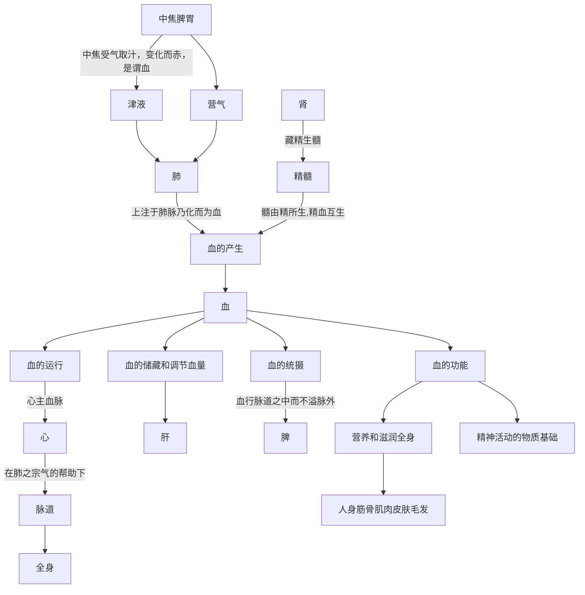

## 3.3血

血是在心肺的共同作用下，形成的具有濡养全身脏腑组织作用的赤色液态物质。

### 生成：

关于血的生成，中医认为是水谷精微与津液在肺化生为血。此外，精血互转，所以精也可以转化为血。

人从外界吸收天气地气，最终形成皮肉筋骨，这个过程中，血是非常重要的一种中间状态，所以广义上皮肉筋骨等形体也属于“血类”。

> 血液主要来源于水谷精微，而水谷精微的化生，有赖于脾胃的运化，所以说脾胃为气血生化之源。《灵枢·决气》说：“中焦受气取汁，变化而赤，是谓血”。就是说**中焦脾胃**所化生的精微物质是生成血的基本物质。
>
> 此外，在血的化生过程中，还要通过**营气和心肺**的作用，方可化生为血。
>
> 《灵枢·邪客》说：“营气者，泌其津液，注之于脉，化以为血”。说明了营气在血液化生中的作用。
>
> 《灵枢·营卫生会》中说：“中焦亦并胃中，出上焦之后，此所受气者，泌糟粕，蒸津液，**化其精微，上注于肺脉，乃化而为血**”。
>
> 此说明水谷精微转化成血液，除中焦脾胃的作用外，还要通过心肺的作用，才能生成血液。故又有“心生血”之说。
>
> 此外，**精与血之间存在着相互滋生与转化的关系**。血能生精养精，精能化血生血。精藏于肾，血藏于肝，若肝血充盛，则肾有所藏，精有所资；若肾精充盈，则肝有所养，血有所充。正如张志聪在《侣山堂类辨》中说：“肾为水脏，主藏精而化血”。
>
> 《中医药学概论-藏象-血的生成》

> 津......能渗注于血脉，补充*血*液，如《灵枢•痈疽》所说：“津液和调，变化而赤是谓*血*”...
>
> **何谓血？岐伯曰：中焦受气取汁，变化而赤是谓血(6)。**...
>
> 血是水谷精微所化生的营气与津液，在心肺的共同作用下，形成的具有濡养全身脏腑组织作用的赤色液态物质。正如《灵枢•邪客》所说：“营气者，泌其津液，注之于脉，化以为血。”...
>
> “夫血者，**水谷之精微，得命门真火蒸化，以生长肌肉皮毛者**也。凡人身筋骨肌肉皮肤毛发有形者，皆血类也。
>
> 《黄帝内经讲解-人与自然- 精、气、津、液、血、脉的生成和功用》

### 运行：

血的运行推动力以心气为主，肺气为辅助。脾气可以约束血在脉道中运行而不溢出脉外。

血与气相比，血为阴，有被动性；气为阳，有主动性。所以血的运行是由气推动的，如果气不足，则无力推动血的运行。

另外，即使气的量充足，但是运行不正常，则血也不能正常运行。而气的运行是由肝的疏泄功能控制，所以肝的功能失常会影响气的运转，进而影响血的运转，形成气滞血瘀类的疾病。

此外，肝可以藏血，并进行血量的调节。

> 血的正常运行，是脏腑共同作用的结果，其中与心、肺、肝、脾的关系更为密切。
>
> **心**主血脉，心气**推动血的运行**；
>
> **肺**朝百脉，循行周身的血都要汇聚于肺，**通过肺气宣降，敷布全身**；
>
> **肝**主藏血，**可储藏和调节血量**；
>
> **脾**气统血，**使血行脉道之中而不溢脉外**。
>
> 所以血的循行，主要是在此四脏的相互协调下共同完成的。
>
> 若此四脏功能失调，均可导致血行的失常。若心气虚，血行无力，可见血瘀；肺气虚，可出现气血两虚及血瘀；肝不藏血，脾失统摄，可出现吐血、衄血、便血等血不归经的证候。
>
> 《中医药学概论-藏象-血的生成》

> 中医学认为，血的运行依赖于气的推动。**心气推动，是血运行的基本动力，而心气又有赖于肺气的敷布**。正如《医学真传》所说：“气非血不和，血非气不运”。
>
> 《中医药学概论-藏象-肺、大肠》

> 肺主气，为相傅之官。**肺主宣降，而朝百脉，其宗气贯心脉，具有促进心运行血液的作用**，是血液正常运行的必要条件。如果肺气失宣，或肺气不足，均可影响心的行血功能，导致血液运行失常，出现心悸不宁，胸闷刺痛，甚则唇青舌紫等心血瘀阻的病理表现。所以临床凡因肺气失宣或不足所导致的瘀血之证，应侧重宣通肺气或补益肺气，
>
> 另一方面，心主行血，血为气母，血至气亦至。如果心气不足，心阳不振，心脉瘀阻，也会导致肺气宣降功能失常，而出现肺气上逆，喘咳气促等大多属于危急的症候，治疗当取强心益气、保肺去瘀为法。正如唐容川所说：“**瘀血乘肺**，咳逆喘促，**鼻起烟煤**，口目黑色，用参苏饮，保肺去瘀，此皆危急之候。凡吐血即时毙命者，多是瘀血乘肺，壅塞气道，肺虚气促者，此方最稳。若肺实气塞者，不须再补其肺，但去其瘀，使气不阻塞，斯得生矣，葶苈大枣汤，加苏木、蒲黄、五灵脂、童便治之。”
>
> 《黄帝内经讲解-藏象学说- 十二脏的生理功能及其相互关系》

### 功能：

血中含有从饮食呼吸中获得的营养物质、水分、能源等。血在血管中运行，将各种资源送至四肢、头部、皮肉筋骨等部位，用来生长肌肉皮毛等形体。

血是精神活动的物质基础，血的异常，包括血虚、血热、血瘀等，可以造成精神失常。

血为气之母，血中也包含能够产生气的物质，能随时补充气。 

> 血为气之母，是说气必须依附于血而存在，气需血的滋养。
>
> 《中医药学概论-气血津液的相互关系》

> 血具有营养和滋润全身的生理功能。血在脉中循行，内至脏腑，外达皮肉，如环无端，运行不息，不断地对全身脏腑组织器官起着营养和滋润作用，以维持正常的生理活动。故《素问·五脏生成篇》说：“肝受血而能视，足受血而能步，掌受血而能握，指受血而能摄”。《灵枢·本脏》说“血和则筋骨劲强，关节清利矣”。这些都具体说明了“血主濡之”（《难经·二十二难》）的生理作用。若血不足，失其滋润、濡养的作用，则可出现两目昏花，面色无华，肌肤干枯，关节不利等症。
>
> 此外，**血是人体精神活动**的主要物质基础。《灵枢·本神》说：“心藏脉，脉舍神。肝藏血，血舍魂”。都说明血与精神活动密切相关。故若血虚、血热或血瘀，均可出现不同程度的精神情志失常的病变。轻则失眠多梦，烦躁，重则神志恍忽，惊悸不安，或谵语、狂妄、昏迷不语。
>
> 《中医药学概论-藏象-血的功能》

> 全身脏腑组织赖心血濡养而维持其正常机能，同时又主神明，为精神思维活动的中枢，所以五脏六腑在心的协调下，才能维持正常的生理活动，假如邪气入侵心脏，就会损伤心脏，以至神气耗散，人即死亡。
>
> 《中医药学概论-藏象-心为五脏六腑之大王》

> 肝脏能贮藏人体大量的血液，并通过肝气的调节，供给各个器官组织的需要，当人入睡的时候，血液随道肝气趋于平静回流到肝脏，使分布在其他方面的血液相对减少，当人醒觉和运动的时候，血液随着肝气的布散，运行于经脉之中，使需要的部分得到补充。...
>
> **肝开窍于目，目得肝血的濡养，才会产生正常的视觉**。故肝血虚则视力减退，若肝气上逆，气血郁闭，可导致暴盲。...
>
> 人体四肢的运动，由筋所主管，只有筋脉得到肝血的充分濡养，才能产生正常的生理活动，所以足得血的营养，才能行走；手得血的营养，才能握物；手指得血的营养，才能摄取东西。反之，肝血不足，筋脉失于濡养，四肢的运动就会受到障碍。...
>
> 《黄帝内经讲解-藏象学说- 肝主藏血》

## 题目：

1. 血的产生与脾、肺、心有密切关系，藏血是----的主要功能，统血是----的主要功能。
2. 血的运行主要由-----气推动，在---的宗气帮助下，运行于全身。

